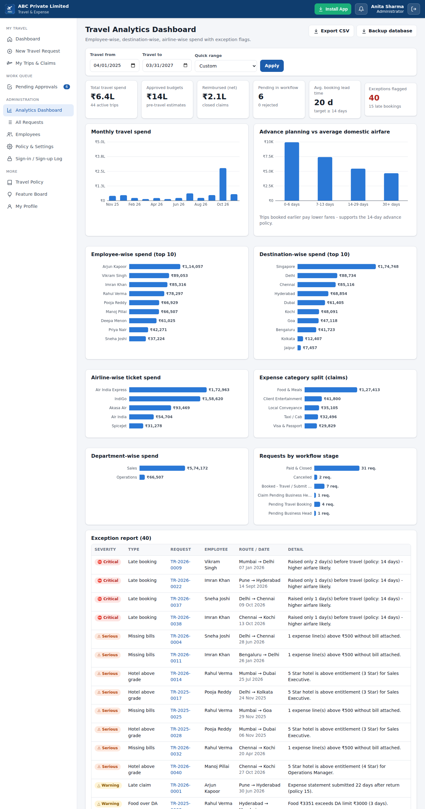
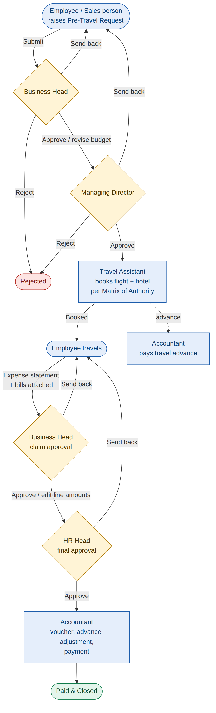

# AICA LEVEL 2 B-93 - PRAVIN PAWAR - Travel expenses software

## ABC Private Limited – Travel & Expense Management App (PWA)

**AICA Level 2 Project (Batch 93) by Pravin Pawar** – a complete corporate travel pre-approval, booking, expense-claim and
reimbursement system for a multinational company, built as an installable Progressive Web App
with a backend database.

## What it does
- **Login / Sign Up** with email id and password. The **first user becomes Admin**; afterwards only
  email ids added by the Admin can sign up. Every sign-up, login, failed attempt and logout is saved.
- **Pre-travel approval workflow:** Sales person / employee raises a request (from city → to city,
  days, flight, hotel, food, misc estimate, purpose) → **Business Head** → **Managing Director** →
  **Travel Assistant** books flight & hotel as per the **Matrix of Authority** (3/4/5 Star, flight class).
- **Post-travel expense statement** with bills attached → **Business Head** → **HR Head** (final) →
  **Accountant** (voucher, advance adjustment, payment) → Paid & Closed.
- Send back / reject at every stage, notifications, full audit trail, travel advances, multi-currency.
- **Advance-planning policy** (default 14 days) with late-booking justification and flags.
- **Admin analytics dashboard:** employee-wise, destination-wise, airline-wise, department-wise,
  monthly spend, lead time vs airfare, and an **exception report** (late booking, above-grade hotel /
  flight, over budget, missing or duplicate bills, food over DA, late claims).
- Roles drop-down: Managing Director, Business Head, Sales Manager, Sales Executive, HR Head,
  Accountant, Travel Assistant, Finance Manager, Operations Manager, Employee + custom roles.
- **PWA:** "Install App" on desktop, "Add to Home Screen" on mobile, Install button in the menu bar.

## Tech
Node.js 22+ (built-in HTTP server + built-in SQLite), plain HTML/CSS/JavaScript front-end,
SVG charts, service worker. **Zero npm dependencies.**

## How to run
1. Install Node.js 22 LTS or newer (the Windows launcher installs it automatically).
2. Open `04_Executable_Application/ABC_Travel_Expense_App/`
3. Windows: double-click **`Start_ABC_Travel_App.bat`** → http://localhost:8080
   (macOS: `Start_ABC_Travel_App.command`, Linux: `./start_mac_linux.sh`)
4. Demo with sample data: **`Start_Demo_Mode.bat`** → login `admin@abc-demo.com` / `Demo@1234`
5. Mobile / shareable https link: **`Start_Public_Link.bat`**
6. Automated test: `npm test` (43 checks)

## Folder structure
| Folder | Contents |
|---|---|
| `00_READ_ME_FIRST.txt` | Quick start |
| `01_Summary_Document/` | Project summary (Word + PDF) |
| `02_Prompt_Files/` | Original prompt, detailed build specification prompt, future-enhancement prompts |
| `03_Example_Files/` | Sample bills, employee import CSV, demo database, export CSV, walkthrough, 26 screenshots |
| `04_Executable_Application/` | Complete source code with one-click launchers |
| `05_Supporting_Documents/` | Workflow & ER diagrams, DB schema, API reference, Matrix of Authority, PWA & deployment guides, test report |

## Screenshots

