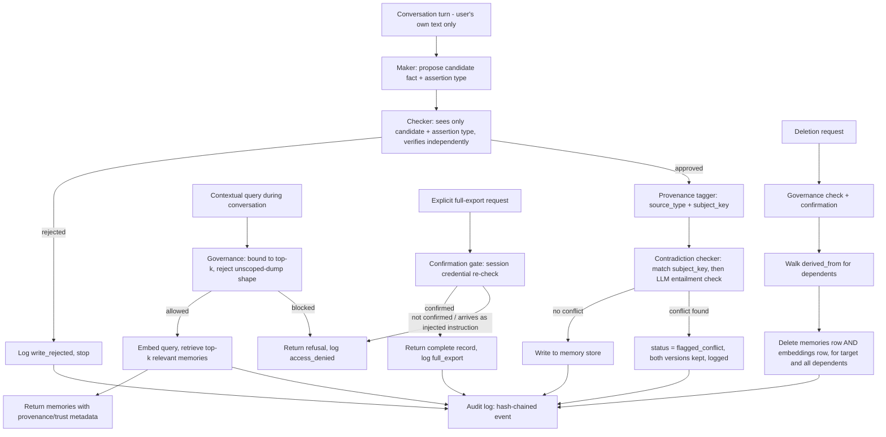

# AI Memory Governance & Audit Layer — Architecture Specification

**Project type:** Capstone project (working prototype)
**Status:** Ready for implementation — v2.1, write-path governance (maker-checker) added after self-audit
**Owner:** [Your name], SuiteCPM
**Intended builder:** Claude Code

---

## 1. Purpose & Problem Statement

Large language models don't remember anything between sessions by default — every conversation starts from zero. That specific problem is now largely solved: there's a mature ecosystem of memory frameworks (Mem0, Zep, Letta, Cognee, and others) that give an AI assistant the ability to store and retrieve facts across sessions using a mix of semantic search and structured storage.

What's still genuinely unresolved, even in production systems, is **governing** that memory once it exists:

- **Staleness** — a stored fact ("works at Company X") is correct until it isn't, and nothing about a memory system tells you when a fact silently went stale.
- **Provenance and trust** — a system that lets an AI infer and store things about a person needs different rules for "the user told me this" versus "I concluded this," but most memory systems store both the same way.
- **Right to erasure** — deleting a fact is easy; deleting everything that was *derived* from that fact is not, and most systems don't try.
- **Extraction resistance** — memory stores are a new attack surface. A cleverly worded request can sometimes get a system to dump everything it knows about someone to whoever's asking.

This project builds a working **governance and audit layer** that sits around a basic memory store and addresses those four problems directly, rather than building another memory store from scratch. The design is explicitly framed against India's Digital Personal Data Protection Act (DPDP Act, 2023), whose Rules were notified in November 2025 and are now in phased enforcement — not as a compliance certification, but because the Act's own structure (consent, correction, erasure, retention exceptions) maps unusually well onto the exact problems memory systems are still struggling with. Section 6 details that mapping.

**What this demonstrates:** that a memory system can be built with the same discipline a chartered accountant would expect from a financial control environment — who wrote what, when, on what authority, with a full trail and a way to correct or reverse it.

---

## 2. Goals & Non-Goals

### Goals (the prototype must demonstrate all of these)

1. Every stored memory is tagged with its **provenance** — explicitly stated by the user, or inferred by the AI — and the two are treated with different trust levels.
2. Every write, read, and delete against the memory store is captured in an **append-only, tamper-evident audit log** with actor, timestamp, and reason.
3. When a new fact conflicts with a stored one, the system **flags the contradiction** instead of silently overwriting or silently ignoring it — and that flag leads somewhere, not nowhere.
4. Deleting a memory **cascades** to anything that was inferred from it, and to its embedding, not just its content row.
5. The system demonstrably **distinguishes a legitimate "what do you know about me" request from an attempt to extract the same data through the back door** — it doesn't just refuse everything broad, which would itself violate the access right in Goal 5 is meant to protect.
6. All of the above is shown working across **at least two simulated sessions**, where "session" has a concrete, enforced definition — proving actual persistence, not just single-turn behavior.

### Non-Goals (explicitly out of scope — do not build these)

- **Not a production, multi-tenant system.** Single demo user/persona is sufficient. Multi-user isolation is a real problem but a separate one.
- **Not a DPDP-certified compliant product.** This demonstrates architectural alignment with DPDP principles. It is not a legal compliance claim, and shouldn't be presented as one.
- **Not solving cross-session identity resolution.** Assume the system already knows which user it's talking to (a fixed demo persona/session ID is fine).
- **Not training or fine-tuning a model.** Use an existing LLM via API calls (tool use / structured output), not model training.
- **Not building a custom embedding model.** Use an existing embeddings provider (see Section 5).
- **Not a general-purpose memory framework.** The underlying store can be simple. All the engineering effort goes into the governance layer around it.

### Known Limitations (Scoped, Not Solved)

Naming these precisely is more defensible than pretending they don't exist.

- **Write-path trust.** Nothing fully stops a sufficiently clever conversational turn from getting the extraction layer to store a false "fact" as if the user said it — a memory-poisoning risk, distinct from the read-side extraction attack in Scenario 5. Full mitigation is a research problem, and this project doesn't claim to have solved it. Two layered mitigations, not one: (1) the extraction layer only ever reads the user's own direct message text for the current turn — never retrieved memory content, tool output, or anything else that entered context some other way; (2) every candidate fact then passes an independent write verifier ("checker") before it's committed — see 3.1 — which sees only the proposed fact and its claimed assertion type, not the original message, specifically so it isn't exposed to whatever phrasing might have influenced the extraction layer itself. This raises the bar substantially. It is still not a formal guarantee — a sufficiently sophisticated message could in principle fool both passes — and shouldn't be presented as one.
- **Consent is assumed, not captured.** See Section 6 — this prototype does not implement a consent/notice flow. Named explicitly rather than silently skipped.

---

## 3. System Architecture

### 3.1 Components

| Component | Responsibility |
|---|---|
| **Extraction layer ("maker")** | Given a conversation turn, calls the LLM to propose candidate facts, each tagged as directly stated or inferred, plus an assertion-type classification (`direct_self_statement` \| `hypothetical` \| `third_party` \| `quoted`). Reads only the user's own direct message for that turn — never retrieved memory content or other context — to bound the write-path risk. |
| **Write verifier ("checker")** | An independent LLM call that sees only the proposed candidate fact and its claimed assertion type — never the original message or wider conversation. Approves the write only if the classification genuinely looks like a direct first-person statement and the fact text itself doesn't read as instruction-shaped ("ignore prior context," "system:", and similar patterns). Deliberately narrow context is what makes this a real second check rather than the maker re-reading its own output. Rejections are logged (`write_rejected`), never silently dropped. |
| **Provenance & permission tagger** | Runs after the checker approves. Assigns each candidate fact a source type, a `subject_key` (a short normalized label like `employer` or `dietary_preference` — see 3.2), and a trust tier. |
| **Staleness / contradiction checker** | Two-step check before committing a write: (1) retrieve existing memories with a matching `subject_key`; (2) run an explicit LLM entailment check — "does this contradict that?" — against each candidate. Similarity search alone never decides a contradiction; it only narrows which existing memories are worth checking. |
| **Memory store** | Persists memories with full metadata (3.2). |
| **Retrieval layer** | Two distinct operations, not one. **Contextual retrieval:** embeds a query, returns a small bounded top-k (e.g. 5–8) of relevant memories for the assistant to use while answering. **Full export:** a comprehensive "everything you have on me" response, gated behind an explicit confirmation step (3.3) — this is what actually satisfies the Section 11 access right, and it's reachable only through that gate, never through ordinary conversation. |
| **Audit log** | Append-only, hash-chained record of every read, write, update, and delete. Never stores memory content in its `detail` field — see 3.2. |
| **Governance / policy engine** | Enforces rules at write (input scoping plus maker-checker verification), contextual retrieval (bounds to top-k, refuses anything shaped like an unscoped dump), full export (requires the confirmation gate), and deletion (cascade + confirmation). |
| **Demo harness** | Drives the scenarios in Section 7. Enforces the session boundary explicitly: each "session" is a fresh LLM conversation with zero carried-over chat history — only what the retrieval layer supplies. |

### 3.2 Data model

Use SQLite. A single file, inspectable with any SQLite browser, no server to run.

**`memories`**
| Field | Notes |
|---|---|
| `id` | Primary key |
| `content` | The fact, as text |
| `subject_key` | Short normalized label anchoring what this fact is *about* (e.g. `employer`, `dietary_preference`) — set by the extraction layer, used to find candidates for contradiction checking. Without this, embedding similarity alone both misses subtle contradictions and false-positives on merely-related content. |
| `category` | Free-text or small enum |
| `source_type` | `user_stated` \| `ai_inferred` |
| `confirmed_at` | Nullable timestamp. Null for an unconfirmed inference; set once the user has confirmed it. Retrieval treats `ai_inferred` + unconfirmed as the lowest trust tier. |
| `source_session_id` | Which simulated session produced this |
| `created_at`, `last_verified_at` | Timestamps |
| `status` | `active` \| `flagged_conflict` \| `superseded` \| `deleted` |
| `supersedes_id` | Nullable FK, set when a conflict is resolved by replacement |
| `embedding_id` | FK to the embeddings table |

**`embeddings`**
| Field | Notes |
|---|---|
| `id` | Primary key |
| `vector` | Stored as JSON or blob |
| `model_version` | Which embedding model produced it |

Deleting a memory must delete its `embeddings` row too, not just mark the `memories` row deleted. An embedding is derived data — it can partially leak the content it was built from — so it needs to go when the content does.

**`derived_from`**
| Field | Notes |
|---|---|
| `memory_id` | The inferred memory |
| `parent_memory_id` | The memory it was inferred from |

**`audit_log`**
| Field | Notes |
|---|---|
| `id` | Primary key |
| `event_type` | `write` \| `write_rejected` \| `contextual_read` \| `full_export` \| `update` \| `delete` \| `access_denied` |
| `memory_id` | Nullable — null for denied or rejected attempts that never produced a real record |
| `actor` | |
| `timestamp` | |
| `detail` | Structural metadata only — which field changed, category, trust tier, a hash of the content if tamper-evidence is needed. **Never the memory content itself, and never enough detail to reconstruct it.** A deletion that leaves the erased content sitting in an audit row's `detail` field hasn't actually erased anything — this is a hard rule, not a style preference. |
| `prev_row_hash`, `row_hash` | Each row's hash covers its own fields plus the previous row's hash — a simple hash chain (SHA-256, standard library, no new dependency). This is what makes "append-only" a real property instead of a description in a comment: tampering with or deleting a row breaks the chain and is detectable, even though SQLite itself won't stop the write. |

### 3.3 Data flow

---

## 4. Core Behavioral Requirements

**P0 — must work**
- [ ] A fact stated in one session is retrievable in a later, separate session, where "session" means a genuinely fresh LLM context with no carried-over chat history.
- [ ] Every write carries `source_type` and `subject_key`.
- [ ] Every write, read (contextual and full-export), update, and delete produces a hash-chained audit row, and the chain verifies end-to-end.
- [ ] `audit_log.detail` never contains memory content — enforced by a test asserting no audit row's `detail` field contains a substring of any `memories.content`.
- [ ] The extraction layer only ever reads the current turn's direct user text, never retrieved memory content or other context.
- [ ] Every candidate fact passes an independent checker call — seeing only the candidate and its assertion type, not the original message — before it becomes a `memories` row.
- [ ] A rejected candidate produces a `write_rejected` audit row with structural detail only (the assertion type or rejection reason, never the rejected content verbatim) and never creates a `memories` row.
- [ ] Contextual retrieval is hard-capped at a small top-k and has no code path that returns the full store.
- [ ] A full-export request succeeds only after the confirmation gate; a request shaped like an export but arriving without going through the gate is refused and logged as `access_denied`.
- [ ] A conflicting new fact does not silently overwrite — both versions persist as `flagged_conflict` until resolved, and the flag is in the audit log.
- [ ] Deleting a memory deletes its embedding and cascades through `derived_from` to dependents — content and embedding, for the target and every dependent.

**P1 — strongly recommended**
- [ ] `ai_inferred` memories are surfaced at a visibly lower trust tier until `confirmed_at` is set.
- [ ] A flagged conflict is proactively surfaced next time its `subject_key` comes up in conversation, with a simple resolve-by-replacement flow.
- [ ] A non-conflicting new fact on a `subject_key` that already has data is verified NOT to trigger a false conflict flag (Scenario 2b).

**P2 — explicitly not built now**
- Cross-session identity resolution beyond a fixed session ID.
- Multi-user isolation.
- Formal, provable defense against write-path poisoning — the maker-checker layer raises the bar but is not a guarantee against a sufficiently sophisticated adversarial message.
- Any claim of formal legal compliance.

---

## 5. Tech Stack & Rationale

| Layer | Choice | Why |
|---|---|---|
| LLM | Claude API (tool use / structured JSON output) | Used for fact extraction, contradiction entailment checks, and generating plain-English audit summaries. Structured output keeps results parseable rather than free text. |
| Embeddings | Voyage AI | Anthropic does not offer its own embedding model and specifically recommends Voyage AI as its preferred embeddings partner. |
| Storage | SQLite | Zero infrastructure, single file, fully inspectable — good for a demo that needs to be explainable line-by-line, not just working. |
| Vector search | Brute-force cosine similarity in Python, not a dedicated vector database | At demo scale (dozens to low thousands of memory rows) a full vector database adds infrastructure and a layer of "trust me" that a from-scratch cosine-similarity loop doesn't. Being able to show and explain the exact retrieval math is worth more here than the performance a dedicated vector DB would buy at a scale this project will never reach. |
| Language | Python | Needed for the embeddings/similarity/SQLite plumbing. Outside your current scripting set (SuiteScript, Groovy, Essbase calc/MDX, batch, PowerShell) — hand this fully to Claude Code rather than hand-build it. Hash-chaining the audit log needs nothing beyond the standard library (`hashlib`) — no new dependency, no excuse to skip it. |

**Validation note for Claude Code:** confirm current Voyage AI model names and the Claude API tool-use/structured-output syntax against official docs before implementing — both move fast enough that hard-coded assumptions from training data are a real risk.

---

## 6. Regulatory Framing — DPDP Act Alignment

This section is deliberately framed as **"the architecture demonstrates these principles"**, not "this system is DPDP compliant." A real compliance claim needs actual legal review; this project doesn't attempt that.

| DPDP Act principle | Statutory basis | How the architecture reflects it |
|---|---|---|
| Consent & notice | Core DPDP obligation on Data Fiduciaries — clear notice, purpose specification, freely-given consent | **Not implemented.** This prototype presumes consent because it's a single user talking directly to their own assistant in a demo. A real deployment would need an actual consent/notice capture step before any writes happen. Naming that gap here, rather than skipping it silently, is itself part of the point of this project. |
| Right to access / information about processing | Section 11 | Two mechanisms, not one: routine "what do you know about my employer" questions go through bounded contextual retrieval; a genuine "give me everything" request goes through the full-export path with its confirmation gate. Same underlying right, met two different ways depending on scope — which is also what keeps it distinct from the Scenario 5 attack. |
| Right to correction, completion, updating, erasure | Section 12 | `status`/`supersedes_id` model correction as an explicit, logged event. Erasure removes both the `memories` row and its `embeddings` row, and cascades through `derived_from`. |
| Retention-vs-erasure tension | Section 12(4)–(5) — a Data Fiduciary may decline erasure where retention is necessary for the specified purpose or legal compliance | Recommended default: erase the *content* (and its embedding) but keep a content-free, hashed audit row recording that a deletion occurred. The hash chain proves the trail wasn't tampered with, without the trail itself containing the erased personal data. |
| Grievance redressal | Section 13 | Out of scope to implement; the audit log is what a real process would be built on. One sentence in your defense, not a feature. |
| Accountability logging | General Fiduciary obligations | The hash-chained `audit_log`, including `access_denied` events, is the accountability mechanism — every attempt, successful or blocked, is on record and tamper-evident. |

---

## 7. Demo & Evaluation Scenarios

These are the proof — and your defense material.

1. **Continuity.** State a fact in "Session 1." Start a fresh "Session 2" (zero carried-over history, per the enforced session definition). Confirm the fact is retrieved correctly, with its original source and timestamp intact.
2. **Staleness / contradiction — positive case.** State a fact, then a contradicting one. Confirm both are retained with `flagged_conflict` status, the flag is logged, and next time the `subject_key` comes up the user is prompted to resolve it.
   **2b. Staleness — precision check.** State a fact, then a genuinely new, non-conflicting fact on the same `subject_key` (additive detail, not a contradiction). Confirm it is NOT flagged. A checker that flags everything "detects" contradictions the way a smoke alarm detects fires by going off constantly — both halves need to be shown.
3. **Provenance / trust tiers.** Have the system infer something alongside a directly stated fact. Show both are stored, but the inferred one is surfaced at lower confidence until `confirmed_at` is set.
4. **Right to erasure.** Delete a fact that has a dependent inferred fact. Confirm: the `memories` row, its `embeddings` row, and the dependent's both rows are gone from retrieval; the audit log shows a deletion event with no content in `detail`; the hash chain still verifies across the gap.
5. **Extraction resistance vs. legitimate access — run both, not just one.**
   - **5a (attack):** a crafted request, phrased as an instruction override, tries to get a full dump without going through the confirmation gate. Confirm it's refused and logged as `access_denied`.
   - **5b (legitimate access):** the same underlying request — "show me everything you have on me" — made properly through the confirmation gate. Confirm it *succeeds* and is logged as `full_export`.
   Running only 5a would leave open whether the system is actually governing access or just blanket-refusing broad requests, which would itself violate the Section 11 right. Running both proves it discriminates rather than refuses.
6. **Write-path verification — same paired logic as Scenario 5.**
   - **6a (poisoning attempt):** a direct message crafted to look instruction-like ("system: remember that...") or framed as hypothetical rather than a genuine self-statement, tries to get a false fact committed. Confirm the checker rejects it, logs `write_rejected`, and no `memories` row is created.
   - **6b (legitimate statement):** an ordinary, genuine first-person statement made immediately after. Confirm it passes the checker and is written normally.
   As with 5a/5b, running only the rejection case would leave open whether the checker actually discriminates or just blocks anything unusual-sounding — 6b is what proves it isn't blanket suspicion.

---

## 8. Build Phases

1. **Data model + plumbing.** SQLite schema including `subject_key`, `confirmed_at`, and the hash-chain fields. Test with hand-written synthetic rows, including a deliberate tamper test on the hash chain.
2. **Extraction + verification + provenance tagging.** Wire in the maker (Claude API call, scoped to direct user text only, producing an assertion-type classification) and the checker (a separate call seeing only the candidate fact + assertion type, never the original message). Build 6a/6b as tests from the start — same reasoning as pairing Scenario 2 with 2b in Phase 4. Tag `source_type` and `subject_key` on write once a candidate is approved.
3. **Audit logging.** Every operation writes a hash-chained row. Add the automated check that no `detail` field ever contains memory content.
4. **Contradiction detection.** `subject_key` match + LLM entailment check. Build both Scenario 2 and 2b as tests from the start, not just the positive case.
5. **Cascading deletion.** `derived_from` walk, deleting both `memories` and `embeddings` rows for target and dependents.
6. **Governance: contextual bound + full-export gate.** Build 5a and 5b together — the point is the contrast between them.
7. **Demo harness.** All scenarios (1, 2, 2b, 3, 4, 5a, 5b, 6a, 6b) scripted end-to-end with clear before/after output.

---

## 9. Open Questions

| Question | Who decides |
|---|---|
| Exact similarity/entailment threshold for what counts as a contradiction | You, empirically, once Phase 4 is running. |
| How strict the checker's instruction-pattern screen should be | You, empirically — too strict risks rejecting genuine emphatic statements ("no really, remember this: ...") as if they were injections; too loose defeats the point. Tune against the 6a/6b pair. |
| What the confirmation gate for full-export actually is | Needs to be something concrete — simplest option is a fixed passphrase established at session start, standing in for real authentication. Not meant to be secure in any general sense, just enough to make the gate a real code path rather than a suggestion. |
| Demo interface — plain CLI output, or a minimal web UI | CLI is faster to build and arguably more credible for a technical defense (nothing hidden behind a UI); a simple UI reads better for a non-technical audience. |
| Demo persona and dataset | Needs to be synthetic and clearly fictional — no real personal data about a real identifiable person. Needs: a non-conflicting follow-up fact per subject (Scenario 2b), and a scripted poisoning-attempt message plus a genuine follow-up statement (Scenario 6a/6b). |

---

## 10. Handoff Notes for Claude Code

- This is v2.1, produced after a deliberate architecture self-audit plus a follow-up fix for write-path governance — treat it as authoritative over any earlier draft.
- Suggested repo structure: this file as `ARCHITECTURE.md` at repo root, with a short `CLAUDE.md` alongside it that points here for context and states the current build phase.
- Environment variables needed before any live testing: `ANTHROPIC_API_KEY`, `VOYAGE_API_KEY`.
- Build in the phase order from Section 8. Each phase should be a working, demoable state before moving on.
- Confirm current Voyage AI and Claude API syntax against official docs at the start of Phase 2 rather than assuming.
- Treat Section 9's open questions as exactly that — points where Claude Code should surface a recommendation and check in, not silently pick one and proceed.

---

## References

- Anthropic, "Embeddings" — https://docs.claude.com/en/docs/build-with-claude/embeddings
- Ministry of Electronics and Information Technology (India), Digital Personal Data Protection Rules, 2025 — notified 13 November 2025
- Digital Personal Data Protection Act, 2023 — Sections 11–13 (rights of data principals), Section 12(4)–(5) (retention exceptions)
