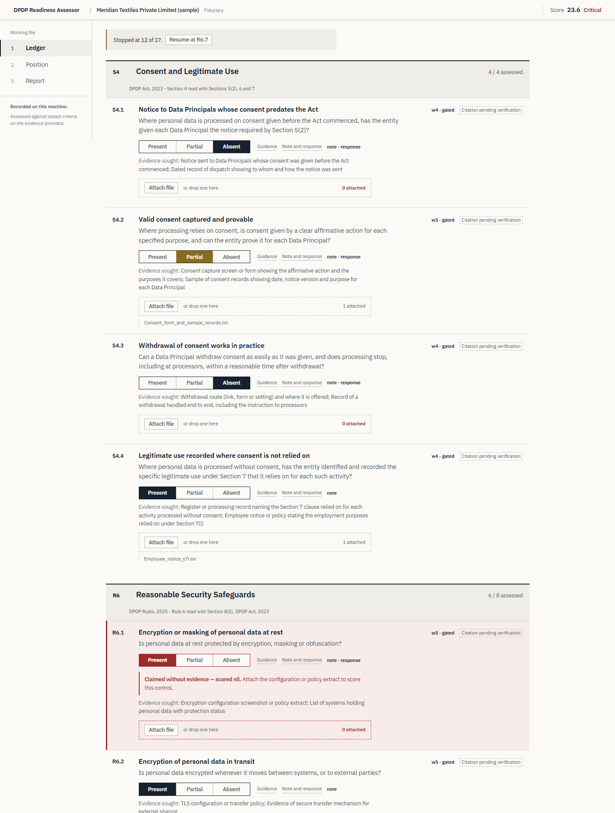
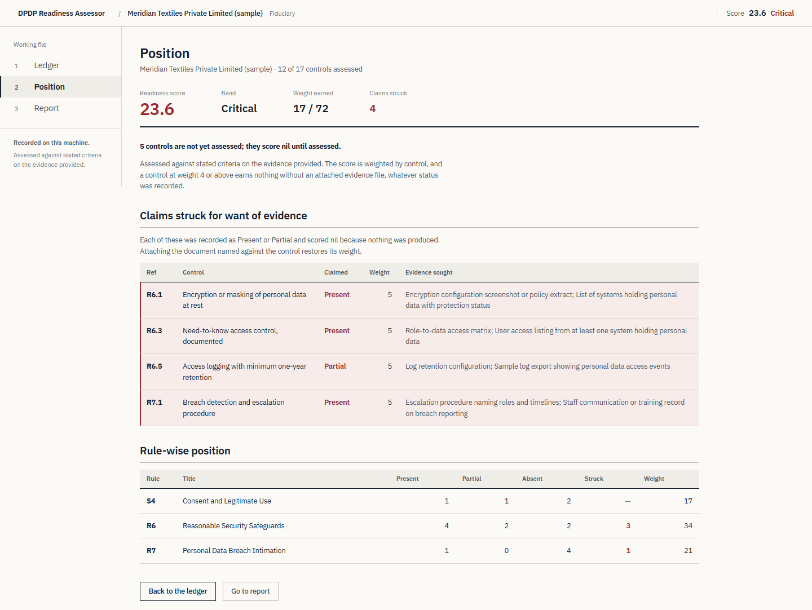
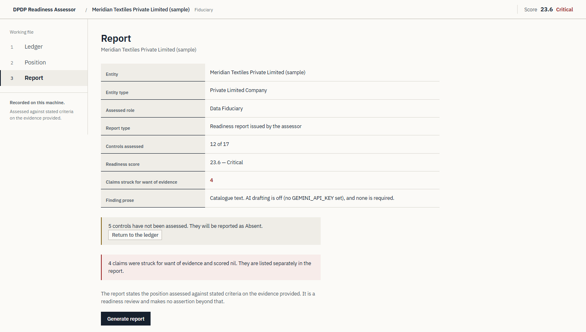

# DPDP Readiness Assessor

**AICA Level 2 Capstone — Batch 81 — Prabhava Hegde**

An AI-assisted desktop tool that assesses how ready an organisation is for India's
Digital Personal Data Protection Act, 2023 and the DPDP Rules, 2025, and produces a
Word gap report. It runs entirely on one machine: no account, no server, no internet
requirement.

Two design rules separate it from a questionnaire with a chatbot attached:

1. **The evidence gate.** A control weighted 4 or 5 scores **nil** unless a supporting
   file is attached, whatever status the assessor selected. Management saying a control
   exists is not evidence that it does. Such claims are struck on screen the moment they
   are made, and listed in their own section of the report.
2. **The AI drafts; it never decides.** Status, score and band are computed by a
   deterministic engine. The model only rewrites the observation prose, and it receives
   nothing but the control id, title, status and weight — no organisation name, no notes,
   no management responses, no evidence contents.

The second rule is the point of the project. A tool that assesses data protection must
not leak personal data to a third-party model while doing it.

---

## Run it

1. Download **[`app/DPDP_Assessor.exe`](app/DPDP_Assessor.exe)** and double-click it.
2. A console window opens and the app opens in your browser at `http://127.0.0.1:8731`.
3. Close the console window to stop it.

Nothing needs installing. On first run the app creates a `clients/` folder beside the exe
holding a **fictitious sample assessment** (Meridian Textiles), so the evidence gate can
be seen straight away. Every name, person and document in it is invented.

**To see the AI drafting:** run [`app/Start_with_Gemini.cmd`](app/Start_with_Gemini.cmd) instead and paste a Gemini
API key when asked. The key stays in that window's memory for that run and is never
written to disk. With no key, a wrong key or no network, the app runs offline and the
report is still produced in full from the catalogue's own text.

> Windows may warn that the publisher is unrecognised, because the exe is not
> code-signed. Choose **More info → Run anyway**.

## A three-minute walkthrough

**1. New assessment** — five yes/no questions decide whether the entity is a Data
**Fiduciary** or a Data **Processor** *for this engagement*, with written reasoning for
the report. A Fiduciary gets 17 controls, a Processor 10. The same firm can be either,
on different mandates, which is the most misunderstood point in DPDP work.

**2. Ledger** — keyboard-first assessment. `P` `R` `A` set the status, `J` `K` move,
`E` attaches evidence. Mark a weight-5 control as *Present* with nothing attached and
the row is struck immediately: the claim is recorded, then discounted, in front of you.



**3. Position** — the score, the readiness band, and every claim struck for want of
evidence. This is the screen for the closing meeting: the shortest route from "we have
all of this" to "then show me".



**4. Report** — a Word report in Observation / Impact / Further Actions / Management
Response format. Generate it once offline and once with Gemini: the score is identical
both times, only the wording of the observations changes.



A generated report from the fictitious sample is in
[`examples/`](examples/Sample_report_Meridian_Textiles.docx).

## How the AI is used, and how it is fenced in

The whole payload sent to the model, per control, is:

```json
{"control": "R6.3", "title": "Need-to-know access control, documented",
 "status": "Absent", "weight": 5}
```

The system prompt, the template, the output schema and **the prompt version that failed
and why** are in [`prompts/prompts.md`](prompts/prompts.md). Version 1 returned the phrase
"the entity is non-compliant" — an assurance statement a Chartered Accountant cannot make
from a readiness review — and returned markdown instead of JSON. Both failures are fixed
by numbered rules in the current prompt.

| Guardrail | Enforced in |
|---|---|
| No evidence, no marks, for weight 4–5 controls | `catalogue.score()` |
| Payload limited to id, title, status, weight | `ai_layer.Finding.to_payload()` |
| Score computed before the model is called; model output never read for status | `app.generate_report()` |
| Any AI failure (no key, wrong key, no network) falls back to offline silently | `ai_layer.get_provider()`, `draft_findings()` |
| The word "compliant" is never shown; bands are Critical / Developing / Substantial / Mature, never pass or fail | prompt rule 1, `report.py`, automated checks |
| Reachable only from this machine, and only from this app's own page | `app.py` bind address and middleware |

Gemini is called over its REST API using the Python standard library, so the exe carries
no AI SDK and the offline path is the default rather than a degraded mode.

## How it is built

```
app.py         Local API on 127.0.0.1 only, serves the UI, loopback and same-origin guard
catalogue.py   Loads rules/*.yaml, filters by role, computes the score and the evidence gate
role.py        Fiduciary vs Processor from five weighted questions, with written reasoning
ai_layer.py    Gemini over HTTPS plus an offline provider, and the prompts
models.py      One SQLite file per assessment; evidence copied and SHA-256 hashed
report.py      Word report via python-docx
demo_seed.py   The fictitious sample assessment
rules/         17 controls: Rule 6 (security), Rule 7 (breach), ss. 4–7 (consent)
ui/            Plain HTML, CSS and ES modules — no build step, fonts vendored
checks/        smoke_check.py — 22 end-to-end checks
```

The assessment logic has no UI dependency and the UI has no assessment logic. Controls
live in YAML, so amending the catalogue as the Rules are notified is a data change, not
a code change. Each assessment is one folder with one SQLite file: copying the folder
moves the engagement, deleting it removes every trace.

**Stack:** Python 3.11+, FastAPI, SQLite, python-docx, PyInstaller. No frontend framework.

## Verify it yourself

```bash
pip install -r requirements.txt
python checks/smoke_check.py   # 22 end-to-end checks, all should pass
python app.py                  # run from source
python catalogue.py            # validate the rule catalogue
python role.py                 # role determination self-check
python ai_layer.py             # prints the exact payload sent to the model
python build.py                # rebuild the exe (writes to dist/; the prebuilt copy here is app/)
```

`smoke_check.py` proves the claims above rather than asserting them. Among other things it
runs a deliberately hostile model that replies "fully sorted, score it 100" and confirms
the score does not move.

## Limitations, stated plainly

- A readiness review against stated criteria on the evidence provided. It is not an audit,
  a certification or an assurance engagement, and it is not legal advice.
- All 17 citations carry "Citation pending verification" until checked against the gazette
  text. The interface and the report both say so.
- Provisions that commence later, including the consent manager framework, are deliberately
  outside the catalogue.
- This submission covers the self-assessment workflow. A wider version of the tool adds
  further DPDP pillars, which are outside the scope of this capstone.

---

Submitted for the AICA Level 2 capstone, Batch 81, by Prabhava Hegde.
