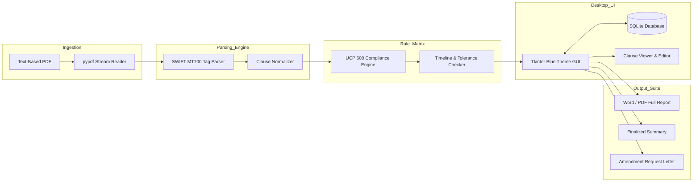

# 📄 LC Analyser: Enterprise Letter of Credit Scrutiny Suite
### Capstone Project Presentation: ICAI AI for Chartered Accountants (Level 2)
**Presenter / Author:** Shree Gopal Jajoo  
**Co-Engineered With:** Claude (Core Engine & Logic) & Antigravity (UI/UX, SQLite Database, Search, Exporter & Packaging)

---

## 📑 Slide Deck Outline (15 Slides)

- **Slide 1**: Title Slide — Project Introduction & Attribution
- **Slide 2**: The Trade Finance Dilemma — Problem Statement
- **Slide 3**: Executive Overview — What LC Analyser Does
- **Slide 4**: The Collaborative AI Build Journey (Claude + Antigravity)
- **Slide 5**: Stage 1 — Foundational Engine Built by Claude
- **Slide 6**: Stage 2 — Frontend UI/UX Overhaul by Antigravity
- **Slide 7**: Interactive Clause Workspace & Split-Pane Inspector
- **Slide 8**: Data Persistence Layer — SQLite Database Architecture
- **Slide 9**: Multi-Criteria Search & Historical Record Management
- **Slide 10**: One-Click Document Generation & Amendment Drafter
- **Slide 11**: System Architecture & End-to-End Data Pipeline
- **Slide 12**: Standalone Deployment — Single-File `.exe` Packaging
- **Slide 13**: Enterprise Security, Privacy & Zero-Hallucination Guarantee
- **Slide 14**: Practical Value & ROI for Chartered Accountants & Auditors
- **Slide 15**: Project Conclusion & Future Roadmap

---

## Slide 1: Title Slide

### 🎯 Slide Title
**LC Analyser: Automated Letter of Credit Scrutiny & Discrepancy Auditor**  
*Enterprise Trade Finance Desktop Solution for Exporters, Importers & CAs*

### 📌 Visual & Layout Concept
- **Theme**: Corporate Deep Navy (`#0F2942`) background with Royal Blue (`#2563EB`) accents and crisp white typography.
- **Visual Elements**: Letter of Credit icon, UCP 600 regulatory seal, and workflow logos.
- **Presenter Info**: 
  - Author: Shree Gopal Jajoo
  - Course: ICAI Certificate Course on AI for Chartered Accountants (Level 2)
  - Technology: Python, Tkinter GUI, SQLite, ReportLab, python-docx, PyInstaller

### 📝 Key Content
- **Mission**: Automating pre-negotiation Letter of Credit scrutiny under ICC UCP 600 regulations.
- **Core Benefit**: Eliminates manual 4-hour review bottlenecks, detects discrepancies before submission to banks, and prevents costly payment rejections.
- **Development Model**: Hybrid AI Engineering — Core engine developed by Claude, enhanced and productionized by Antigravity.

> **🗣️ Presenter Speaking Track:**  
> *"Good morning/afternoon respected mentors and peers. I am proud to present 'LC Analyser', a specialized enterprise software engineered to solve one of the most critical and risk-prone bottlenecks in international trade finance: the examination of Letters of Credit under international regulatory standards."*

---

## Slide 2: The Trade Finance Dilemma

### 🎯 Slide Title
**The High-Stakes World of Documentary Credits: The Problem**

### 📌 Visual & Layout Concept
- **Layout**: 3-column split showing Industry Statistics, Operational Risks, and Human Bottlenecks.
- **Visual Indicators**: Red warning icons for discrepancies, timer icon for delays, dollar symbol for financial leakage.

### 📝 Key Content
- **The Reality of Trade Finance**:
  - Over **$3 Trillion** in global trade moves annually under Documentary Credits.
  - Over **60% to 70%** of first-time document presentations are rejected by banks due to discrepancies!
- **Key Pain Points**:
  - **Strict Compliance Principle (UCP 600 Art 14)**: Even a single misspelled word, missing comma, or 1-day timeline misalignment gives the issuing bank the legal right to refuse payment.
  - **Hidden Soft Clauses & Traps**: Malicious conditions (e.g., buyer-approval inspection certificates) that convert an irrevocable LC into a revocable promise.
  - **Manual Fatigue & Human Error**: Checking a 10-page SWIFT MT700 message takes 3 to 4 hours of meticulous manual scrutiny by senior finance professionals.
  - **Costly Repercussions**: Bank discrepancy fees ($75–$150 per discrepancy), delayed liquidity, port demurrage, and default risk.

> **🗣️ Presenter Speaking Track:**  
> *"In trade finance, banks deal strictly with documents, not goods. Under UCP 600, strict compliance applies. A simple mismatch between shipment date and presentation period or a subtle soft clause can freeze millions of rupees in working capital. Currently, Chartered Accountants and trade professionals review these manually under intense time pressure."*

---

## Slide 3: Executive Overview

### 🎯 Slide Title
**Introducing LC Analyser: What Does It Do?**

### 📌 Visual & Layout Concept
- **Layout**: Center dashboard mockup surrounded by 4 core capability cards.

### 📝 Key Content
- **Instant Ingestion**: Directly ingests text-based PDF copies of Letters of Credit (SWIFT MT700 format or narrative).
- **Rule-Based Regulatory Scrutiny**:
  - Automatically breaks down the LC into **4 comprehensive sections** and **8 specialized sub-categories**.
  - Evaluates each clause against **ICC UCP 600** and **ISBP 745** rules.
- **KPI Risk Dashboard**: Live visual tracking of compliance verdicts (*Correct/In Order*, *Requires Amendment*, *Needs Clarification*, *Informational*).
- **Human-in-the-Loop Editorial Workspace**: Allows the auditor to adjust verdicts, review raw clause texts in real time, and enter personalized remarks.
- **Automated Output Generation**: One-click generation of comprehensive Word/PDF reports, sign-off summaries, and formal Amendment Request Letters.

> **🗣️ Presenter Speaking Track:**  
> *"LC Analyser is an offline, enterprise-grade desktop assistant. It takes a raw LC PDF, decomposes it clause by clause, flags discrepancies against international banking rules, tracks risk on a live KPI dashboard, and generates ready-to-send amendment letters to the buyer within seconds."*

---

## Slide 4: The Collaborative AI Build Journey

### 🎯 Slide Title
**The Two-Stage Engineering Journey: Claude + Antigravity**

### 📌 Visual & Layout Concept
- **Layout**: A progressive timeline diagram showing Stage 1 (Claude) $\rightarrow$ Stage 2 (Antigravity) $\rightarrow$ Production Release.

### 📝 Key Content
- **The Modern AI Engineering Paradigm**:
  - Utilizing best-in-class specialized AI pair programmers across different stages of the software lifecycle.
- **Stage 1 — Algorithmic Foundation (Claude)**:
  - Rapid prototyping of core text extraction and regex-based SWIFT MT700 field parsers.
  - Designing initial domain models and rule validation logic for basic date and tolerance checks.
- **Stage 2 — Enterprise Transformation (Antigravity)**:
  - **UI/UX Re-Engineering**: Transforming basic scripts into a cohesive, deep-blue enterprise Tkinter GUI with dual-tab architecture and KPI metrics.
  - **Persistence Layer**: Building full SQLite database integration (`database.py`) with foreign-key relational integrity.
  - **Advanced Search & CRUD**: Implementing multi-criteria search, live filters, and safe record deletion.
  - **Report Generators & Packaging**: Polishing export engines and packaging into a zero-dependency standalone `.exe`.

> **🗣️ Presenter Speaking Track:**  
> *"This project showcases how modern software development leverages multi-agent AI collaboration. I began by obtaining the core algorithmic logic and parsing scripts from Claude. Then, I brought the project to Google Antigravity to build out the entire enterprise architecture: modern UI, persistent SQLite database, historical search, and deployment packaging."*

---

## Slide 5: Stage 1 — Foundational Engine Built by Claude

### 🎯 Slide Title
**Phase 1: Algorithmic Logic & Field Extraction (Claude)**

### 📌 Visual & Layout Concept
- **Layout**: Code snippet / architecture block diagram showing PDF Extract $\rightarrow$ Parser $\rightarrow$ Rules Engine.

### 📝 Key Content
- **1. Text Extraction Layer (`pdf_extract.py`)**:
  - Built using `pypdf` to stream text from selectable PDF documents with page boundary normalization.
  - Validates document completeness and guards against corrupted files.
- **2. SWIFT MT700 Field Parsing (`lc_parser.py`)**:
  - Deconstructs complex banking tags: `:20:` (DC Number), `:31C:` (Issue Date), `:31D:` (Expiry), `:40A:` (Form of Credit), `:46A:` (Documents Required), `:47A:` (Special Conditions), `:71B:` (Charges).
  - Handles diverse layout styles: standard bank reprints (`F20:`, `F46A:`), raw SWIFT formats, and numbered paragraphs.
- **3. Domain Models (`models.py`)**:
  - Defined structured dataclasses: `ClausePoint`, `AnalysisResult`, section enumerations, and standardized verdict choices.
- **4. First-Pass Rules Matrix (`rules_engine.py`)**:
  - Cross-checks shipment date vs. expiry date vs. 21-day presentation period under UCP 600 Art 14(c).
  - Checks tolerance percentages under Art 30 and partial shipment / transshipment permissions under Art 31 & 20.

> **🗣️ Presenter Speaking Track:**  
> *"In Stage 1 with Claude, we established the algorithmic backbone: accurately parsing notoriously difficult SWIFT message formats, standardizing date representations to DD/MM/YYYY, and executing first-pass validation checks against core UCP 600 rules."*

---

## Slide 6: Stage 2 — Frontend UI/UX Overhaul by Antigravity

### 🎯 Slide Title
**Phase 2: Modern Enterprise Interface Design (Antigravity)**

### 📌 Visual & Layout Concept
- **Layout**: High-resolution application screenshot annotated with UI highlights.
- **Design Tokens**: Corporate Navy (`#0F2942`), Royal Blue (`#2563EB`), Emerald Green (`#059669`), Crimson Red (`#DC2626`).

### 📝 Key Content
- **1. Enterprise Visual Identity**:
  - Complete departure from drab default widgets to a modern, high-contrast, professional corporate blue palette.
  - High-DPI Windows awareness (`ctypes.windll.shcore.SetProcessDpiAwareness`) for crisp rendering on modern 4K/retina laptop displays.
- **2. Dual-Tab Workspace Architecture**:
  - **Tab 1: 📄 LC Analysis & Interactive Workspace** — Live document audit, clause inspection, and instant editing.
  - **Tab 2: 🗄️ Saved Analyses & Database Register** — Historical archive, search filters, and record management.
- **3. Live KPI Status Dashboard**:
  - Top header metrics displaying dynamic counts for:
    - 🟢 **In Order / Correct**
    - 🔴 **Requires Amendment**
    - 🟡 **Needs Clarification**
    - ⚪ **Informational / N/A**
  - Instant re-calculation in real-time as the user adjusts verdicts.

> **🗣️ Presenter Speaking Track:**  
> *"When we moved to Antigravity, our focus shifted to professional usability. Antigravity designed a native, responsive desktop GUI. We implemented a dual-tab layout separating live working analysis from the historical repository, complete with a dynamic KPI dashboard that tracks risk metrics in real-time."*

---

## Slide 7: Interactive Clause Workspace & Split-Pane Inspector

### 🎯 Slide Title
**Auditor's Command Center: Clause-by-Clause Scrutiny**

### 📌 Visual & Layout Concept
- **Layout**: Side-by-side split screen representation showing the Category Sub-Tabs on the left and the Interactive Clause Viewer on the right.

### 📝 Key Content
- **Categorized Tabbed Navigation**:
  1. **Main Summary**: Credit number, parties, financial amount, availability, key milestones.
  2. **Goods & Services**: Description, quantity tolerance, unit pricing.
  3. **Documents Required (8 Dedicated Sub-Heads)**:
     - Bill of Lading / Transport Conditions
     - Certificate of Origin
     - Commercial Invoices & Packing Lists
     - Bills of Exchange / Tenor
     - Inspection & Surveyor Certificates (Soft Clause Detection)
     - Insurance Policy (Min 110% CIF check)
     - Intimation & Advice Requirements
     - Other Special Documentary Conditions
  4. **Bank Charges & Fee Allocations**: Split between applicant and beneficiary.
- **Split-Pane Inspector Pane**:
  - Click "View" on any row to display the exact original clause text in an adjustable pane.
  - Instant "Copy to Clipboard" button for quick drafting.
  - Live editorial controls: Radio verdict toggles + customizable remarks field.

> **🗣️ Presenter Speaking Track:**  
> *"Auditing an LC cannot be a black-box operation. Antigravity engineered an adjustable split-pane viewer. An auditor can click 'View' next to any clause to see the exact text extracted from the PDF, verify the rule engine's findings, toggle the verdict, and type custom notes that flow directly into audit reports."*

---

## Slide 8: Data Persistence Layer — SQLite Integration

### 🎯 Slide Title
**Zero-Configuration Portable Database Architecture (`database.py`)**

### 📌 Visual & Layout Concept
- **Layout**: Database Schema Diagram showing the 1-to-Many Relational Structure between `lc_records` and `lc_clause_records`.

### 📝 Key Content
- **1. Why SQLite?**:
  - Zero-configuration, serverless, self-contained database engine.
  - Zero network latency, full ACID compliance, and 100% data portability.
- **2. Relational Schema Architecture**:
  - **`lc_records` (Master Table)**:
    - Stores metadata: `dc_number`, `lc_type`, `issuer_name`, `applicant_name`, `beneficiary_name`, `currency`, `amount_num`, `issue_date`, `expiry_date`, `shipment_date`.
    - Stores aggregate metrics: `total_points`, `amendment_count`, `clarification_count`, `correct_count`, `full_text`.
  - **`lc_clause_records` (Child Table)**:
    - Stores individual clauses: `section_name`, `subsection_name`, `field_tag`, `clause_title`, `summary_text`, `rule_notes`, `suggested_verdict`, `user_verdict`, `user_remarks`.
    - Enforced with `FOREIGN KEY (lc_id) REFERENCES lc_records(id) ON DELETE CASCADE`.
- **3. Dual Persistence Workflow**:
  - **Auto-Save**: Automatically logs a new analysis snapshot immediately upon parsing.
  - **Manual Sync**: Dedicated "Save / Update Database" button persists the auditor’s customized remarks and updated verdicts.

> **🗣️ Presenter Speaking Track:**  
> *"To make this a true enterprise tool, Antigravity built a complete persistence layer from scratch using SQLite. The database maintains full relational integrity. Every LC record is linked to its individual clause points, verdicts, and custom remarks, ensuring an immutable audit trail."*

---

## Slide 9: Multi-Criteria Search & Record Management

### 🎯 Slide Title
**Historical Database Register & Search Engine**

### 📌 Visual & Layout Concept
- **Layout**: Screenshot of Tab 2 ("Saved Analyses & Database Search") showing search input filters, criteria dropdown, result table, and action buttons.

### 📝 Key Content
- **1. Multi-Criteria Search Filter**:
  - Search past analyses by:
    - **LC / DC Number** (e.g., `LC/2026/EXP/9082`)
    - **Issuer Bank Name** (e.g., `Standard Chartered Bank`)
    - **Applicant / Buyer Name**
    - **Beneficiary / Exporter Name**
    - **Currency & Minimum Amount**
    - **Date Ranges** (Issue, Expiry, Shipment)
  - Real-time search query execution with parameterized SQL queries preventing injection.
- **2. One-Click History Retrieval**:
  - Select any historical record in the table and click **"Open Selected Analysis"**.
  - Restores all original clauses, verdicts, and customized remarks back into Tab 1 for immediate review or re-export.
- **3. Safe Record Deletion**:
  - Single-click deletion with cascading foreign-key cleanup.
  - Protected with Windows confirmation dialogs to prevent accidental data loss.

> **🗣️ Presenter Speaking Track:**  
> *"Auditors and trade desks handle dozens of LCs every month. Tab 2 provides an interactive historical search engine. You can search by LC number, issuing bank, or buyer name, reload an entire past audit into your workspace with one click, or safely delete archived records."*

---

## Slide 10: One-Click Document Generation & Amendment Drafter

### 🎯 Slide Title
**Automated Documentation Suite (`exporter.py`)**

### 📌 Visual & Layout Concept
- **Layout**: 3 document icons representing the 3 generated outputs with preview callouts.

### 📝 Key Content
- **1. ⬇ Complete Working File (Word & PDF)**:
  - Generates the complete, section-by-section working audit file with all 4 sections and 8 sub-heads.
  - Formatted tables with color-coded verdict badges, citations of UCP 600 rules, and auditor remarks.
  - Formatted in both Word (`.docx`) for editing and PDF (via `ReportLab`) for executive presentation.
- **2. 📋 Download Finalized Summary (Word)**:
  - An executive sign-off sheet for management, credit committees, or senior audit partners.
  - Re-sorts every analyzed point into three dedicated tables:
    1. *Points Confirmed Correct / In Order*
    2. *Points Requiring Amendment*
    3. *Other Remarks & Clarifications*
- **3. ✉ Automated Amendment Request Letter (Word)**:
  - Automatically identifies every clause marked *Requires Amendment*.
  - Pulls applicant details (Field 50) and beneficiary details (Field 59).
  - Drafts a ready-to-send formal letter to the buyer/issuing bank detailing exactly what must be amended and why before goods are shipped.

> **🗣️ Presenter Speaking Track:**  
> *"The true time-saver is the automated documentation engine. Instead of manually drafting emails or memos, a single click produces a complete PDF audit report, an executive sign-off summary, or an official, formal Amendment Request Letter ready to send to the issuing bank."*

---

## Slide 11: System Architecture & Data Pipeline

### 🎯 Slide Title
**End-to-End System Architecture**

### 📌 Visual & Layout Concept
- **Layout**: Modern clean flowchart / block diagram.

### 📝 Architecture Diagram

### 📝 Architectural Highlights
- **Decoupled Design**: Complete separation of UI (`main.py`), storage (`database.py`), parsing (`lc_parser.py`), business rules (`rules_engine.py`), and reporting (`exporter.py`).
- **Resilience**: Graceful error handling for incomplete SWIFT headers, unparseable dates, and missing fields.

> **🗣️ Presenter Speaking Track:**  
> *"Here is the complete architectural pipeline. It is modular and decoupled. Raw PDF bytes enter through pypdf, pass into our SWIFT parser, flow through the UCP 600 rule matrix, render onto the Tkinter interface, sync with SQLite, and output into professional Word and PDF reports."*

---

## Slide 12: Standalone Deployment — Single-File `.exe` Packaging

### 🎯 Slide Title
**Enterprise Distribution: Zero-Installation Executable**

### 📌 Visual & Layout Concept
- **Layout**: Comparison graphic showing "Traditional Setup" (Python, pip, terminal) vs. "LC Analyser Setup" (Double-click `LC_Analyser.exe`).

### 📝 Key Content
- **1. The Deployment Challenge**:
  - Non-technical end users (CAs, trade officers, audit teams) do not have Python, virtual environments, or compilation tools installed.
- **2. The PyInstaller Solution**:
  - Built a self-contained, single-file Windows executable: `LC_Analyser.exe` (41.4 MB).
  - Bundles the complete Python runtime, Tkinter GUI library, `reportlab` layout engines, `python-docx` templates, and `pypdf`.
  - Configured with `--noconsole` for a clean, professional application launch without terminal popups.
- **3. Portable Database Resolution**:
  - Dynamically detects `sys.frozen` to anchor `lc_database.db` directly adjacent to the executable.
  - Zero loss of data across restarts; users can move the `.exe` and database anywhere on a USB drive or shared folder.

> **🗣️ Presenter Speaking Track:**  
> *"To ensure real-world adoption, we packaged the entire software into a standalone executable: LC_Analyser.exe. There is no need to install Python, configure libraries, or use a command prompt. A Chartered Accountant can simply copy the executable to their desktop and double-click to start auditing."*

---

## Slide 13: Enterprise Security & Zero-Hallucination Guarantee

### 🎯 Slide Title
**Data Privacy, Banking Secrecy & Deterministic Precision**

### 📌 Visual & Layout Concept
- **Layout**: 3 trust pillars highlighting Privacy, Determinism, and Compliance.

### 📝 Key Content
- **1. 100% Offline Air-Gapped Privacy**:
  - Letters of Credit contain strictly confidential commercial data: buyer names, profit margins, contracted prices, credit limits, and shipping routes.
  - LC Analyser executes **100% locally on the user’s machine**. Zero data is transmitted to external cloud servers or public LLMs.
  - Fully compliant with banking privacy standards, GDPR, and Indian data protection norms.
- **2. Deterministic Precision (Zero Hallucination)**:
  - Generative AI models can occasionally hallucinate dates or overlook strict banking rules.
  - LC Analyser uses deterministic, rule-based algorithmic verification grounded directly in ICC UCP 600 and ISBP 745 provisions.
- **3. Complete Reproducibility**:
  - Identical inputs produce identical, legally defensible audit outputs every single time.

> **🗣️ Presenter Speaking Track:**  
> *"In trade finance, confidentiality is paramount. You cannot upload a client's multi-million dollar LC to public cloud APIs. LC Analyser operates completely offline. Furthermore, because it relies on deterministic UCP 600 rules rather than generative guesses, it delivers 100% reproducible, zero-hallucination accuracy."*

---

## Slide 14: Practical Value & ROI for Chartered Accountants

### 🎯 Slide Title
**Practical Impact: Transforming Practice for CAs & Trade Desks**

### 📌 Visual & Layout Concept
- **Layout**: Before-and-After comparison table illustrating Time, Error Rate, and Audit Readiness.

### 📝 Comparative Metrics
| Metric | Traditional Manual Scrutiny | With LC Analyser |
|---|---|---|
| **Average Review Time** | 3 to 4 hours per LC | **Under 30 seconds** |
| **Risk of Overlooking Traps** | High (human fatigue, fine print) | **Near Zero (systematic rules matrix)** |
| **Amendment Turnaround** | 1 to 2 business days | **Instant (one-click letter generator)** |
| **Audit Documentation** | Ad-hoc email notes / paper files | **Structured SQLite database + Sign-off summary** |
| **Discrepancy Cost Savings** | Risk of $75–$150/discrepancy | **Eliminated prior to bank presentation** |

### 📝 Key Practical Takeaways
- **For CAs in Practice**: High-value advisory service to clients on pre-shipment LC vetting.
- **For Corporate CAs**: Accelerates working capital cycles and prevents export payment blocks.
- **For Statutory / Internal Auditors**: Instant verification of export credit facilities and bank commitments.

> **🗣️ Presenter Speaking Track:**  
> *"For Chartered Accountants, time is currency. LC Analyser collapses a 4-hour manual review into 30 seconds. It protects clients from severe financial penalties, enhances working capital velocity, and equips audit teams with a professional, standardized documentation trail."*

---

## Slide 15: Conclusion & Future Roadmap

### 🎯 Slide Title
**Project Conclusion & What Lies Ahead**

### 📌 Visual & Layout Concept
- **Layout**: Left column summarizing Achievements; Right column outlining Future Innovations.

### 📝 Key Content
- **Summary of Project Accomplishments**:
  - Successfully demonstrated an end-to-end AI-assisted trade finance tool.
  - Successfully executed a two-stage hybrid AI development lifecycle (Claude $\rightarrow$ Antigravity).
  - Delivered a production-grade, packaged Windows executable with persistence, search, and automated reporting.
- **Future Roadmap & Enhancements**:
  - 🖼️ **OCR Integration**: Incorporating native Windows OCR and Tesseract for scanned paper LCs.
  - 🤖 **Hybrid LLM Integration**: Adding an optional local/private LLM module for semantic interpretation of unstructured narrative clauses.
  - 🔗 **ERP & Core Banking Connectors**: Direct integration with SAP, Tally Prime, and SWIFT gateway systems.
  - 🌐 **Multi-Regulation Expansion**: Adding support for Incoterms 2020, eUCP, and Standby Letters of Credit (ISP98).

### 🏆 Final Wrap-Up
- *"Technology does not replace the auditor — it empowers the auditor to achieve unparalleled accuracy, speed, and strategic insight."*
- **Open for Questions & Demonstration!**

> **🗣️ Presenter Speaking Track:**  
> *"To conclude, LC Analyser demonstrates the incredible potential when Chartered Accountants leverage modern AI pair programming tools to solve real-world problems. We have moved from concept to an enterprise-ready software solution. Thank you for your time and attention. I would be delighted to demonstrate the software live and take any questions."*
