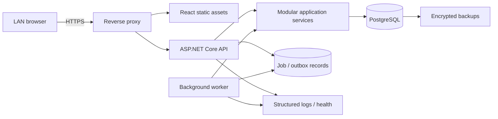
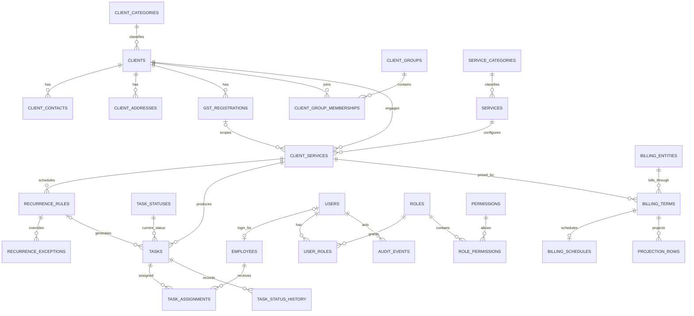
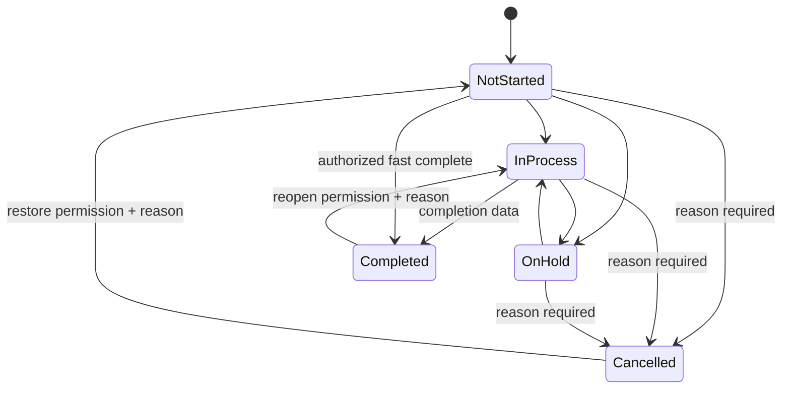

# CA Firm Practice Management System — Technical Blueprint

Status: Proposed baseline  
Date: 2026-08-19  
Scope: Architecture and phased roadmap only; no application implementation is authorized by this document.

# 1. Executive Summary

Build the system as a **modular monolith**: one deployable ASP.NET Core application, one React web client, one PostgreSQL database, and one background-worker process that initially ships from the same codebase. Modules have explicit ownership and communicate through application interfaces and domain events, but operations remain simple enough for a LAN server.

Use **one centralized relational database**. Separate databases per client would make cross-client reporting, task assignment, security administration, backups, migrations, and billing projections harder without creating meaningful protection for this single-firm application. Separate databases per functional module would sacrifice useful foreign keys and transactions. Logical boundaries are provided by modules, PostgreSQL schemas, permissions, and repository conventions—not separate databases.

The central business relationship is more accurately:

> Client → GST registrations and contacts; Service master → Client service agreement → recurrence and billing terms → generated work items → assignments; each billing term → billing entity.

This corrects two common modeling errors: a service is not a work item, and a client does not belong to one billing entity. Billing is configured per client-service agreement and is effective-dated.

Recommended stack: **.NET 10 LTS / ASP.NET Core 10, React 19 with TypeScript, PostgreSQL 18, Entity Framework Core 10, same-origin secure cookie authentication, OpenAPI, Docker-based development, and native Windows Server 2019 production hosting**. IIS serves the combined application and PostgreSQL runs as a native Windows service; Hyper-V and Docker Desktop are not production prerequisites. As of this blueprint, .NET 10 is an active LTS release supported through November 2028, and PostgreSQL 18 is supported through November 2030. Pin exact patch and package versions in the repository and update them through tested maintenance releases. See the official [.NET support policy](https://dotnet.microsoft.com/en-us/platform/support/policy), [PostgreSQL versioning policy](https://www.postgresql.org/support/versioning/), and [React version page](https://react.dev/versions).

The MVP ends after controlled client/service setup, task lifecycle, recurrence, calendar, billing configuration, projections, core dashboards/reports, audit, backup, and production hardening. Invoice generation, payments, client portal, messaging, and document management remain future modules.

# 2. Requirements Analysis

## 2.1 Business capabilities

The system has five core capability chains:

1. **Registry:** clients, legal/tax identifiers, categories, groups, contacts, addresses, GST registrations, active periods.
2. **Work definition:** service catalogue, client-specific service enrollment, recurrence and due-date rules.
3. **Work execution:** generated or one-off work items, assignments, status transitions, comments, due dates, calendar and workload.
4. **Commercial configuration:** effective-dated fees and billing schedules per client service and billing entity.
5. **Governance:** identity, RBAC, auditing, reporting, operations, migrations, backup and recovery.

## 2.2 Existing workbook observations

`Clients List.xlsm` contains two sheets: `Master Data` (worksheet bounds: 511 data rows, 39 columns) and `Billing MIS` (972 data rows, 20 columns). It is a useful migration source, not a target schema.

- `Master Data` stores services such as ITR, GST, TDS, Audit, and ROC Return as columns. This is a repeating-column anti-pattern; each enabled service becomes a `client_services` row.
- One GSTIN column cannot represent zero-to-many registrations. Values such as `NA` must become no registration, not a fake GSTIN.
- `Accountant`, `Leader`, and `ITR Data` are free-text people fields with spelling/case variants. They require employee matching and an exception report before import.
- `Billing MIS` stores months as columns and service/frequency in labels such as `Accounting - Monthly`. These become billing schedule/occurrence rows, not additional yearly schema columns.
- Existing “Billing Entity” values include legal-looking entities, people, and `Cash`. The migration cannot assume they are all legal billing entities; they require business classification.
- Client code is the safest initial join candidate between sheets, but duplicates, whitespace, obsolete codes, and missing rows must be profiled before import.

## 2.3 Quality attributes

| Attribute | Design response |
|---|---|
| Maintainability | Module-owned code/tables, dependency rules, ADRs, centralized policies and business services |
| Correctness | Foreign keys, check constraints, effective dates, idempotent generators, decimal money, deterministic date engine |
| Auditability | Append-only business audit events plus dedicated task status history |
| Security | Same-origin cookies, server-side authorization, least-privilege DB credentials, encrypted backups |
| Availability | Single-node recovery-focused design, health checks, service restart policy, tested restore |
| Performance | Server-side pagination, targeted composite indexes, asynchronous exports, explain-plan review |
| Evolvability | Versioned APIs, additive migrations, outbox/job boundaries, no UI-owned business rules |

# 3. Assumptions and Open Questions

Defaults below allow design to proceed. Items marked **Confirm before implementation** must be decided during Phase 0; they do not block this blueprint.

| Topic | Recommended default | Why / open question |
|---|---|---|
| Organization scope | One CA organization, multiple billing entities | Do not add SaaS tenant complexity. Add tenant isolation only if the product is later sold to unrelated firms. |
| Accounting period | Indian financial year, 1 April–31 March | Confirm whether reports also need calendar-year views. |
| Time and currency | `Asia/Kolkata`; INR; store timestamps as UTC | Dates retain local business meaning; money uses `numeric(19,2)` and ISO currency code. |
| Client groups | Many-to-many, with one optional `PRIMARY` membership | Supports family and corporate group overlaps; workbook’s single Group maps to `PRIMARY`. |
| Client identity | One client represents one legal/person engagement | A proprietorship’s owner vs trade concern needs a business decision during cleansing. |
| PAN/TAN | Optional, normalized uppercase; unique only after cleansing | duplicate PAN can be legitimate in current data. |
| GST service scope | Client service may optionally target one GST registration | One client can have GST work per GSTIN or a consolidated non-GSTIN service. |
| Employees/logins | Separate entities, employee may have zero/one user account | HR identity survives login disablement; service accounts need not be employees. |
| Task ownership | One primary assignee; zero-to-many secondary assignees | Teams are optional routing aids, not a replacement for accountable ownership. |
| Status workflow | Seed stable semantic codes; admin may rename labels and configure allowed transitions within guardrails | Completely free-form status meanings would break reporting and business logic. |
| Reopening | Manager/authorized user only, reason required, fully audited | Preserves historical completion details. |
| Billing meaning | Projection is a fee schedule, not an invoice or revenue-recognition ledger | Projection follows billing month. |
| Billing allocation | One active billing term per client service for a date; split billing deferred | If one service must split across entities, later add allocation rows totaling 100%. |
| Taxes | Projection amounts are professional fees exclusive of GST by default | Invoice/tax computation is outside MVP. |
| Holiday calendar | Weekend + configurable India/state/firm holidays | Confirm Saturday policy and state-specific calendars. |
| Notifications | In-app indicators only in MVP | Email, WhatsApp, SMS are future adapters. |
| Attachments | Deferred | Keep `task_id` and audit/event extension points, but do not build storage now. |
| Import cutover | Dry-run, reconcile, sign off, backup, then final import | Workbook remains read-only source and is archived with checksum. |

# 4. Recommended Technology Stack

## 4.1 Options

| Option | Strengths | Trade-offs | Fit |
|---|---|---|---|
| **A. ASP.NET Core 10 + React + PostgreSQL + EF Core** | Strong typing, mature DI/security/tooling, excellent concurrency, migration tooling, cross-platform service deployment, clear domain/application layers | Two languages; React requires frontend conventions | **Recommended** for long-lived business rules and controlled LAN/cloud operation |
| B. Django 5.2 LTS + Django REST Framework + React/HTMX + PostgreSQL | Fast administration and CRUD delivery, mature ORM/auth, productive Python ecosystem | Rich task/billing domain can drift into model/views without discipline; SPA still adds TypeScript | Strong alternative if the maintainers are primarily Python developers. Django 5.2 LTS is supported through April 2028 per the official [download/support page](https://www.djangoproject.com/download/). |
| C. NestJS + React + PostgreSQL + Prisma/TypeORM | TypeScript end to end, clear modules, approachable for web teams; Nest explicitly targets testable, loosely coupled applications | More runtime/package churn; ORM choice and transaction patterns need closer governance | Strong alternative if the team is TypeScript-first; see the official [NestJS architecture overview](https://docs.nestjs.com/introduction). |

## 4.2 Selected baseline

- Backend: .NET 10 LTS, ASP.NET Core minimal/controller endpoints organized as vertical slices.
- Frontend: React 19.2, TypeScript strict mode, Vite, React Router, TanStack Query, React Hook Form, Zod, and a single accessible component library selected in Phase 0.
- Database: PostgreSQL 18 current minor release; one database with PostgreSQL schemas (`identity`, `clients`, `services`, `tasks`, `billing`, `audit`, `system`).
- Data access: EF Core 10 + Npgsql; SQL projections for heavy reports where measured.
- Authentication: ASP.NET Core Identity-compatible password hashing and same-origin encrypted `HttpOnly`, `Secure`, `SameSite=Lax/Strict` cookies. No browser token in local storage.
- Authorization: policy-based permission checks plus query scopes (`own`, `team`, `all`).
- API: REST/JSON under `/api/v1`, OpenAPI generated from code.
- Validation: request DTO validation at API boundary; domain invariants in application/domain services; DB constraints as last line of defense.
- Background work: hosted worker initially; persisted job/outbox records and PostgreSQL advisory lock make generation restart-safe. Split into a separate worker deployment only when needed.
- Logging/metrics: structured JSON logs, correlation IDs, health endpoints, bounded log retention; OpenTelemetry-ready interfaces but no observability platform required for MVP.
- Testing: xUnit, assertion library, Testcontainers/PostgreSQL integration tests, API tests, Vitest/Testing Library, Playwright critical-path E2E.
- Deployment: one codebase with two tested runtime lanes. Docker Compose supports macOS/Windows development; a versioned `win-x64` release package installs natively on Windows Server 2019 under IIS with a PostgreSQL Windows service. Staff use the same browser UI on Windows and macOS.

The stack is a baseline, not permission to take every dependency listed immediately. Each dependency is added only in the phase that uses it and is pinned through lockfiles/central package management.

# 5. Architecture

## 5.1 Architecture style

Use a modular monolith with a thin HTTP host, cohesive business modules, a shared relational database, and an internal background worker. This provides transactional integrity and straightforward reporting without distributed-system overhead. Module boundaries are enforced in code review and automated architecture tests.



## 5.2 Layering

Within each module:

- **Domain:** entities, value objects, policies and domain events. No EF, HTTP or React dependencies.
- **Application:** commands, queries, use cases, authorization requirements and interfaces.
- **Infrastructure:** EF mappings/repositories, job adapters, hashing, clock and external adapters.
- **Presentation:** endpoints, DTOs and module registration.

The frontend never connects to PostgreSQL and never decides permissions or authoritative billing/due dates. It asks the API and renders results.

## 5.3 Request and event rules

1. Endpoint authenticates, validates shape, and invokes one use case.
2. Application service authorizes action and record scope.
3. Domain service applies invariant inside one database transaction.
4. Audit/outbox records are written in the same transaction when material.
5. Response returns a DTO, never an EF entity.
6. Post-transaction workers handle generation, exports and future notifications idempotently.

No in-process event may hide a required synchronous invariant. Cross-module reads use stable query interfaces or read models; writes go through the owning module.

# 6. Module Boundaries

| Module | Owns | May read | May modify | Depends on |
|---|---|---|---|---|
| Identity & Access | users, sessions, roles, permissions, role mappings | employee identity | only its tables | system clock, audit |
| Employees & Teams | employees, teams, memberships | user linkage, task summaries | only its tables | identity query interface, audit |
| Clients | clients, categories, contacts, addresses, GST registrations, groups/memberships | task/billing summaries through read APIs | only client tables | audit |
| Services | service categories, service master, client service agreements | client/GSTIN identifiers | service tables | clients query interface, audit |
| Tasks | work items, assignments, statuses, history, comments | client/service/employee display data | task tables | services, employees, audit |
| Scheduling | recurrence/due rules, exceptions, generation runs | active client service agreements, holidays | scheduling tables; creates tasks only via Tasks application interface | services, tasks, system |
| Calendar | no source-of-truth tables; read model/query | tasks, assignments, client/service names | none | tasks |
| Billing | billing entities, effective-dated terms/schedules | clients and client services | billing tables | services, audit |
| Projection | optional cached projection runs/rows | billing terms, schedules, clients/groups | projection cache only | billing, clients |
| Reports | report definitions/export jobs | approved read models | export job metadata | all through reporting queries |
| Audit | audit events | actor and target display data | append-only audit tables | identity/system |
| System | holidays, settings, jobs/outbox, import batches | none | system tables | audit |

Modules do not directly mutate another module’s tables. The database can still enforce cross-module foreign keys; ownership is an application rule, not an excuse to weaken integrity.

# 7. Database Architecture

## 7.1 Database decision

| Option | Evaluation |
|---|---|
| One centralized relational database | Best reporting, transactional consistency, backup, migration and LAN operations. Selected. |
| Database per client | Hundreds/thousands of schemas, migrations and connections; difficult group reporting and task assignment; inappropriate unless strict tenant isolation is a product requirement. |
| Database per module | Loses simple FKs/transactions and creates distributed reporting; unnecessary for current scale. |
| One database, logical schemas | Selected implementation: central integrity plus discoverable module ownership. |

All business tables use `uuid` primary keys generated as time-ordered UUIDs, `timestamptz` for instants, `date` for business dates, `numeric(19,2)` for money, `char(3)` currency, and lowercase immutable codes. Store normalized search fields where necessary; preserve user-facing original values separately.

## 7.2 Cross-cutting column conventions

- Mutable masters: `id`, `created_at`, `created_by_user_id`, `updated_at`, `updated_by_user_id`, `row_version`.
- Deactivation, not generic deletion: `is_active`, `active_from`, `inactive_at`, `inactive_reason` as applicable.
- Transaction records such as tasks and audit events are never soft-deleted. They use explicit `CANCELLED`, `VOID`, or retention operations.
- `row_version bigint` increments on update and is exposed as an ETag/version to prevent lost updates.
- Codes use `varchar(50)` and unique indexes on normalized uppercase/lowercase expression as appropriate.
- Foreign-key delete behavior defaults to `RESTRICT`; cascade is allowed only for true dependent drafts/join rows, never historical records.
- PII is not duplicated into arbitrary JSON. Snapshot only fields required to preserve historical meaning.

## 7.3 Integrity patterns

- Effective-dated rows use `[effective_from, effective_to)` semantics; `effective_to` is nullable/exclusive.
- PostgreSQL exclusion constraints or transactional overlap checks prevent overlapping active billing terms for the same agreement/scope.
- Partial unique index enforces at most one primary GSTIN per client and one primary group membership per client.
- Tasks generated from a recurrence have a unique `(client_service_id, recurrence_rule_id, period_start, period_end)` occurrence key.
- Monetary calculations round once at the defined output boundary using an explicit midpoint policy; never use floating point.
- Client/service deactivation closes future eligibility but does not rewrite history.

# 8. ERD



The diagram omits teams, sessions, holidays, job/outbox and lookup children for legibility. It is a logical ERD; the migration-generated physical ERD becomes authoritative once implementation starts.

# 9. Entity Catalogue

Types below are PostgreSQL types. Every foreign key receives an index unless already covered by a more useful composite index.

## 9.1 Identity and employees

### `identity.users`

Purpose: login identity, independent of employment. PK `id uuid`. Columns: `username varchar(100)`, `normalized_username varchar(100)`, `email varchar(320)`, `normalized_email varchar(320)`, `password_hash text`, `security_stamp varchar(100)`, `is_active boolean`, `failed_count int`, `locked_until timestamptz`, audit timestamps/version. Unique: normalized username; normalized email where non-null. Index: `(is_active)`. Password hashes never enter audit data.

### `identity.user_sessions`

Purpose: revocable server-side session metadata. PK `id uuid`; FK `user_id → users`; columns `token_hash bytea`, `created_at`, `last_seen_at`, `expires_at`, `revoked_at`, `ip_hash`, `user_agent varchar(500)`. Unique token hash; indexes `(user_id, revoked_at)`, `(expires_at)`. Raw session secret exists only in the protected cookie.

### `identity.roles`, `identity.permissions`, `identity.user_roles`, `identity.role_permissions`

- `roles`: PK UUID; `code varchar(50)`, `name varchar(100)`, `description`, `is_system`, `is_active`; unique code/name.
- `permissions`: PK UUID; immutable `code varchar(100)` such as `tasks.assign`, module/action/description; unique code. New code capability still requires software support; assignment is configurable.
- `user_roles`: composite PK/FKs `(user_id, role_id)` plus assignment audit fields; index `(role_id, user_id)`.
- `role_permissions`: composite PK/FKs `(role_id, permission_id)`, optional `scope_ceiling varchar(20)`; index `(permission_id, role_id)`.

### `employees.employees`

Purpose: staff/person record. PK UUID; optional unique FK `user_id → identity.users`; columns `employee_code varchar(30)`, `display_name varchar(200)`, `email`, `phone`, `designation`, `department`, nullable self-FK `manager_employee_id`, `joined_on`, `left_on`, `is_active`, timestamps/version. Unique normalized employee code; indexes `(manager_employee_id, is_active)`, normalized name/email.

### `employees.teams`, `employees.team_memberships`

`teams`: code, name, optional manager FK, active flag. `team_memberships`: composite `(team_id, employee_id)`, `valid_from`, `valid_to`, `is_lead`; enforce non-overlapping active membership intervals if history is required. Index employee/active interval.

## 9.2 Clients

### `clients.client_categories`

Configurable legal constitution. PK UUID; `code`, `name`, `display_order`, `is_active`; unique code and normalized name. Deactivation prevents new use but preserves references. Seeds include INDIVIDUAL, HUF, PARTNERSHIP, LLP, PRIVATE_LIMITED, PUBLIC_LIMITED, TRUST, SOCIETY, PROPRIETORSHIP, OPC, OTHER; map workbook `Firm` only after definition is agreed.

### `clients.clients`

Purpose: core client identity. PK UUID. Columns: `client_code varchar(30)`, `legacy_code varchar(30)`, `display_name varchar(250)`, `legal_name varchar(250)`, FK `category_id`, `pan varchar(10)`, `tan varchar(10)`, `onboarded_on date`, `status varchar(20)`, `deactivated_on date`, `deactivation_reason text`, `notes text`, timestamps/version. Unique normalized `client_code`; PAN/TAN format checks. Indexes `(status, display_name)`, `(category_id, status)`, normalized display/legal name, PAN, legacy code. Status is `ACTIVE` or `INACTIVE` in MVP; deactivation requires date/reason and closes future generation.

### `clients.client_contacts`

PK UUID, FK client; `contact_type`, `name`, `designation`, `phone`, `email`, `is_primary`, `is_active`, notes and audit columns. Partial unique primary per client/contact type; indexes normalized phone/email and `(client_id, is_active)`.

### `clients.client_addresses`

PK UUID, FK client; `address_type`, address lines, city, district, FK/state code, postal code, country code, `is_primary`, active interval. Partial unique primary per client/type; index `(client_id, is_active)` and postal code.

### `clients.indian_states`

Seeded reference: PK/code `state_code char(2)`, name, GST jurisdiction code if separately needed, active flag. Not freely deletable.

### `clients.gst_registrations`

PK UUID; FK client and state; `gstin varchar(15)`, `trade_name varchar(250)`, `registration_status varchar(30)`, `effective_from date`, `effective_to date`, `is_primary boolean`, `is_active boolean`, cancellation reason, timestamps/version. Unique uppercase GSTIN globally after cleansing; partial unique primary per client; checks validate length/shape and effective range. Indexes `(client_id, is_active)`, `(state_code, is_active)`, GSTIN. GSTIN is a business identifier, not the row PK.

### `clients.client_groups`, `clients.client_group_memberships`

`client_groups`: PK UUID; code, name, description, active flag; unique normalized code/name. Membership: composite/FK client/group, `membership_type` (`PRIMARY`, `SECONDARY`), effective dates, notes; unique `(client_id, group_id, effective_from)` and partial one current PRIMARY per client. Index `(group_id, valid_to, client_id)` supports group dashboards.

## 9.3 Services and client configuration

### `services.service_categories`

PK UUID; code, name, display order, active. Unique code/name.

### `services.services`

Purpose: reusable service definition, never a dated task. PK UUID; FK category; `code varchar(50)`, `name varchar(150)`, `description`, `default_billable boolean`, `supports_recurrence boolean`, `supports_gstin_scope boolean`, `is_active`, timestamps/version. Unique code and normalized name; index `(category_id, is_active)`. Defaults aid new configuration but are copied/overridden in client service setup.

### `services.client_services`

Purpose: a client’s engagement/configuration for a service. PK UUID; FKs client, service, optional GST registration; `engagement_code`, `title_override`, `effective_from`, `effective_to`, `is_active`, `default_priority`, `responsible_team_id`, notes, timestamps/version. Unique active logical scope `(client_id, service_id, gst_registration_id)` with null-safe semantics; indexes `(client_id, is_active)`, `(service_id, is_active)`, `(responsible_team_id, is_active)`. A GST FK must belong to the same client, enforced in application plus composite DB constraint/trigger if necessary.

## 9.4 Tasks and scheduling

### `tasks.task_statuses`, `tasks.task_status_transitions`

Status master: PK UUID, immutable code, configurable label/color/order, semantic flags `is_terminal`, `counts_as_complete`, active flag. Seeds: NOT_STARTED, IN_PROCESS, ON_HOLD, COMPLETED, CANCELLED. Transition table composite `(from_status_id, to_status_id)`, required permission and booleans `reason_required`, `completion_data_required`. System semantics cannot be deleted through UI.

### `scheduling.recurrence_rules`

PK UUID; FK client service; `frequency_code` (MONTHLY, QUARTERLY, HALF_YEARLY, YEARLY, CUSTOM_MONTHS), `interval_count smallint`, `anchor_date date`, `period_basis`, `due_rule_code`, nullable `due_day smallint`, `due_month_offset smallint`, `due_day_offset smallint`, `business_day_adjustment`, `generate_lead_days smallint`, `timezone`, `effective_from/to`, `rule_version int`, `is_active`, timestamps/version. Checks enforce valid combinations. Index `(is_active, effective_from, effective_to)` and `(client_service_id, is_active)`. A rule change closes the old version and creates a new row.

### `scheduling.recurrence_rule_months`

For custom/specific month schedules: composite PK `(recurrence_rule_id, month_number)` with check 1–12 and optional `sequence`. Do not store comma-separated months.

### `scheduling.recurrence_exceptions`

PK UUID; FK recurrence rule; `period_start`, `period_end`, `action` (`SKIP`, `OVERRIDE`), override due date/title/assignee/priority, required reason, timestamps/actor. Unique `(recurrence_rule_id, period_start, period_end)`. Existing generated tasks are not silently rewritten by an exception.

### `tasks.tasks`

Purpose: actual work item. PK UUID; FK client, service, client service (nullable only for approved one-off task), optional GST registration and recurrence rule; `task_number bigint generated/sequence`, `title`, `description`, `period_start/end`, `due_date`, FK current status, `priority`, `billable_snapshot boolean`, `completed_at`, `completed_by`, `cancelled_at`, `cancelled_by`, cancellation reason, `reopened_count`, created source, timestamps/version. Unique task number and generated occurrence key. Indexes `(due_date, status_id)`, `(client_id, due_date)`, `(service_id, due_date)`, `(client_service_id, period_start)`, partial overdue candidate index on nonterminal statuses, and created timestamp. Denormalized client/service names are not stored; historical display uses referenced inactive masters, which remain retained.

### `tasks.task_assignments`

PK UUID; FKs task, employee; `assignment_role` (`PRIMARY`, `SECONDARY`, `REVIEWER`), `assigned_at/by`, `unassigned_at/by`, remarks. Partial unique current PRIMARY per task and unique current `(task_id, employee_id, assignment_role)`. Index `(employee_id, unassigned_at, task_id)` supports My Tasks.

### `tasks.task_status_history`

Append-only PK UUID; FKs task, from/to statuses, actor; `changed_at`, `reason`, `completion_note`, optional structured metadata. Index `(task_id, changed_at desc)` and `(to_status_id, changed_at)`. Every transition, including reopen, is written in the same transaction as `tasks.status_id`.

### `tasks.task_comments`

PK UUID; FK task/author; `body text`, created/edited timestamps, `is_redacted`. No hard delete; authorized redaction preserves metadata. Attachments are deferred.

### `scheduling.generation_runs`

PK UUID; run window, started/finished timestamps, status, worker ID, counts, error summary. Child `generation_run_items` records recurrence, occurrence key, outcome and task ID. Unique occurrence constraint is final idempotency protection.

### `system.holidays`

PK UUID; `calendar_code`, `holiday_date`, name, `scope_type`/optional scope ID, active flag. Unique calendar/date/scope. Index holiday date. Weekend rules are settings/versioned configuration.

## 9.5 Billing and projection

### `billing.billing_entities`

Purpose: legal firm/entity issuing a future invoice. PK UUID; `code`, legal/trade name, PAN, optional GSTIN, address/contact fields or linked structured address later, `currency_code`, `is_active`, effective dates, timestamps/version. Unique code; GSTIN unique where present; indexes active/name. `Cash` is not automatically a billing entity—it may be a payment mode or migration placeholder requiring cleansing.

### `billing.billing_terms`

Purpose: versioned commercial terms for a client service. PK UUID; FKs client service and billing entity; `is_billable`, `pricing_model` (`FIXED`, later `HOURLY`/`UNIT`), `amount numeric(19,2)`, `currency_code char(3)`, `tax_inclusive boolean`, `effective_from/to`, `version`, notes, timestamps/version. Check nonnegative amount and required entity/amount when billable. Prevent overlapping active terms for the same client service. Index `(client_service_id, effective_from, effective_to)` and `(billing_entity_id, effective_from)`.

### `billing.billing_schedules`

One-to-one FK/PK billing term; `frequency_code` (`MONTHLY`, `QUARTERLY`, `HALF_YEARLY`, `ANNUALLY`, `SPECIFIC_MONTH`, `ONE_TIME`, `CUSTOM_MONTHS`), `interval_count`, `anchor_date`, `billing_day`, `business_day_adjustment`, `projection_timing` (`PER_BILLING_EVENT` default), and optional one-time date. Child `billing_schedule_months` stores custom months. Checks enforce valid combinations.

Task recurrence and billing schedule are deliberately separate: monthly work may be billed quarterly, and annual work may be billed in a selected month.

### `billing.projection_runs`, `billing.projection_rows` (defer persistence until Phase 8)

Projection can first be computed as a query. Persist only when exports/performance require reproducible snapshots. Run: input horizon/as-of date, filters hash, status, created by/at. Row: FK run, billing term/entity/client/service, `projection_date`, service period, amount/currency, explanation JSON. Unique `(run_id, billing_term_id, projection_date, service_period_start)`. Index common report dimensions. These rows are cache/snapshots, never invoice truth.

## 9.6 Audit, jobs, settings and import

### `audit.audit_events`

Append-only PK UUID; `occurred_at`, optional actor user/employee; `action_code`, `module`, `entity_type`, `entity_id uuid`, `correlation_id`, `request_id`, `source`, `old_values jsonb`, `new_values jsonb`, `reason`, `ip_hash`. Index `(entity_type, entity_id, occurred_at desc)`, `(actor_user_id, occurred_at desc)`, `(action_code, occurred_at)`. JSON is appropriate here because audit payload shapes vary; secrets, password hashes, session tokens, full file contents and routine read events are excluded.

### `system.outbox_messages`, `system.background_jobs`

Outbox: PK UUID, event type, JSON payload, occurred/processed timestamps, attempts/error, unique event ID; index unprocessed. Jobs: type, payload, due time, locked owner/until, attempts/status/error; index `(status, due_at)`. Payloads are versioned and contain IDs, not mutable object dumps.

### `system.settings`

Key/value configuration with typed `value_json`, scope, schema version, modified actor/time. Only genuinely operational settings belong here. Core relational data and arbitrary business logic do not.

### `system.import_batches`, `system.import_rows`

Tracks source filename/checksum, dry-run/final mode, counts, status and actor. Per-row source key, target entity ID, outcome, warnings/errors and sanitized raw reference. Enables repeatable workbook migration and reconciliation without polluting audit events.

# 10. RBAC

## 10.1 Model

Use action-level permissions plus a small set of record scopes:

- **Action:** `clients.view`, `clients.create`, `clients.edit`, `clients.deactivate`, `gstins.manage`, `services.manage`, `tasks.view`, `tasks.create`, `tasks.assign`, `tasks.change_status`, `tasks.reopen`, `billing.configure`, `billing.project`, `reports.export`, `users.manage`, `roles.manage`, `audit.view`, `settings.manage`.
- **Scope:** `OWN`, `TEAM`, `ALL`. “Own” means currently assigned; “team” uses active team membership/management. Scope is evaluated in server queries, not by filtering already-returned data in the browser.
- **Field sensitivity:** separate permissions for billing amounts, PII export and audit visibility where needed.

Roles are collections of permissions; initial role names are seed defaults, not business logic. Avoid unrestricted per-record ACLs in MVP. Add explicit client-team responsibility or row-level grants later only if a real confidentiality requirement appears.

## 10.2 Enforcement

Every endpoint declares a permission policy. Application handlers repeat/own the authoritative record-scope check so alternate entry points cannot bypass it. Report/export queries use the same scope builder. UI permission checks improve usability only; they are not security controls.

Critical tests cover denial as well as success, cross-team access, inactive user, changed role, direct object ID access, and export scope. Role changes revoke active sessions or increment a security stamp so new permissions take effect promptly.

# 11. Task Architecture

## 11.1 Lifecycle



Transitions use a single `ChangeTaskStatus` application service. It validates allowed transition, permission, reason/completion data, optimistic version, and current client/service constraints; updates the current status and appends history atomically.

Assignment uses a single service enforcing at most one current primary assignee. Reassignment closes the prior assignment rather than overwriting it. Task creation snapshots only operational facts that may legitimately differ per occurrence (title, due date, billable indicator); it retains FKs for current master display.

## 11.2 Deactivation behavior

- Deactivating a client requires reason/date and a preview of active client services, open tasks and future billing terms.
- In one transaction: mark client inactive and close/disable future client-service/recurrence eligibility from the chosen date. Do not auto-cancel existing open tasks without an explicit admin choice.
- Existing tasks, assignments, GST registrations, terms and audit history remain queryable.
- Operational lists default to active clients; historical/report filters can include inactive.
- Reactivation is a distinct audited action; old schedules do not silently restart. Admin chooses which services/rules to reopen.

# 12. Recurring Task Engine

## 12.1 Model and generation

The recurrence rule describes service periods and occurrence cadence; the due-date policy calculates due date. A persisted worker runs at least daily and generates only a rolling horizon (default 45 days before due date), not years of tasks.

Algorithm:

1. Acquire a singleton PostgreSQL advisory lock and open a generation run.
2. Select active rule versions whose horizon intersects the run window and whose client, service and client-service agreement are eligible.
3. Enumerate service periods deterministically in `Asia/Kolkata`.
4. Apply matching skip/override exception.
5. Calculate statutory/firm due date, then weekend/holiday adjustment (`NONE`, `PREVIOUS_BUSINESS_DAY`, `NEXT_BUSINESS_DAY`).
6. Build immutable occurrence key and insert task through the Tasks module.
7. Unique constraint makes reruns harmless; record created/already-existed/skipped/error outcome.
8. Commit bounded batches and surface failures on the admin job dashboard.

## 12.2 Example: monthly GST return

Agreement: ABC Pvt Ltd + GST Return + GSTIN `07...`; monthly periods; rule effective 1 April 2026; due on day 20 of the following month; next-business-day adjustment; 21-day generation lead.

- Period: 1–31 July 2026.
- Nominal due date: 20 August 2026.
- If 20 August is a configured holiday, move to the next business day.
- On/after 30 July (21 days before nominal due), generator creates “GST Return — ABC Pvt Ltd — July 2026,” links the GSTIN/rule/period, and assigns according to current routing.
- A repeated run resolves the same occurrence key and creates nothing.

## 12.3 Changes and exceptions

- A rule edit is effective-dated: close v1 and create v2. It never rewrites completed/historical tasks.
- Generated future tasks inside an admin-defined review window are shown in a change impact preview. Admin may leave them, reschedule selected tasks, or cancel/regenerate them with reasons. No silent bulk rewrite.
- One-off due-date overrides live on the task or recurrence exception and are audited.
- Missed generator runs catch up from the last safe watermark; overdue occurrences are still created and flagged.
- Client/service deactivation stops new generation from effective date. Existing open tasks remain explicit decisions.
- Use a pluggable `IDueDatePolicy` keyed by service/rule. Generic rules cover most services; statutory exceptions get isolated, tested policy classes—not UI formulas or arbitrary scripts.

# 13. Billing Architecture

Billing configuration follows precedence:

1. Service master supplies defaults only when creating a client service.
2. Client-service billing term is authoritative for the effective date.
3. An approved one-off task override may affect later invoicing, but task amounts are not required for projection MVP.

`client_services` represents what work the firm performs; `billing_terms` represents the commercial agreement; `billing_schedules` represents when expected billing occurs. This lets monthly GST work bill quarterly through Firm A and annual Audit work bill in September through Firm B for the same client.

Terms are immutable once used in finalized projection/invoice contexts: close the date range and create a new version. Billing entity deactivation blocks new terms but retains historical references. Do not attach a single `billing_entity_id` to `clients`.

The MVP supports fixed fees. Hourly, unit, slab, bundled and split-entity pricing are explicit future pricing strategies, not overloaded negative amounts or notes.

# 14. Billing Projection

## 14.1 Calculation contract

Input: date range, as-of date, permitted record scope, optional client/group/service/entity filters. For every billable term overlapping the range:

1. Expand billing schedule occurrences within `[from, to]` using effective dates and business-day policy.
2. Emit `amount` for each occurrence in the term currency.
3. Attribute dimensions from stable FKs: client, all current/effective group memberships per stated grouping rule, service, billing entity, and optionally responsible employee/team.
4. Aggregate only within the same currency. MVP has INR only; never silently combine currencies.
5. Return detail lines plus totals and an explanation (`term version`, frequency, occurrence date, amount).

For fixed billing:

`ProjectedAmount(range) = Σ occurrenceAmount(term, date)` for eligible schedule occurrences in the range.

Examples: ₹2,000 monthly → ₹24,000 over 12 occurrences; ₹1,000 quarterly → ₹4,000; ₹25,000 annual → ₹25,000, total ₹53,000 for a full year if all terms cover that year. Boundary months follow effective dates and the configured billing anchor, not division by 12.

## 14.2 Semantics and reporting

- Default group rollup uses membership effective on projection date. If a client belongs to multiple groups, “all memberships” reports can double count; financial totals therefore require a `PRIMARY group only` default and label alternate multi-membership views.
- Employee attribution is operational and must state its rule (responsible team/employee as of occurrence); it is not revenue ownership.
- “Projected” remains distinct from invoice issued, receivable and payment. Future modules may reconcile projection → invoice line via references.
- Calculate on demand for normal ranges. Add cached `projection_runs/rows` only after measurement or when users require frozen scenario snapshots.
- Tests cover leap years, fiscal-year boundaries, partial terms, fee change mid-period, selected month, one-time schedule, inactive entity, holiday movement, grouping and rounding.

# 15. Calendar

Calendar is a task read model, not a separate source of truth. Endpoints query tasks with server-side filters and permission scope.

- Views: day, work week, week, month, agenda/list.
- Fields: client, optional GSTIN, service, task title, primary/secondary assignees, due date, status, priority and billable flag. Amount is separately permissioned.
- Buckets: overdue (`due_date < local today` and nonterminal), due today, upcoming, completed and cancelled.
- Admin `ALL`, manager `TEAM`, employee `OWN`; explicit permissions can widen scope.
- Dragging a task to another date is disabled initially. Reschedule is an explicit action requiring reason and audit, preventing accidental due-date changes.
- Queries use bounded date windows, pagination for agenda mode, and composite indexes; month view can return compact summaries and lazy-load details.

# 16. API Architecture

## 16.1 Conventions

- Base path `/api/v1`; plural nouns; JSON uses camelCase; dates are `YYYY-MM-DD`; instants are ISO 8601 UTC.
- `GET` reads, `POST` creates/executes commands, `PUT` replaces only where full replacement is meaningful, `PATCH` performs constrained partial edits, `DELETE` is not used for historical business data. Commands such as deactivate/reopen use explicit subresources.
- List envelope: `{ items, page, pageSize, totalCount }`; default page 1/25, maximum 200. Stable sort always includes `id` as a tie-breaker. Cursor pagination can replace offset pagination for very large task histories without breaking resource shapes.
- Filtering uses explicit query parameters, e.g. `status=IN_PROCESS&dueFrom=2026-08-01&sort=dueDate,-priority`; unknown filters return 400. Search is bounded and normalized.
- Create returns 201 + `Location`; async report/export returns 202 + job resource; update returns resource or 204 consistently.
- Optimistic concurrency uses `ETag`/`If-Match` backed by row version; stale updates return 409.
- Idempotency key is required for generation/import/bulk commands and optional for user create commands.

## 16.2 Representative endpoints

```text
POST   /api/v1/auth/login
POST   /api/v1/auth/logout
GET    /api/v1/auth/me
POST   /api/v1/auth/change-password

GET    /api/v1/clients
POST   /api/v1/clients
GET    /api/v1/clients/{clientId}
PATCH  /api/v1/clients/{clientId}
POST   /api/v1/clients/{clientId}/deactivation
POST   /api/v1/clients/{clientId}/reactivation
GET    /api/v1/clients/{clientId}/gst-registrations
POST   /api/v1/clients/{clientId}/gst-registrations
GET    /api/v1/client-groups/{groupId}/summary

GET    /api/v1/services
POST   /api/v1/services
GET    /api/v1/clients/{clientId}/services
POST   /api/v1/clients/{clientId}/services
PATCH  /api/v1/client-services/{clientServiceId}
PUT    /api/v1/client-services/{clientServiceId}/recurrence

GET    /api/v1/employees
POST   /api/v1/employees
GET    /api/v1/teams/{teamId}/workload

GET    /api/v1/tasks
POST   /api/v1/tasks
GET    /api/v1/tasks/{taskId}
POST   /api/v1/tasks/{taskId}/assignments
POST   /api/v1/tasks/{taskId}/status-transitions
POST   /api/v1/tasks/{taskId}/reschedule
GET    /api/v1/calendar?from=2026-08-01&to=2026-08-31

GET    /api/v1/billing-entities
POST   /api/v1/billing-entities
GET    /api/v1/client-services/{id}/billing-terms
POST   /api/v1/client-services/{id}/billing-terms
POST   /api/v1/billing-projections:calculate

GET    /api/v1/reports/tasks
POST   /api/v1/report-exports
GET    /api/v1/report-exports/{jobId}
GET    /api/v1/audit-events?entityType=Client&entityId={id}
```

The colon command endpoint is reserved for calculation/action cases with no natural subresource. Bulk endpoints have explicit item limits and per-item outcomes.

## 16.3 Error contract

Use RFC 9457-style Problem Details:

```json
{
  "type": "https://practice.local/problems/validation",
  "title": "Validation failed",
  "status": 400,
  "code": "VALIDATION_FAILED",
  "traceId": "...",
  "errors": { "gstin": ["GSTIN format is invalid."] }
}
```

Map validation 400, unauthenticated 401, forbidden 403, not found 404, conflict/concurrency/duplicate 409, rule violation 422, rate limit 429, unexpected error 500. Constraint names map to safe business messages. Stack traces, SQL, credentials and internal IDs not required by the user are never returned.

# 17. Frontend Architecture

## 17.1 Structure and state

Use feature folders mirroring backend modules. Server state lives in TanStack Query; short-lived form/view state stays local; authenticated user/permissions have one session provider. Avoid a global store until a demonstrated cross-feature state need exists. Generated API types may be produced from OpenAPI, while user-facing view models remain feature-owned.

All large lists are server-paginated, sortable and filterable. Filters are reflected in the URL so reports can be bookmarked. Forms have inline validation, unsaved-change warnings, clear saving/success/failure states, keyboard support and accessible labels. Dangerous actions use impact previews and explicit reason fields.

## 17.2 Screen catalogue

| Screen | Purpose and main fields | Filters / actions | Permission and UX |
|---|---|---|---|
| Login | username/email, password | sign in, change expired password | Generic failure; lockout without account enumeration |
| Main dashboard | active clients, due today, overdue, in process, completed, projected month | date/team/entity scope; drill down | Metrics respect record scope and show last refresh |
| Client list | code, name, category, primary group, GSTIN count, status | name/code/phone/email/GSTIN/category/group/status; create/export | Active default; saved filters later |
| Client details | identity, contacts, addresses, GSTINs, services, open tasks, billing summary, audit timeline | edit/deactivate/reactivate/add child records | Tabs lazy-load; impact preview before deactivation |
| GST registrations | GSTIN, state, trade name, dates, status, primary | add/edit/deactivate/set primary | Format feedback; prevent cross-client linkage |
| Groups | group metadata, members, task/billing summaries | add/remove membership, view group | Warn about multiple membership totals |
| Service master | code/name/category/defaults/active | search, create/edit/deactivate | Defaults clearly distinguished from client overrides |
| Client service setup | service/GSTIN scope, effective dates, recurrence, routing, billing terms | enroll, preview occurrences, close/change versions | Wizard with summary; no hidden schedule defaults |
| Employees/users | employee, manager/team, account status, roles | invite/create login, disable, reset, assign role | Employee and login states shown separately |
| Task list | number, client/service/GSTIN, assignee, due, priority/status | all required filters, bulk assign/status only when safe | Dense keyboard-friendly table; scope indicator |
| Task detail | work/period/due/assignees/status/history/comments | assign, transition, reschedule | Timeline makes audit visible; reasons required |
| Calendar | day/week/month/agenda | employee/team/status/priority/service | Color never sole status signal; compact month cards |
| Billing configuration | client service, entity, fee, currency, effective dates, schedule | add future version/close term | Timeline and overlap validation |
| Projection | horizon and dimensional filters, detail/totals | calculate, drill down, export | Shows definition, as-of time and excludes invoice claims |
| Reports | core report catalog | filter, run, export | Async exports, permission scoped |
| Administration | categories, roles, holidays, job health, settings, import | CRUD appropriate masters, retry jobs | Guardrails on semantic codes and system role |

MVP dashboard metrics: active clients, due today, overdue, in process, completed in selected period, tasks by employee, and current-month projected billing by entity. Defer trend analytics, utilization, completion-rate targets, advanced forecasting and AI summaries.

# 18. Security

## 18.1 Application controls

- Password hashing uses the framework’s versioned adaptive password hasher; never custom crypto. Configure length-first passphrases, breached-password checks if network policy permits, lockout/backoff, forced change for admin-created temporary credentials, and no password in logs/audit.
- Browser authentication uses encrypted same-origin cookies (`HttpOnly`, `Secure`, appropriate `SameSite`) with antiforgery tokens on state-changing requests. ASP.NET Core supports cookie authentication directly; see the official [cookie authentication guidance](https://learn.microsoft.com/en-us/aspnet/core/security/authentication/cookie?view=aspnetcore-10.0).
- Authorization is enforced in endpoints and application/query scope. Object IDs are untrusted input.
- EF parameterization, no string-concatenated SQL, allow-listed sorting, DTO binding, length/range limits and output encoding protect common injection/XSS paths.
- Content Security Policy, frame denial, MIME sniffing prevention, Referrer Policy and strict transport headers are set at reverse proxy/app.
- Login and expensive report endpoints are rate-limited; LAN origin does not imply trusted user.
- Secrets come from server environment/secret files readable only by service account; never source control or frontend bundles.
- Separate PostgreSQL roles: migration owner (deployment only), application DML role, backup role, monitoring role. App cannot alter schema.
- TLS is used even on LAN, preferably with an internal CA certificate distributed to client machines. Firewall allows HTTPS from authorized LAN subnet; PostgreSQL is not exposed to desktops.

## 18.2 Operational controls

Server has a static/reserved address, supported OS patches, endpoint protection, restricted admin login, time sync, disk encryption where practical and UPS protection. Backups are encrypted and access-tested. Production data is not copied to development without masking. Admin actions and permission changes are audited.

No secrets or sensitive PII enter structured logs. Logs use stable IDs and trace IDs. Define a data-retention policy before adding document uploads or client portal access.

# 19. Audit Logging

Audit business-significant writes: client/GSTIN create/change/deactivate; client service/rule changes; task create/assignment/status/reschedule; billing entity/term changes; employee/user enable/disable; role/permission changes; import, export of sensitive reports; system setting/holiday change; backup/restore administrative outcomes.

Do not audit every list/read, health check, password hash, session token, noisy technical heartbeat, or duplicated full entity for trivial timestamps. Sensitive export access may get a compact access event, but general reads belong in access logs if required.

Audit event fields identify actor, UTC timestamp, action, entity, correlation/request ID, source, reason and allow-listed old/new values. Domain-specific history such as task status remains normalized for easy reporting; generic audit JSON provides forensic context. Audit writes are transactional with the business write and append-only for application roles. Retention default: at least seven financial years plus current year, subject to the firm’s legal policy; archive only through an approved, logged process.

# 20. Testing

## 20.1 Test pyramid and gates

- **Unit:** due-date policies, recurrence enumeration, billing schedule expansion, rounding, status transitions, permission scope predicates.
- **Domain/application:** commands with in-memory fakes only where behavior is persistence-independent.
- **Integration:** real PostgreSQL container for constraints, EF mappings, transactions, indexes/query behavior, concurrent generation and migrations.
- **API:** authentication, validation, authorization, Problem Details, pagination/filtering/concurrency.
- **Frontend:** component/form/accessibility behavior with mocked API; avoid snapshot-only tests.
- **E2E:** Playwright login → create client → configure service → create/assign/complete task; recurrence/calendar; billing projection; deactivation; permission denial.
- **Migration:** empty database migrate up; previous release copy migrate forward; seed idempotency; restore backup then migrate; destructive migration rehearsal.

Required merge gates: backend compile/analyzers, unit/integration tests, frontend lint/typecheck/tests/build, migration pending-model check, dependency/security scan, architecture boundary tests. Release gates add E2E, backup/restore rehearsal for schema-affecting releases, and UAT acceptance.

## 20.2 Critical test matrix

| Area | Non-negotiable cases |
|---|---|
| Recurrence | monthly/quarterly/yearly/custom, month ends, leap year, rule version boundary, missed run, parallel runs, idempotency, skip/override |
| Due dates | next/previous business day, weekends, firm/state holiday, following-month fixed day, timezone boundary |
| Billing | each frequency, partial effective period, mid-year rate/entity change, one-time/specific month, exact decimal rounding, INR grouping |
| Permissions | own/team/all, direct ID attempt, exports, role change/session revocation, inactive user |
| Deactivation | no future generation, open task decision preserved, historical visibility, reactivation not auto-restarting |
| GSTIN | zero/one/many, primary uniqueness, format/state relationship, inactive registration, service scoped to correct client |
| History | completed/cancelled/reopened transitions and reasons survive master deactivation |
| Database | FK restrictions, effective-date overlaps, optimistic concurrency, unique occurrence under race |

# 21. LAN Deployment

## 21.1 Topology

Windows and macOS staff computers are first-class browser clients and require no installed desktop application. Development hosts use the same Compose definition through Docker Desktop. The production host is a patched Windows Server 2019 x64 machine without Hyper-V, on UPS-backed hardware with 4 CPU cores, 8–16 GB RAM, SSD storage sized after migration sampling, a static LAN address and internal DNS such as `practice.firm.lan`. Services:

- IIS on 443 terminating TLS and hosting the combined React/ASP.NET Core application;
- optional .NET worker installed as a native Windows service when scheduled jobs begin;
- PostgreSQL as a native automatically started Windows service bound to server loopback/private interfaces;
- scheduled backup process and log rotation.

Windows Firewall permits HTTPS from authorized LAN/VPN ranges and administrative access only from designated devices. It denies database port 5432 from user PCs. `/health/live` checks process; `/health/ready` checks database and critical migration compatibility but reveals no secrets.

## 21.2 Release/update procedure

Each release is an immutable version/tag containing a checksum-approved `win-x64` package, release notes, reviewed migration executable/script, compatibility declaration and rollback instructions. CI also continues to verify the Compose development lane.

1. Confirm latest successful off-machine backup and free disk space.
2. Put app in maintenance/read-only mode when migration requires it.
3. Run preflight and tested migration with deployment credentials.
4. Atomically swap the IIS application directory, recycle its app pool, start/update the worker when applicable and execute smoke checks.
5. End maintenance mode; record release outcome.
6. If app failure with backward-compatible schema, restore the previous IIS application directory. If data migration fails, stop and restore tested backup/forward-fix according to runbook—never improvise schema edits.

EF migrations are version-controlled and reviewed. Microsoft recommends reviewing/testing production migrations and supports reviewed SQL scripts or self-contained bundles; startup auto-migration is not the production default ([official guidance](https://learn.microsoft.com/en-us/ef/core/managing-schemas/migrations/applying)).

For a non-developer administrator, Phase 11 provides signed `preflight`, `backup`, `update`, `verify`, and `restore` runbooks/scripts with clear pass/fail output. The admin selects an approved release package; they do not build source code or edit the database.

# 22. Backup & Recovery

## 22.1 Minimum viable

- Nightly encrypted logical PostgreSQL backup after business hours; retain 14 daily, 8 weekly and 12 monthly copies.
- Copy every successful backup to a second physical device/location; one copy must not be continuously writable from the database host.
- Back up deployment configuration, encryption-key recovery material and uploaded files when that module exists; source code comes from Git/release artifacts.
- Produce checksum and manifest; alert/flag missed or zero-size backups.
- Monthly automated restore into an isolated database plus smoke query; quarterly documented human recovery drill.
- Initial targets: RPO 24 hours, RTO 4 hours. **Confirm with firm leadership**; shorter RPO requires WAL archiving/replication.

## 22.2 Robust future

Nightly base backups plus continuous encrypted WAL archiving for point-in-time recovery, immutable off-site/object-lock retention, backup monitoring, optional warm standby, and annual disaster simulation. Keep encryption keys separately recoverable by two authorized people.

Restore procedure: isolate failure, record incident, provision clean compatible PostgreSQL, verify checksum, restore base/logical backup and WAL if used, run integrity/reconciliation queries, start same compatible app version, smoke test permissions/tasks/projections, obtain owner sign-off, then reopen access. A backup is not considered valid until it has restored successfully.

# 23. Scalability

## 23.1 Expected capacity

| Scale | Assessment |
|---|---|
| 500 clients / tens of staff | Far below limits; operational simplicity dominates. |
| 2,000 clients / 100 employees | Comfortable with listed indexes, pagination, connection pooling and bounded reports. |
| 10,000 clients / millions of tasks | Still appropriate for PostgreSQL/modular monolith; tune queries, worker batches and reporting indexes using measurements. |
| Tens of millions of tasks | Consider yearly/financial-year partitioning of task history/audit, read replica/reporting store, archival policy, and separate worker deployment—but only after evidence. |

Likely bottlenecks are unbounded task/calendar queries, wildcard search across many fields, N+1 ORM loads, projection expansion over long horizons, large synchronous Excel exports, audit table growth, and recurrence job lock contention. Countermeasures: explicit selects/read models, indexes aligned to actual filters, pagination, background exports, capped horizons, batch inserts, query-plan monitoring and table statistics.

Use PostgreSQL full-text/trigram indexes only when measured search needs justify extensions. Archive completed tasks to separate partitions, not a second ad hoc database; retain transparent reporting views. A future cloud move can place the same containers behind managed TLS and use managed PostgreSQL/backups. Microservice extraction is justified only when a module has independent scaling/ownership/release requirements; the outbox and module APIs provide seams.

## 23.2 Future-feature seams

| Future capability | Boundary kept open now |
|---|---|
| Client portal / mobile app | Versioned API and external identity/record-scope policy can be added without exposing database entities |
| Email, WhatsApp, SMS | Task/domain events enter the outbox; future notification adapters subscribe without changing task rules |
| Documents/attachments | Future document module references client/task IDs and owns object storage/virus scanning/retention |
| Invoice and payment tracking | Projection rows/terms have stable references; future invoice module owns immutable invoice/receipt ledgers instead of changing projections into invoices |
| Accounting/email/calendar integrations | Adapter/integration module consumes outbox messages and maintains external-ID mappings/idempotency keys |
| Branches/multi-office | Add office master and effective employee/client responsibility links; do not overload billing entity as office |
| Cloud | Stateless API/worker images, externalized secrets, PostgreSQL compatibility and backup runbooks map to managed infrastructure |
| Advanced analytics / AI | Permission-filtered reporting views and audited, purpose-limited data exports; AI never bypasses authorization or becomes the source of record |

These are extension seams, not placeholder tables or dormant dependencies. Each future capability still requires its own threat model, ADR, schema and phased acceptance criteria.

# 24. Project/Folders Structure

```text
/
  src/
    Practice.Api/                    # Composition root, middleware, OpenAPI, health
    Practice.Worker/                 # Recurrence, outbox, exports
    Practice.BuildingBlocks/         # IDs, clock, result/error, transaction abstractions
    Modules/
      Identity/
        Domain/ Application/ Infrastructure/ Presentation/
      Employees/
      Clients/
      Services/
      Tasks/
      Scheduling/
      Billing/
      Reporting/
      Audit/
      System/
    Practice.Database/
      AppDbContext.cs
      Configurations/                # Delegates to module-owned mappings
      Migrations/
      Seeds/
  web/
    src/
      app/                            # Router, providers, shell
      features/
        auth/ clients/ services/ employees/ tasks/
        calendar/ billing/ reports/ administration/
      shared/                         # UI primitives, API client, formatting
  tests/
    Unit/
    Integration/
    Architecture/
    Api/
    E2E/
  deploy/
    compose/
    reverse-proxy/
    scripts/
  docs/
    architecture/
    adr/
    database/
    modules/
    api/
    operations/
  tools/
    import/                           # Workbook profiler/importer, reconciliation
```

The shared database context gives reliable cross-module FKs and one migration history. Each module supplies its mappings and owns its schema; only `Practice.Database` assembles migrations. Architecture tests reject forbidden module references. If recurrence logic changes, the normal impact area is `Modules/Scheduling`, focused task creation contract, corresponding tests and perhaps one documented migration—not UI/billing internals.

# 25. Development Standards

## 25.1 Change workflow

Every implementation session must:

1. Inspect repository status, architecture/ADRs and relevant module.
2. State requested scope and files/modules expected to change before editing.
3. Identify database, API, UI, permission, audit and test impact.
4. Implement only the requested phase/feature; preserve unrelated user changes.
5. Centralize business rules in application/domain services, not controllers/components.
6. Add/modify migrations; never edit production schema manually.
7. Run proportionate unit/integration/API/UI tests plus lint/type/build checks.
8. Report files created/modified, migrations, tests executed/results, manual verification, limitations, risks and recommended next phase.

## 25.2 Coding/data rules

- Nullable reference types and TypeScript strict mode on; warnings treated deliberately.
- Async I/O end to end; cancellation tokens on requests/jobs; explicit transaction boundaries.
- No generic repository over EF. Use module-specific query/command abstractions where they add a boundary.
- Domain names match the glossary: Service, Client Service, Work Item/Task, Billing Term, Billing Entity, Projection.
- No magic status/frequency strings scattered through code; stable typed codes with mapping at boundaries.
- UTC clock is injected; local-date/calendar service is explicit; tests never depend on wall clock.
- API DTOs are not database entities. Monetary and date types remain precise across JSON.
- Seed operations are idempotent and update only controlled fields; business users can deactivate configurable masters.
- Bulk import is staged, validated and reconciled; one bad row does not silently corrupt the batch.

## 25.3 Migration strategy

- **Add column:** nullable or safe default first, deploy code that writes it, backfill in bounded migration/job, then enforce not-null later.
- **Rename:** expand/contract—add new column, dual-read/write temporarily, backfill, switch readers, later drop old. Direct rename is acceptable only during pre-production or proven exclusive downtime.
- **Add table/index:** ordinary reviewed migration; large production indexes use PostgreSQL online/concurrent approach outside a transaction where required.
- **Remove:** stop all reads/writes, deploy compatibility release, observe, back up, then drop in a later release.
- **Relationship change:** add new FK nullable, populate and reconcile orphans, add constraint, switch code, later remove old FK.
- **Data migration:** deterministic, resumable where large, with pre/post counts and exception report. Never hide significant data transformation in seed code.
- **Rollback:** favor application rollback on backward-compatible additive schema. Destructive/data migrations use restore or tested forward-fix; each migration documents reversibility.
- CI creates a fresh DB, migrates previous-release fixture forward, verifies no pending model changes and generates a reviewed deployment artifact.

# 26. Git Strategy

Use trunk-based development with short-lived feature branches: `feature/phase-03-client-gstin`, `fix/task-due-date`. Protect `main`; require review and green checks. Avoid long-running environment branches. Commit coherent vertical changes and include migration + model + tests together. Never edit/reorder an already-released migration; add a corrective migration.

Use conventional, meaningful commit subjects (`feat(tasks): audit task reopen`) without forcing noisy micro-commits. Tag releases `v0.1.0`, `v0.2.0`; maintain release notes, DB compatibility and backup requirements. Hotfix branches start from the affected tag and merge back. Release rollback uses the documented compatible application image/tag; database rollback follows the migration runbook, not `git revert` alone.

# 27. Documentation Strategy

Repository documentation:

- `README.md`: purpose, current status, quick start, links.
- `docs/architecture/overview.md`: this architecture and diagrams.
- `docs/adr/NNNN-title.md`: decisions and consequences.
- `docs/database/`: naming, generated ERD, migration and seed policy, data dictionary.
- `docs/modules/{module}.md`: ownership, invariants, APIs/events and dependencies.
- `docs/api/`: conventions and generated OpenAPI usage.
- `docs/operations/`: LAN install, update, backup, restore, incident and monitoring runbooks.
- `docs/testing.md`, `docs/security.md`, `docs/glossary.md`, `CHANGELOG.md`.

Documentation changes are acceptance criteria when behavior, operations, schema ownership or public API changes. Generated OpenAPI/ERD complements, but does not replace, explanation of business semantics.

# 28. Architecture Decision Records

Create individual ADR files in Phase 0 using this initial log:

| ADR | Decision | Alternatives | Reason | Consequences |
|---|---|---|---|---|
| 0001 | Modular monolith | microservices, unstructured monolith | Simple operations and transactions with enforceable boundaries | Requires architecture tests/review; services can be extracted later |
| 0002 | One PostgreSQL database with logical schemas | per-client DB, per-module DB, document DB | Reporting, FK integrity, backups and migrations | DB remains a shared operational dependency |
| 0003 | .NET 10/React/PostgreSQL | Django, NestJS | LTS, strong typing/tooling and business-rule fit | C# + TypeScript skills required |
| 0004 | Same-origin secure cookie sessions | SPA JWT local storage, LAN/Windows implicit auth | Revocation and browser security; future external clients can add OAuth/OIDC | Requires CSRF protection and server session policy |
| 0005 | Roles + action permissions + own/team/all scope | fixed roles, unrestricted per-record ACL | Configurable yet understandable | Complex confidentiality cases may need later grants |
| 0006 | Service master separate from client service and task | one task/service table | Correct defaults, agreements and historical work | More explicit entities/UI |
| 0007 | Versioned recurrence rules + rolling generation | generate years ahead, calculate only at read time | Auditable, bounded and operationally actionable | Worker/idempotency required |
| 0008 | Separate task recurrence and billing schedule | infer billing from tasks | Monthly work can bill quarterly; projection independent | Two related configurations need clear UX |
| 0009 | Effective-dated client billing terms | fee on service/client/task only | Preserves rate/entity history | Overlap validation/version UI required |
| 0010 | Deactivate masters; never delete transactions | physical delete, universal `deleted_at` | Historical and audit integrity | Lists must default-filter inactive records |
| 0011 | EF migrations; reviewed deployment artifact | manual DDL, startup-only migration | Repeatable and traceable production changes | Release process owns migration step |
| 0012 | Projection is not invoice | reuse monthly spreadsheet totals as invoices | Prevents accounting ambiguity and supports future invoicing | Projection must be labeled and later reconciled |
| 0013 | Cross-platform browser and container deployment | separate Windows/macOS native builds | One artifact and operating model across staff/host platforms | Docker/VM prerequisite; validate amd64 and arm64 release images |
| 0014 | Native Windows Server 2019 production; Compose development | Windows 10 host, Hyper-V/Linux VM, Docker Desktop on Server | Matches available server without unsupported Docker/virtualization dependency | Maintain Windows IIS/PostgreSQL packaging and production test lane |
| 0015 | 10-digit mobile login, extensible roles and field policies | email/user-code login, fixed roles, unrestricted requiredness | Owner-confirmed operating model with controlled flexibility | Bootstrap is local; system invariants override optionality |

# 29. Phased Development Roadmap

Each phase ends in a deployable, testable increment. File paths below refer to the structure in section 24 and may be refined by ADR without changing module ownership.

## Phase 0 — Discovery, glossary and repository foundation

- **Objective/modules:** confirm open questions, lock ADRs, establish solution/web/test/docs skeleton, CI, formatting, local Compose and threat/data-classification baseline.
- **Database/backend/frontend/API:** no business tables; connectivity spike and `/health`; empty app shell/login placeholder; OpenAPI/error/pagination conventions documented.
- **Tests/seed:** compile, lint, architecture-test harness, blank PostgreSQL connectivity; no business seed.
- **Acceptance/verify:** one command starts DB/API/web, health is green, CI runs, ADRs 0001–0012 reviewed, glossary signed off.
- **Do not build:** CRUD, auth, workbook import or real scheduling.
- **Dependencies/files:** none; root configs, `src/Practice.Api`, `web`, `tests`, `deploy`, `docs`.

## Phase 1 — Database, operational and import foundations

- **Objective/modules:** AppDbContext, schemas, migrations, system settings/holidays, audit/outbox primitives, structured logging, workbook profiler/staging design.
- **Database:** initial system/audit/import tables and migration role setup; migration/backup scripts.
- **Backend/frontend/API:** DB health/readiness, audit writer interface, admin diagnostics shell; no business pages.
- **Tests/seed:** fresh/up migration integration test; India states and initial holiday calendar framework; workbook profiling tests with sanitized fixture.
- **Acceptance/verify:** migration artifact applies to empty DB, second apply is safe, backup restores, profiler reports counts/duplicates/unmatched values without modifying source.
- **Do not build:** final data import or business masters.
- **Dependencies/files:** Phase 0; `Practice.Database`, System/Audit modules, `tools/import`, operations docs.

## Phase 2 — Authentication, users, employees and RBAC

- **Objective/modules:** secure login/logout/session, employee/login separation, roles/permissions, teams and policy enforcement.
- **Database:** identity and employee/team tables, seed system permissions/default roles and bootstrap admin process.
- **Backend/frontend/API:** auth/session/password services; user/employee/team/role endpoints; login and administration screens.
- **Tests/seed:** hashing/session/lockout, own/team/all policy, inactive user, role-change revocation; exact defaults Administrators, Manager, Articles, Paid Assistants, Accountants and Client Accountants. Administrators may add roles; only Administrators is protected.
- **Acceptance/verify:** bootstrap admin logs in, creates employee/login, assigns role, denied user receives 403, disabled session stops working; no credentials in logs.
- **Do not build:** client/task-specific access beyond test resources.
- **Dependencies/files:** 0–1; Identity/Employees modules, auth/admin frontend, security docs.

## Phase 3 — Client registry, groups, GSTINs and controlled import

- **Objective/modules:** searchable client master, contacts/addresses, categories, many-to-many groups, multiple GSTINs, deactivate/reactivate, Phase-1 audit wiring.
- **Database:** client tables/constraints/indexes; import mappings and reconciliation results.
- **Backend/frontend/API:** client/group/GSTIN use cases/endpoints; client list/detail/edit/deactivation screens; workbook transform dry-run and approved import command.
- **Tests/seed:** zero/one/many GSTIN, primary uniqueness, search/pagination, group overlap, deactivation/history/RBAC, import idempotency; category seeds.
- **Acceptance/verify:** create/search/edit/deactivate a client with two GSTINs; import dry-run reports totals and exceptions; approved sample reconciles source-to-target counts.
- **Do not build:** services, tasks or billing; do not automatically classify ambiguous `Firm`, duplicate tax IDs or `Cash`.
- **Dependencies/files:** 1–2; Clients module/frontend, import mappings, client docs/migration.

## Phase 4 — Service catalogue and client service agreements

- **Objective/modules:** configurable service/category master and client-specific enrollments with GSTIN scope/effective dates/routing defaults.
- **Database:** service/client-service tables and constraints/indexes.
- **Backend/frontend/API:** catalogue/enrollment CRUD, impact-safe deactivation, client service setup screens; import spreadsheet service columns into staged proposed agreements.
- **Tests/seed:** duplicate scope, cross-client GSTIN rejection, defaults vs overrides, effective dates/deactivation, permissions; agreed service seeds from workbook.
- **Acceptance/verify:** enroll client in GST Return for two GSTINs and Audit once; service default changes do not overwrite existing agreement.
- **Do not build:** recurrence generation, work items or fees.
- **Dependencies/files:** 2–3; Services module/frontend, import transformer, migration/docs.

## Phase 5 — Task lifecycle and assignments

- **Objective/modules:** one-off/manual tasks, primary/secondary assignment, status workflow/history, My/Team/All task lists and comments.
- **Database:** statuses/transitions, tasks, assignments, status history/comments and indexes.
- **Backend/frontend/API:** task commands/queries, concurrency, filtered list/detail/assignment/status UI.
- **Tests/seed:** every transition, reason rules, reopen, reassignment history, scope enforcement, race/concurrency; status/transition seeds.
- **Acceptance/verify:** manager creates/assigns; employee updates own task; cancellation/reopen require reason; unauthorized cross-team access denied; timeline intact.
- **Do not build:** automatic recurrence, calendar grid, task amount/invoicing.
- **Dependencies/files:** 2–4; Tasks module/frontend, migration/docs.

## Phase 6 — Recurrence engine and calendar

- **Objective/modules:** versioned recurrence/due rules, holidays/exceptions, idempotent rolling generator, job health, calendar/read models.
- **Database:** recurrence/rule-month/exception/run-item tables, occurrence uniqueness and tuned task indexes.
- **Backend/frontend/API:** due policy engine, worker batching/locking, impact preview, recurrence editor/preview and calendar views.
- **Tests/seed:** full critical recurrence/due matrix, parallel/catch-up/deactivation, calendar scope/performance; holiday examples only, not unverified statutory calendars.
- **Acceptance/verify:** monthly GST example generates exactly one correct task after repeat/concurrent runs; skipped holiday adjusts; inactive client generates none; calendar permissions work.
- **Do not build:** notifications or every statutory service-specific rule; add policies only for confirmed MVP services.
- **Dependencies/files:** 1, 4, 5; Scheduling/Worker/Calendar/System modules and frontend, migration/docs.

## Phase 7 — Billing entities and effective-dated billing configuration

- **Objective/modules:** legal billing entity master, client-service fixed fee terms and independent schedules with version timeline.
- **Database:** billing entity/term/schedule/month tables, non-overlap constraints/indexes.
- **Backend/frontend/API:** entity/term/schedule services/endpoints and guarded configuration UI; staged Billing MIS mapping.
- **Tests/seed:** all frequencies, overlaps, inactive entity, rate/entity change, permissions/decimals; no billing entity seed until firm validates legal entities.
- **Acceptance/verify:** one client’s GST and Audit use different entities/frequencies; mid-year fee change preserves prior term; `Cash` remains an import exception unless classified.
- **Do not build:** projection aggregation, invoices, payments or taxes.
- **Dependencies/files:** 2, 4; Billing module/frontend/import, migration/docs.

## Phase 8 — Billing projection

- **Objective/modules:** deterministic on-demand monthly/quarterly/yearly projection with dimensional drill-down and CSV/XLSX export job.
- **Database:** add projection cache/run rows only if acceptance-scale measurement requires snapshots; otherwise report job metadata only.
- **Backend/frontend/API:** calculation service, scoped queries, filters/client-group/entity/service totals, projection screen/export.
- **Tests/seed:** full billing matrix, fiscal boundary, effective changes, primary-group no-double-count, explanation and export scope; representative fixtures.
- **Acceptance/verify:** hand-calculated sample matches monthly/quarterly/year totals; workbook sample reconciliation explains every difference; amounts never cross-currency sum.
- **Do not build:** invoice generation, receivables, payment collection, revenue recognition.
- **Dependencies/files:** 3, 4, 7; Billing/Reporting modules and UI, perhaps migration/docs.

## Phase 9 — Dashboards and MVP reports

- **Objective/modules:** operational/admin dashboards and core client/task/billing reports with exports.
- **Database:** measured covering indexes/materialized read model only if justified.
- **Backend/frontend/API:** metric/read query services, dashboard cards/drill-down; active/inactive/GSTIN clients, overdue/status/employee/client/service tasks, projection by month/client/group/entity/service.
- **Tests/seed:** metric definitions, permission scope, date boundaries, export parity/performance; scenario fixtures.
- **Acceptance/verify:** every card total drills to the same filtered records; employee cannot infer all-firm totals; representative data meets agreed response budget.
- **Do not build:** advanced analytics, utilization targets, custom report builder or AI.
- **Dependencies/files:** 3, 5, 6, 8; Reporting module, dashboards/reports UI, query tuning/docs.

## Phase 10 — Audit UI, security and operational hardening

- **Objective/modules:** complete significant audit coverage/viewer, CSP/CSRF/rate-limit review, sensitive export logging, job/admin health, data retention controls.
- **Database:** audit indexes/retention support and any security-stamp changes.
- **Backend/frontend/API:** audit search/timeline, admin operational views, security headers/limits and safe error review.
- **Tests/seed:** audit transactional behavior/redaction, OWASP-focused authorization/input tests, log secret scan, restore verification; none.
- **Acceptance/verify:** sampled actions show correct actor/old/new/reason; security checklist passes; failures have trace IDs without SQL/secrets.
- **Do not build:** SIEM, full compliance certification or client portal security model.
- **Dependencies/files:** all prior core phases; Audit/System/API middleware/admin UI/security docs.

## Phase 11 — Production release, migration and UAT

- **Objective/modules:** final workbook cleansing/import/cutover, native Windows Server 2019 IIS/PostgreSQL commissioning, update/rollback tooling, backup/restore drill, performance/UAT and administrator training.
- **Database:** final reviewed migration + approved import batch; production roles, backup/WAL settings as chosen.
- **Backend/frontend/API:** release candidate only; fixes limited to acceptance blockers; operations screens finalized.
- **Tests/seed:** full CI/E2E, previous-version migration, load sample, restore drill, permission matrix/UAT; approved master seeds and bootstrap admin rotation.
- **Acceptance/verify:** signed reconciliation (client, GSTIN, agreement and annual projection totals), successful restore to clean host, documented update/rollback, named staff complete UAT.
- **Do not build:** new scope during stabilization; future modules enter a separate roadmap.
- **Dependencies/files:** 0–10; deploy/tools/docs plus targeted fixes.

## Phase 12 — Post-MVP stabilization (time-boxed)

- **Objective/modules:** production observations, query/index fixes, accessibility/usability corrections, retention/backup evidence and prioritized next roadmap.
- **Database/backend/frontend/API:** only evidence-driven compatible improvements; no speculative redesign.
- **Tests/seed:** regression for every incident/fix; no ad hoc production-only data.
- **Acceptance/verify:** agreed stabilization window closes with no critical defects, measured SLA/backup evidence, and approved backlog.
- **Do not build:** portal, messaging, invoices, documents or AI unless separately chartered.
- **Dependencies/files:** released system; affected modules only.

# 30. Recommended MVP

MVP comprises Phases 0–11 with these user outcomes:

- secure user/employee/role administration;
- normalized client registry, categories, overlapping groups and multiple GSTINs;
- configurable services and client service agreements;
- manual and recurring tasks, assignment, auditable workflow and calendar;
- fixed-fee billing terms by client service and billing entity;
- monthly/quarterly/annual projections and core scoped reports;
- deactivation with preserved history, audit trail, controlled workbook migration;
- tested LAN deployment, update, backup and recovery.

Explicitly outside MVP: client/mobile portals, attachments/document management, invoice/tax generation, receivables/payments, email/WhatsApp/SMS, external calendar/accounting integrations, multi-tenant SaaS, multi-currency aggregation, hourly/slab/bundled/split billing, advanced analytics and AI-assisted work.

# 31. Risks and Mitigations

| Risk | Mitigation |
|---|---|
| Workbook ambiguity/dirty identities | Profile first, canonical mapping tables, dry-run, exception ownership, signed reconciliation, source checksum/archive |
| Confusing service/task/billing concepts | Glossary, separate entities/screens, ADR 0006/0008, UX summaries |
| Incorrect statutory dates | Versioned rules, named due-date policies, effective dates, business-owner test cases and preview before activation |
| Projection mistaken for invoice/revenue | Clear labels/definitions, separate schema, no invoice number/status, explanation lines |
| Permission leakage in reports | One reusable server query-scope builder, denial/API/export tests, no client-side-only filtering |
| Historical changes overwritten | Effective-dated terms/rules, append-only histories, restrict deletion, audited reopen/deactivation |
| Duplicate recurring tasks | Occurrence unique key, advisory lock, idempotent worker/run records and concurrency tests |
| Single-server failure | off-machine immutable backup, restore drills, UPS, spare-host runbook; later PITR/standby |
| Migration outage/data loss | expand/contract, reviewed artifacts, backup/preflight, prior-version migration test, maintenance mode |
| Modular monolith erosion | schema/table ownership, interfaces, dependency tests, ADR review, no cross-module writes |
| Over-engineering | phase exclusions, fixed-fee MVP, no generic workflow/rule language, add caches/partitions only with evidence |
| Key person dependency | architecture/module/operations docs, repeatable scripts, UAT/admin training and code review |

# 32. Immediate Next Step

Phases 0–9 are complete. The next approved increment is **Phase 10 — Audit UI, security and operational hardening**.

Before production billing-data import, Abhishek must confirm the firm's legal billing entities and how unresolved workbook value `Cash` should be classified. Phase 9 dashboards consume Phase 8 projections as expected fees rather than invoices or revenue. Phase 10 will harden audit visibility, security controls and operations without expanding into invoices, receivables or payments.
