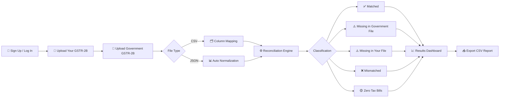
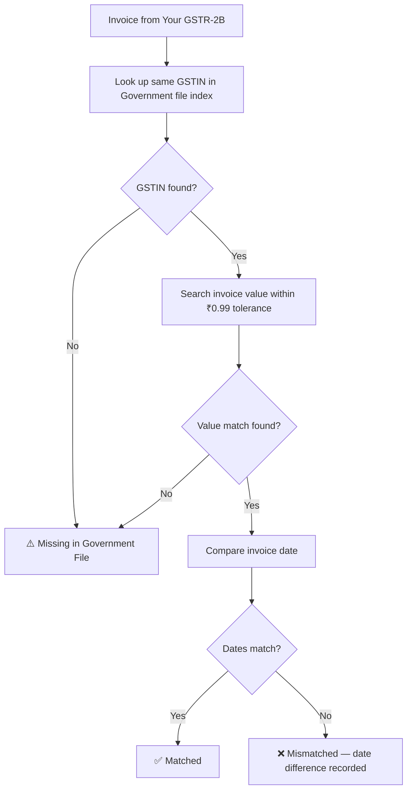
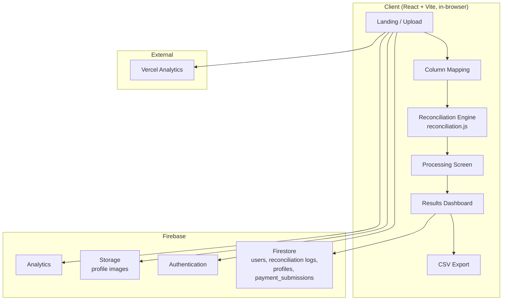
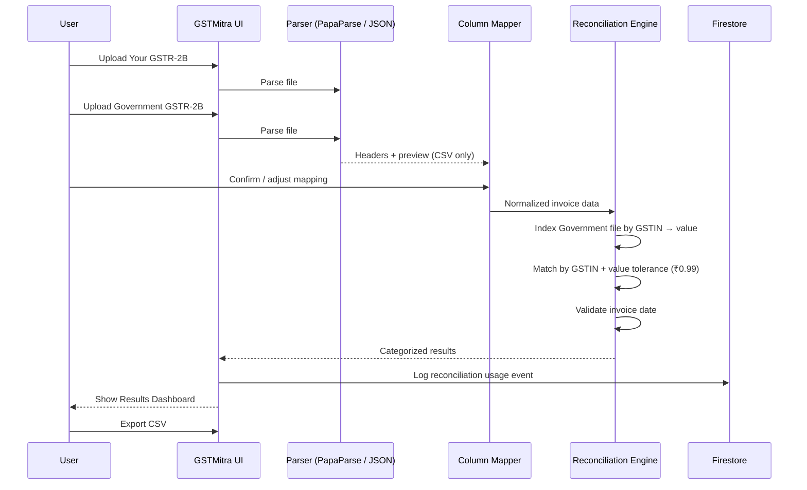

# GSTMitra

**Smart, secure GSTR-2B reconciliation for businesses, accountants, and tax professionals.**

GSTMitra is a web-based platform that helps you reconcile **Your GSTR-2B** records against the **Government Provided GSTR-2B** file downloaded from the GST Portal. Upload two files, map your columns, run reconciliation, review categorized results, and export a CSV report — all through a fast, dark-themed interface.

> **Current scope:** Your GSTR-2B vs Government Provided GSTR-2B only. GSTR-1 / GSTR-2A reconciliation is not offered as a product flow (a handful of internal variable names still reference `gstr1`/`gstr2A` for historical reasons — see [Known Issues](#-known-issues--cleanup-needed)).

---

## 🚀 Overview



---

## ✨ Features

### 📂 File Upload
- Accepts **CSV** and **JSON**
- Two files required: **Your GSTR-2B** and **Government Provided GSTR-2B**
- JSON parsing understands a few common shapes: a plain invoice array, a `b2b`-nested GST export structure (grouped by supplier `ctin`), or a generic `data` wrapper

### 🧠 Column Mapping (CSV)
CSV headers vary between accounting tools, so GSTMitra tries to auto-detect columns and falls back to manual mapping:

| Field | Recognized aliases (JSON keys it also auto-detects) |
|---|---|
| GSTIN | `gstin`, `GSTIN`, `ctin`, `supplierGstin`, `supplier_gstin` |
| Invoice Number | `invoiceNumber`, `invoice_number`, `inum`, `inv_num` |
| Invoice Date | `invoiceDate`, `invoice_date`, `idt`, `inv_date` |
| Invoice Value | `invoiceValue`, `invoice_value`, `val`, `inv_val`, `total` |
| Taxable Value | `taxableValue`, `taxable_value`, `txval`, `tax_val` |
| IGST / CGST / SGST | `igst`/`cgst`/`sgst` (and `_amount` variants), case-insensitive |

You can also set a **start row** for CSVs (useful when a file has extra header/title rows before the real column headers), and preview mapped data before running reconciliation.

### 🔍 Reconciliation Engine
Everything runs **client-side in the browser** — files are parsed and compared locally, not uploaded to a server for processing.

**Actual matching logic** (this is what the code does today):



- **Primary key:** GSTIN, then closest invoice value within a **₹0.99 tolerance**
- **Secondary check:** invoice date (normalized across `DD-MMM-YYYY`, `DD/MM/YYYY`, `YYYY-MM-DD`, `DD.MM.YYYY`, and generic formats)
- Government-file invoices that are never claimed as a match are reported as **Missing in Your GSTR-2B**
- Records are indexed by GSTIN → invoice value for fast lookup instead of an all-pairs comparison, so it scales reasonably with larger files
- **Invoice number is *not* currently part of the matching key** — it's stored and shown, but GSTIN + value (+ date) drive the actual match

### 🟡 Zero Tax Bill Detection
Any invoice where `invoiceValue === taxableValue` (i.e., no tax component) is pulled out into its own **Zero Tax Bills** bucket instead of being counted as matched/missing/mismatched.

### 📊 Results Dashboard
- Summary counts: total invoices, total value, matched, mismatched, missing (both directions), zero-tax bills
- Drill-down detail view per category with side-by-side comparison of mismatched fields
- Search/filter within results
- **CSV export** of the full reconciliation output

> There's no chart/graph rendering in the results screen yet — the dashboard is numeric summary cards + tables. See [Roadmap](#-roadmap).

### 🔐 Authentication
Powered by **Firebase Authentication**:
- Email/password sign-up and login
- Google sign-in
- New users get a Firestore `users/{uid}` document on first login (`usage_count`, `is_paid`, `subscription_expiry`, etc.)

### 👤 Profile
Authenticated users can maintain: first/last name, mobile number, company name, GSTIN, and a profile photo (stored via Firebase Storage).

### 💳 Usage Tracking & Subscription
- Every reconciliation run logs an event to a `reconciliation` Firestore collection and increments `usage_count` on the user's document
- A subscription tiers screen and a payment submission page (manual UPI reference + admin verification flow) exist in the app
- **Note:** per the current Firestore rules, reconciliation itself is presently open to all authenticated users ("now free for everyone") — the paid-tier gating exists in the UI/data model but isn't actively restricting reconciliation access

---

## 🔒 Privacy & Data Handling

Be precise about what "privacy-first" means here — it applies to **reconciliation file contents**, not to the app as a whole:

| Data | Where it goes |
|---|---|
| Your GSTR-2B / Government GSTR-2B file contents | Parsed and compared **entirely in your browser**; not sent to a backend as part of the comparison |
| Account info (email, display name, UID) | Firebase Authentication |
| Profile (name, mobile, company, GSTIN, photo) | Cloud Firestore + Firebase Storage |
| Usage events, reconciliation counts | Cloud Firestore |
| Payment submission details | Cloud Firestore (`payment_submissions`) |
| Product analytics | Firebase Analytics **and** Vercel Analytics |

**Accurate summary:** *Your reconciliation files are processed locally in your browser and are not uploaded. Account, profile, usage, and payment-submission data is stored via Firebase to support login, personalization, and the subscription flow, and both Firebase and Vercel Analytics are active.*

### Firestore Access Rules
```
users/{userId}              → owner read/write only
payment_submissions/{docId} → create by owner, read by owner
usage_logs/{userId}         → owner read/write
profiles/{userId} (+ subcollections) → owner read/write
reconciliations/{userId} (+ subcollections) → owner read/write
everything else             → denied
```

---

## 🏗️ System Architecture



## 📊 Data Flow



---

## 🛠️ Technology Stack

| Technology | Purpose |
|---|---|
| React 18 | UI |
| Vite | Dev server & build |
| Tailwind CSS | Styling (custom dark/neumorphic theme) |
| Framer Motion | Animations |
| Firebase Auth | Authentication (email/password, Google) |
| Cloud Firestore | Users, usage logs, profiles, payment submissions |
| Firebase Storage | Profile images |
| Firebase Analytics | Product analytics |
| Vercel Analytics | Product analytics |
| PapaParse | CSV parsing |
| XLSX | Installed dependency (not yet wired into the upload flow — see Roadmap) |
| React Dropzone | Drag-and-drop upload |
| React Router | Routing |
| Lucide React | Icons |
| qrcode.react | UPI QR code (payment page) |

## 🎨 Design System

| Token | Value | Use |
|---|---|---|
| `dark-bg` | `#000000` | Page background |
| `dark-card` | `#101010` | Card surfaces |
| `dark-border` | `#1a1a1a` | Borders |
| `accent-green` | `#00ff88` | Success / matched |
| `accent-blue` | `#00d4ff` | Info / processing |
| `accent-purple` | `#8b5cf6` | Warning |
| `text-primary` | `#ffffff` | Primary text |
| `text-secondary` | `#a1a1aa` | Secondary text |

Font: **Montserrat**. Includes neumorphic inset/raised shadows and glow effects (green/blue/purple) for status states.

---

## 📁 Project Structure

```
GSTMitra/
├── components/                    # Legacy top-level screen components
│   ├── ColumnMappingScreen.jsx
│   ├── DetailedView.jsx
│   ├── FileUploadZone.jsx
│   ├── LandingScreen.jsx
│   ├── ProcessingScreen.jsx
│   ├── Profile.jsx
│   ├── ResultCard.jsx
│   └── ResultsScreen.jsx
│
├── src/
│   ├── components/
│   │   ├── Auth/                  # AuthDemo, AuthHeader, AuthModal, LoginForm,
│   │   │                          # ProfileInfoModal, ProtectedRoute, SignupForm, UserProfile
│   │   └── SubscriptionTiers.jsx
│   ├── contexts/
│   │   └── AuthContext.jsx
│   ├── firebase/
│   │   ├── auth.js                # Sign up / in, profile + usage doc creation
│   │   ├── config.js               # Firebase app init (env-based)
│   │   └── storage.js              # Profile image upload
│   ├── pages/
│   │   └── PaymentPage.jsx         # UPI QR + manual payment submission
│   ├── utils/
│   │   ├── reconciliation.js       # Core matching engine
│   │   └── logReconciliationUsage.js
│   ├── App.jsx
│   ├── index.jsx
│   └── index.css
│
├── firestore.rules
├── package.json
├── vite.config.js
├── tailwind.config.js
└── README.md
```

---

## ⚙️ Installation

### Prerequisites
- Node.js 18+
- npm

### Setup
```bash
git clone <repository-url>
cd GSTMitra
npm install
```

### Environment Variables
Copy the example env file and fill in your Firebase project credentials:
```bash
cp .env.local.example .env.local
```

```env
VITE_FIREBASE_API_KEY=your_api_key
VITE_FIREBASE_AUTH_DOMAIN=your_project.firebaseapp.com
VITE_FIREBASE_PROJECT_ID=your_project_id
VITE_FIREBASE_STORAGE_BUCKET=your_storage_bucket
VITE_FIREBASE_MESSAGING_SENDER_ID=your_sender_id
VITE_FIREBASE_APP_ID=your_app_id
VITE_FIREBASE_MEASUREMENT_ID=your_measurement_id
```

### Run
```bash
npm run dev      # start Vite dev server
npm run build    # production build (outputs to build/)
```

---

## 🚀 Deployment

Deployable to any static host with SPA routing support:
- **Vercel** (a `vercel.json` is already included)
- Netlify
- Firebase Hosting
- Cloudflare Pages

```bash
npm run build
```

---

## 🛡️ Security Notes

- All reconciliation processing is client-side — no file contents hit a server
- Firestore access is scoped per-user via `firestore.rules` (see [Privacy & Data Handling](#-privacy--data-handling))
- Review and harden `firestore.rules` before going to production, especially around the `reconciliation` usage-logging collection (not explicitly covered by the current ruleset shown above) and payment submission verification, which currently appears to be a manual/admin process rather than an automated one

---

## ⚠️ Known Issues / Cleanup Needed

The product is GSTR-2B vs GSTR-2B only, but the codebase still carries naming and labels from an earlier GSTR-1 vs GSTR-2A design:

- Internal state/variables named `gstr1`, `gstr1Mapping`, `gstr1StartRow`, etc. throughout `App.jsx`, `ColumnMappingScreen.jsx`, `ResultsScreen.jsx`, and `DetailedView.jsx` (they represent "Your GSTR-2B", not GSTR-1)
- `ProcessingScreen.jsx` still shows the label **"Government Provided GSTR-2A"** and a loading message referencing GSTR-2A
- `package.json`'s `description` field still reads *"Privacy-First GSTR-1 vs GSTR-2A Reconciliation Tool"*
- Recommended fix: rename internal variables to something like `yourGstr2b` / `govtGstr2b`, and update the remaining GSTR-2A label/loading text and the `package.json` description to match the actual GSTR-2B vs GSTR-2B product

---

## 🗺️ Roadmap

**File Support**
- [ ] Wire up the already-installed XLSX dependency for native Excel upload
- [ ] Multi-sheet selection
- [ ] GST export ZIP support

**Reconciliation**
- [ ] Bring invoice number into the matching key (currently informational only)
- [ ] IGST / CGST / SGST comparison as part of match/mismatch logic (currently only checked in the ad-hoc `compareInvoiceValues` diff helper)
- [ ] Configurable value tolerance (currently hardcoded at ₹0.99)
- [ ] Duplicate invoice detection
- [ ] Supplier-wise and month-wise reconciliation views

**Dashboard**
- [ ] Actual charts (pie/bar) on the Results screen — currently numeric summary cards only
- [ ] Downloadable PDF report
- [ ] Match-rate and discrepancy-value analytics

**Platform**
- [ ] Reconciliation history / saved runs
- [ ] Enforce or remove the free/paid usage gate consistently (rules currently note reconciliation is free for everyone despite the subscription UI)
- [ ] Automate payment verification instead of manual admin review
- [ ] Multi-user / organization accounts

---

## 🤝 Contributing

1. Fork the repository
2. Create a feature branch
3. Make your changes
4. Test thoroughly
5. Submit a pull request

## 📄 License

MIT License — see the LICENSE file for details.

---

**GSTMitra** — simplifying GSTR-2B reconciliation for businesses and tax professionals.
