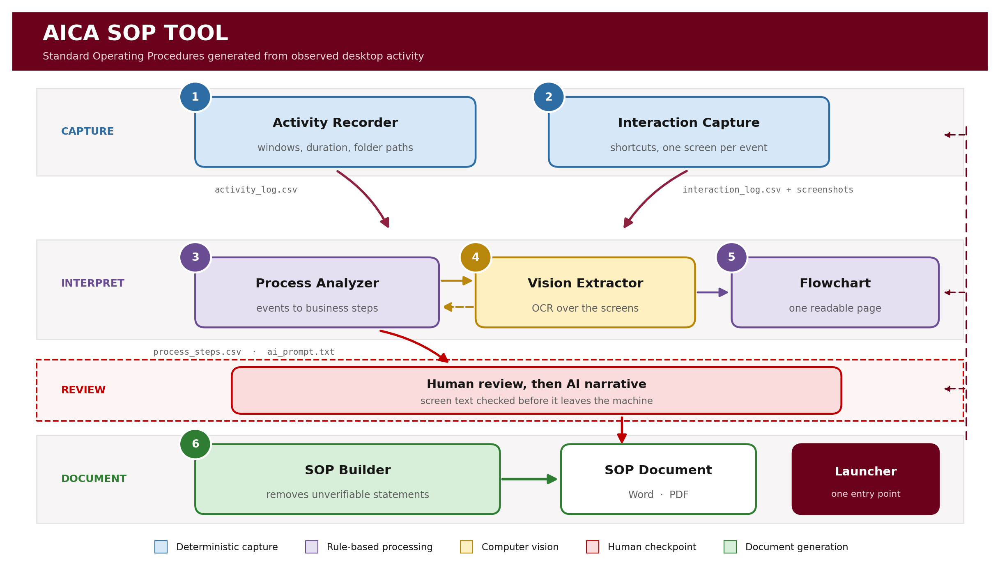

# AICA SOP Tool

**AI-assisted Standard Operating Procedure generation from observed desktop activity**

AICA Level-2 Capstone Project
Submitted by **Dheeraj Gupta** — AICA Level-2 Participant



---

## The problem

Finance processes are performed daily but rarely documented. When the person
who performs a process leaves, the knowledge leaves with them. Writing an SOP
by hand is slow, so it is usually postponed and then skipped.

## The solution

The tool observes a process being performed once, then assembles a complete
Standard Operating Procedure from what it observed:

```
Record the process  →  Interpret the events  →  Read the screens
                    →  Draft the narrative   →  Build the document
```

The output is a Word and PDF document containing a process flow diagram,
numbered steps, a screenshot for every step, prerequisites, controls, risks
and escalation contacts.

An example is included under [`samples/`](samples/).

---

## Design principle

**Captured facts and inferred content are kept separate.**

Application names, window titles, keyboard shortcuts, folder paths and
screenshots are recorded deterministically by Windows APIs. Nothing is
invented.

The document builder applies a further test before anything is written. Some
detail read from the screen cannot be reliably attributed to the action that
was performed, so it is removed rather than presented as fact:

| Removed | Reason |
|---------|--------|
| Interface command listings | The ribbon is visible on every screen regardless of the action, so a list such as *Insert, Formulas, Data, Review* describes the application rather than the step |
| Worksheet tab claims | Sheet names are matched anywhere in the screen text, including column headers and cell contents, so the list frequently disagrees with the screenshot |
| Cell reference claims | Tokens such as `LTO7` or `PT053` are product codes and reference numbers read from data columns, not cell addresses |
| Sentences stating only that a detail requires confirmation | Such a sentence carries no instruction |

A reference that names one or two commands actually used by the step is kept.
Every generated document reports how many statements were removed, so the
evidence quality of the SOP is stated on its face.

---

## Architecture

The diagram above shows four phases. Colour indicates how far each stage sits
from the raw evidence: blue is deterministic capture, purple is rule-based
processing, amber is computer vision, red is the human checkpoint, and green
is document generation.

| Stage | Module | Function |
|------:|--------|----------|
| 1 | `activity_recorder_v3.py` | Records active application, window title, duration and Explorer folder paths |
| 2 | `interaction_capture_v5.py` | Records approved shortcuts with one screenshot per event |
| 3 | `process_analyzer_v7.py` | Merges both logs by timestamp into ordered business steps |
| 4 | `vision_extractor_v1.py` | Reads file names and folder paths from the screenshots |
| 5 | `flowchart_builder_v2.py` | Draws the sequence as a single-page column diagram |
| 6 | `sop_builder_v14.py` | Assembles the final Word and PDF document |
| — | `aica_sop_tool.py` | Launcher that orchestrates the six stages |
| — | `add_scrolling.py` | One-off utility that adds a scrollbar to every window |

Each stage is a separate program. The launcher starts them as independent
processes, which keeps every module testable on its own and avoids COM
threading conflicts between the capture agents and Word automation.

---

## AICA Level-2 module coverage

| Module | Where it appears |
|--------|------------------|
| AI Agents and multi-agent architecture | Six cooperating agents, each owning one stage |
| Computer Vision | OCR extraction of on-screen business detail |
| Python development | Entire pipeline |
| Full-stack application | Tkinter interfaces across all stages |
| Workflow automation | Launcher orchestration with input-dependent gating |
| Agentic AI | Structured prompt construction and grounded narrative generation |

---

## Installation

### 1. Python packages

```bat
python -m pip install -r requirements.txt
```

### 2. External programs

| Program | Purpose | Source |
|---------|---------|--------|
| Graphviz | Process flow diagram | https://graphviz.org/download/ |
| Tesseract OCR | Reading text from screenshots | https://github.com/UB-Mannheim/tesseract/wiki |

Verify both are reachable:

```bat
dot -V
tesseract --version
```

The launcher also locates Tesseract in its default install folder, so a
missing PATH entry is not fatal.

### 3. Platform

Windows 10 or 11. The capture layer uses Windows APIs for window detection
and Shell COM for folder paths. PDF export uses an installed Microsoft Word.

---

## Running the tool

```bat
python aica_sop_tool.py
```

The launcher checks the environment, detects the newest capture session, and
enables each stage only once its inputs exist.

### Sequence

1. **Start Activity Recorder** — run the folder path self-test, then perform
   the process
2. **Start Interaction Capture** — run its self-test as well
3. **Analyze Logs** — select both logs, then export
4. **Extract Screen Text** — untick the prompt-append option
5. **Rebuild Flowchart** — redraws it to fit one readable page
6. **Open ai_prompt.txt** — paste into ChatGPT, save the reply as
   `sop_text.txt` in the session folder
7. **Build SOP Document**

Return to the analyzer and press **Rebuild Prompt With OCR** after stage 4 so
the screen evidence is written inline beneath each step.

---

## Output

```
sessions/SESSION_YYYYMMDD_HHMMSS/
├── activity_log.csv          window, duration and folder path records
├── process_steps.csv         merged, ordered business steps
├── ai_prompt.txt             structured prompt with inline screen evidence
├── ocr_context.csv           extracted screen text, for review before sharing
├── sop_text.txt              AI narrative
├── process_flow.png          single-page column diagram
├── SOP_<Process>.docx        final document
├── SOP_<Process>.pdf
└── screenshots/              one image per captured step
```

Every generated document ends with a **Capture Quality Summary** reporting how
many distinct screens were embedded, how many folder paths were resolved,
which capture generation produced the session, and how many unverifiable
statements were removed.

Capture sessions are excluded from this repository by `.gitignore`, because
the screenshots contain live business content.

---

## Privacy and data handling

- Typed text, passwords and clipboard contents are **never** captured
- Only a fixed list of approved shortcuts is recorded
- Screenshot capture can be paused at any time during recording
- `ocr_context.csv` exists specifically so extracted text can be reviewed and
  edited before any of it reaches an external AI service
- All processing before the narrative step is local to the machine

The tool should be used only with the informed consent of the person being
recorded.

---

## Known limitations

- Windows only
- PDF export requires Microsoft Word; otherwise save the DOCX manually
- Global shortcut hooks may require running as Administrator
- OCR accuracy depends on screen resolution and font size
- The narrative step is manual by design, which provides a human review point
  before content is published

---

## Development notes

The pipeline was refined across several recording cycles. Three findings are
worth recording, because each changed the design rather than only the code.

**Folder paths must be resolved by the agent that observes the event.** The
interaction agent resolves a path only when a shortcut fires while Explorer
is in focus. In a typical session every shortcut is pressed inside Excel, so
that agent never had the opportunity. Explorer navigation changes the active
window, which is what the activity recorder observes, so the capability
belongs there.

**COM is apartment-threaded.** A Shell object created on the interface thread
cannot be used from the keyboard hook or mouse listener thread. Each thread
now initialises its own apartment, and a self-test button confirms the
capability before a recording begins rather than after.

**Removing a symptom is not the same as removing a cause.** Interface command
listings first appeared bundled inside worksheet tab claims, so the tab
filter removed them as a side effect. Once the prompt forbade tab claims, the
listings reappeared in sentences of their own. The filter now targets the
listing itself.

---

## Possible extensions

- Direct API integration to remove the manual narrative step
- UI element detection to identify which control was clicked
- A knowledge repository that gathers generated SOPs into a searchable corpus
- Multi-session merging for processes spanning several sittings

---

## Repository contents

```
aica_sop_tool.py              launcher
activity_recorder_v3.py       stage 1
interaction_capture_v5.py     stage 2
process_analyzer_v7.py        stage 3
vision_extractor_v1.py        stage 4
flowchart_builder_v2.py       stage 5
sop_builder_v14.py            stage 6
add_scrolling.py              window scrolling utility
requirements.txt
.gitignore
README.md
docs/architecture.png         architecture diagram
samples/                      an example generated SOP
```

---

*Submitted for AICA Level-2 certification, The Institute of Chartered
Accountants of India.*
