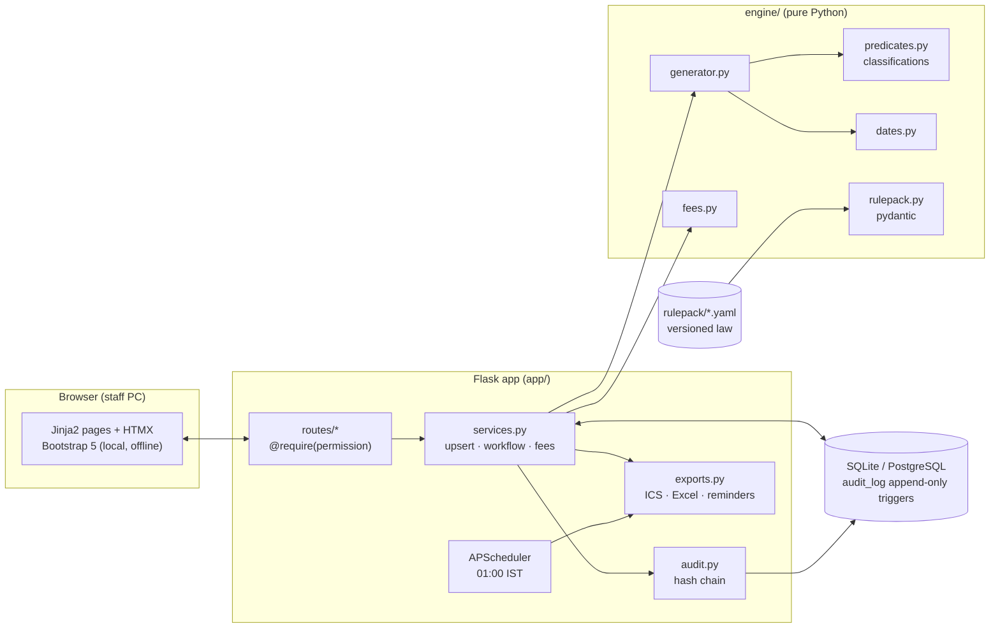

# MCA Compliance Mapper
**AICA Level 2 capstone · Batch 89 · CA Swapnil, Swapnil & Associates, Chartered Accountants, New Delhi**

> MCA Compliance Mapper: a lifecycle ROC & LLP compliance calendar for a CA firm (CA Swapnil, Batch 89).
> It tracks every entity from incorporation through every FY, half-year, director KYC cycle and corporate event.
> The law is versioned, effective-dated, citation-backed YAML (e.g. DIR-3 KYC annual → triennial w.e.f. 31-03-2026).
> A fee engine covers all MCA/LLP regimes incl. CCFS-2026; maker–checker roles; append-only, hash-chained audit log.
> Flask + SQLite, works offline on Windows (START_APP.bat); 188 automated tests; demo data is fictitious.


---

## 1. The problem
MCA compliances hang off many different anchor dates: incorporation, financial-year end, the AGM, fixed calendar dates, half-years, three-year director cycles, and ad-hoc events such as appointments, allotments, charges and office shifts. In most small firms they live in an Excel sheet. Obligations with no e-form (Board meetings, registers, share certificates, MBP-1) are forgotten. And the law keeps moving: DIR-3 KYC became triennial from 31-03-2026, and the small-company limits rose on 01-12-2025.

The firm needed one answer, for **every client on any date**: *what is due, when, who is working on it, what it will cost if late, and who confirmed it was filed.*

## 2. The solution
| Idea | How it works |
|---|---|
| **The law is data** | 62 rules in `rulepack/*.yaml`. Each has its section/rule, notification, source URL, `effective_from`/`effective_to` and a *verified* flag. Pydantic validates the pack at start-up; the app refuses to start on an invalid row and names it. A law change = close one row, open another; nothing in history is edited. |
| **Lifecycle, not first-year** | A pure engine (`engine/`, no Flask, no DB) generates every obligation from incorporation to FY(today)+1: annual, half-yearly, calendar (DPT-3), per-DIN (DIR-3 KYC) and event-driven. Generation is idempotent: statuses survive; items that stop applying are *superseded*, never deleted. |
| **Explainable classifications** | Small company, MGT-7/7A, MGT-8, AOC-4 XBRL/CFS/NBFC, CSR, secretarial and internal audit, Rule 9B, Board-meeting regime, small LLP, LLP audit. Each shows the numbers used, the threshold version and the citation. Where practitioners disagree, it returns **AMBIGUOUS** and asks a partner. |
| **Every fee regime** | Normal fee by capital or contribution; ₹100/day (AOC-4, MGT-7); multiplier slabs (incl. the s.139 ≤ 15-day slab and higher fees for repeat INC-22/PAS-3); CHG-1 ad valorem; DIR-3 KYC fixed fees; LLP matrix (small/other, > 360 days per-day); scheme overlays (CCFS-2026, GC 02/2026, GC 08/2025). Penalties are shown as text only (s.454 / LLP s.76A). |
| **A CA firm's discipline** | Six roles checked on the server; maker–checker; a partner signs off each rule; client letters are **blocked** while any rule behind them is unverified; an append-only, SHA-256 hash-chained audit log protected by database triggers. |

### Legal verification came first
Before any code, every row of the brief was checked against the Companies Act, the LLP Act, the Rules and MCA notifications ([docs/RULEPACK_VERIFICATION.md](docs/RULEPACK_VERIFICATION.md)). **23 corrections** to the brief are recorded in [docs/LEGAL_NOTES.md](docs/LEGAL_NOTES.md), for example:
- DIR-3 KYC for a DIN allotted in FY 2025-26 is due **30-06-2029**, not 2028 (MCA illustration; partner decision Q1).
- Share certificates are due in **two months** (s.56(4)(a)), not 60 days.
- An LLP needs an audit only if it crosses **both** limits (LLP Rule 24(8)).
- Secretarial-audit borrowings are tested at FY end (Rule 9), not at the year's maximum.

## 3. Features (by screen)
| Screen | What it does |
|---|---|
| Sign-in | Argon2id passwords; forced change at first sign-in; 5 failures → 15-minute lock; optional TOTP (compulsory for partners and the owner when enabled); server-side sessions (30 min idle, 12 h max) |
| Dashboard | Health tiles; overdue items with fee exposure *if filed today*; next 30 days; my reviews; partner decisions; DSC expiring |
| My work | Sort and filter; one-click HTMX status buttons that respect maker–checker; bulk assign |
| Entities | Filters by type, relationship manager, ROC and health; entity page with compliance timeline, classification panel, events, directors, notes, documents and audit trail |
| Onboarding wizard | Entity → FY preview (both LLP options) → directors → latest facts → preview of every obligation → confirm |
| Annual facts | One row per FY; shows which obligations each field drives; missing years flagged *Facts stale* |
| Record event | 30 typed forms (appointment, allotment, charge, SR, RO shift, SBO…) showing what each will create |
| Directors | Every DIN, its entities, triennial KYC date, DSC expiry, change-of-details filings, partner override |
| Calendar | Month and agenda views; **.ics** feeds per user, per entity, whole firm (RFC 5545) |
| Reports | Compliance register and overdue & fee exposure (**Excel**); entity compliance score; staff on-time % |
| Client letter | On the firm letterhead: filings due, documents needed, fee if filed today; print to PDF or copy as e-mail |
| Fee calculator / Board planner | Every regime with a "what if filed on" date; s.173 gap rules (120/90 days) |
| Rule pack | Browse rows; partner sign-off; versions, publishing and field-level diff; in-app editing (Owner) validated before save; regulatory update log |
| Admin | Users (deactivate, never delete), unlock, reset, revoke sessions; firm settings; audit trail with CSV export and chain verification |
| Reminders | Nightly at 01:00 IST (and at start-up): T-30, T-7, T-1 and first overdue day to the assignee and relationship manager; optional SMTP digest |

More screenshots are in [docs/screenshots/](docs/screenshots/); a walk-through per role is in [docs/USER_GUIDE.md](docs/USER_GUIDE.md).

## 4. Architecture

Details, the data model (ERD) and the design decisions are in [docs/ARCHITECTURE.md](docs/ARCHITECTURE.md).

## 5. Roles
| Permission | Viewer | Preparer | Manager | Partner | Owner |
|---|:-:|:-:|:-:|:-:|:-:|
| View dashboard / calendar | assigned | assigned | all | all | all |
| Add / edit entity, facts, events; status up to *Ready for review* | – | ✔ | ✔ | ✔ | ✔ |
| Approve for filing (checker; never your own item) | – | – | ✔ | ✔ | ✔ |
| Mark filed; Not applicable / Waived (reason ≥ 20 chars) | – | – | – | ✔ | ✔ |
| Assign work; archive entity; read audit trail | – | – | ✔ | ✔ | ✔ |
| Delete entity; verify a rule; classification decisions; reveal PAN | – | – | – | ✔ | ✔ |
| Edit / publish rule pack; users; settings; verify audit chain | – | – | – | – | ✔ |

Every permission is enforced on the server. A 25-route × 5-role matrix test fails the build if any route is added without `@require`.

## 6. How to run

### Windows: double-click (recommended, under 5 minutes)
1. Install **Python 3.12 or newer** from python.org (tick *Add python.exe to PATH*).
2. Double-click **`START_APP.bat`**. The first run creates `.venv`, installs the pinned packages (internet needed once), creates `.env` with fresh keys, migrates the database and loads the **fictitious** demo firm. **It prints the demo passwords once in the window.**
3. The browser opens at **http://127.0.0.1:5000**. Sign in as `owner`, `partner`, `manager`, `article1` or `viewer` with the password shown. You will be asked to set your own password (≥ 12 characters).

Later runs: double-click `START_APP.bat` again. The app works fully offline.

### Any OS: command line
```bash
python -m venv .venv
.venv/bin/pip install -r requirements.txt          # Windows: .venv\Scripts\pip ...
.venv/bin/python cli.py init-db                   # creates .env (keys) and migrates
.venv/bin/python cli.py seed-demo --password "Demo-Pass-2026!"
.venv/bin/python run.py                           # http://127.0.0.1:5000
```

### Docker
```bash
cp .env.example .env        # then fill SECRET_KEY and FERNET_KEY (commands inside the file)
docker compose up --build   # http://127.0.0.1:5000 ; data persists in the "instance" volume
```
*Docker was not available on the development PC, so the Docker files were written but not run there. The Windows and command-line paths were tested end to end.*

### Useful commands (`cli.py`)
| Command | Purpose |
|---|---|
| `init-db` | Create `.env` on first run; migrate the database (Alembic) |
| `seed-demo [--password P] [--if-empty]` | Load the fictitious demo firm |
| `create-owner --username U --name "N"` | First owner for a real installation |
| `nightly [--catch-up]` | Recompute + reminders + digest (for Windows Task Scheduler / cron) |
| `backup` / `restore FILE --yes` | Online SQLite backup to `instance/backups/` (verified: integrity + triggers) |
| `verify-audit` | Recompute the audit hash chain |
| `calendar`, `fee`, `rulepack` | Engine-only tools (no database) |
| `package` | Clean, checked copy of this folder for the ICAI upload |

### Tests
```bash
.venv/bin/python -m pytest -q --cov=engine --cov=app
```
**188 passed** · engine coverage 99 % · overall 92 %. All golden tests 1–24 are automated; see [docs/TEST_REPORT.md](docs/TEST_REPORT.md).

## 7. Dependencies (pinned in `requirements.txt`)
| Package | Why |
|---|---|
| Flask, Flask-Login, Flask-WTF | Web framework, sessions, CSRF |
| SQLAlchemy, alembic | ORM (PostgreSQL-compatible schema) and migrations, incl. the audit triggers |
| argon2-cffi, PyOTP, cryptography | Argon2id passwords, TOTP two-factor, Fernet encryption of PAN |
| pydantic, PyYAML | Validating the rule pack |
| python-dateutil | Calendar-month arithmetic (`relativedelta`) |
| openpyxl | Excel exports |
| APScheduler | In-process nightly job |
| python-dotenv | `.env` secrets |
| pytest, pytest-cov | Tests and coverage |

Bootstrap 5.3.3, HTMX 2.0.4 and the fonts (Inter, Cormorant Garamond; SIL OFL) are served from `app/static/`, so there is no internet dependency at run time.

## 8. Rule-pack sources and verification
- Primary: Companies Act 2013 and LLP Act 2008 (India Code), the Rules, MCA notifications and general circulars. Row-by-row evidence, with a verdict and URL for every rule, is in [docs/RULEPACK_VERIFICATION.md](docs/RULEPACK_VERIFICATION.md).
- Every row starts `verified: false`. A partner verifies it in-app against the exact content hash. Fees from unverified rows show **"Estimate — unverified"**, and client-facing exports are blocked until verification.
- The automated fetchers were refused by mca.gov.in and indiacode.nic.in, so where a primary PDF could not be opened this is stated per row. Nothing is presented as verified that was not.

## 9. Security and data protection (DPDP Act, 2023)
- **Security:**
  - server-side authorisation on every route;
  - CSRF protection on every POST;
  - a CSP with a per-request nonce (no inline scripts or styles), `X-Frame-Options: DENY`, a strict referrer policy, and `Cache-Control: no-store` on every page;
  - HttpOnly, SameSite=Lax (and Secure) cookies;
  - login rate limiting and lockout;
  - uploads sniffed for real PDF/PNG content, stored under random names outside `static/` and served only through an authorised route.
- **Data protection:**
  - **Purpose limitation:** only the data needed for ROC/LLP compliance is kept.
  - **Minimal personal data:** name, DIN, contact details, DSC expiry and PAN (encrypted, shown masked; reveal is partner-only and logged).
  - **Access logging:** every read of sensitive data and every change is in the audit trail.
  - **Retention:** a retention setting (default 8 years).
  - **No secrets in the repository:** `.env`, the database and uploads live in `.env` / `instance/` and are git-ignored.

## 10. Out of scope (deliberately)
- No filing on the MCA portal, no automation of the V3 login, no scraping behind CAPTCHA.
- No storage or use of client DSCs, passwords or MCA credentials.
- No real client data in this repository. The demo entities (Alpha … Theta), people, CINs, DINs and PANs are fictitious.
- Income-tax, GST, TDS and labour-law dates are not included. The rule pack is designed so they can be added later as another domain file.
- Optional Phase 7 (AI module, client role) and a PyInstaller build were not built.

## 11. Limitations and open points
- **Open questions** await partner decisions (LEGAL_NOTES Q4–Q6): MGT-8 with MGT-7A; Rule 9B after a company becomes small again; DPT-3 for Government companies.
- **Unverified rows:** all 62 rows ship unverified, as the brief requires, until a partner signs them off.
- **Unconfirmed notification numbers:** a few G.S.R. numbers (the 2021/2022 small-company notifications and the 2019 KYC due-date amendment) are recorded from memory.
- **Single-process edits:** in-app rule editing applies to the running process. Restart other processes (if any) after an edit.
- **Excel number formats:** amounts of ₹100 crore or more show as ₹123,45,67,890 (Excel allows only two format conditions).
- **Development server:** Flask's server suits a small firm's LAN. Put a WSGI server and HTTPS in front for anything wider.

## 12. Repository map
```
AICA-L2-Batch-89-Swapnil/
├── README.md · requirements.txt · .env.example · .gitignore · alembic.ini
├── run.py · START_APP.bat · cli.py · demo_data.py · Dockerfile · docker-compose.yml
├── app/        Flask app: config, models, auth, permissions, audit, services, exports, routes/, templates/, static/
├── engine/     pure rule engine: dates, predicates, generator, fees, rulepack, types
├── rulepack/   VERSION + 7 YAML files (the law as data)
├── migrations/ Alembic (0001 schema + audit triggers, 0002 documents)
├── tests/      188 tests: dates, classification, generator, fees, rulepack, permissions, audit, e2e flows
└── docs/       LEGAL_NOTES · RULEPACK_VERIFICATION · ARCHITECTURE · USER_GUIDE · TEST_REPORT · screenshots/
```

*Built with an AI pair-programmer (Claude) under CA review: the AI wrote code at speed; the Chartered Accountant verified the law, corrected the brief and signs off every rule.*
