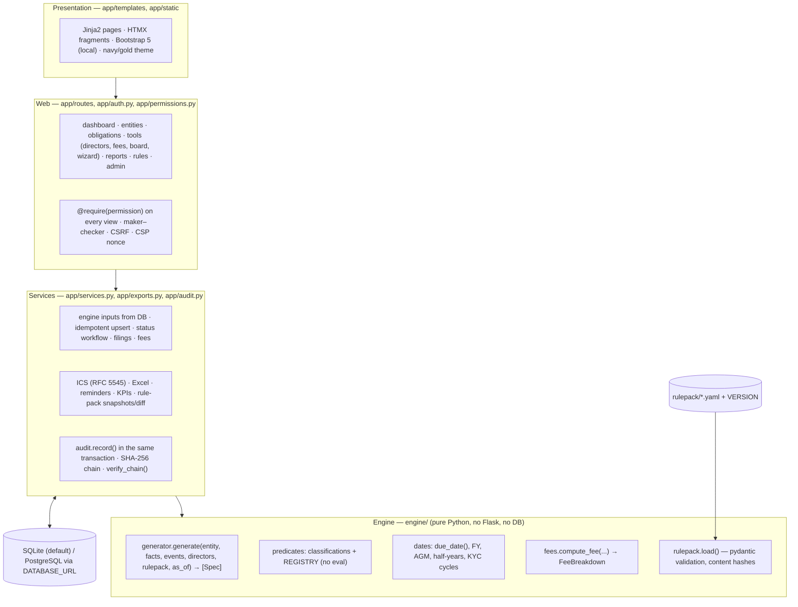
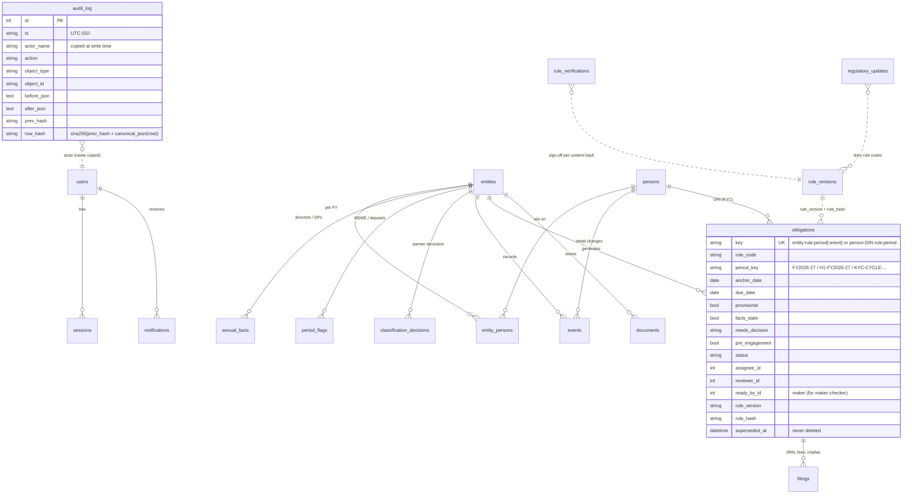

# Architecture

## 1. Layers

**Rule of the codebase:** `engine/` never imports Flask or SQLAlchemy. Every legal computation can therefore be tested in isolation (102 engine tests, 99 % coverage). The web layer only maps rows to plain dataclasses (`engine/types.py`) and back.

## 2. Data model (ERD)

Other tables: `login_attempts`, `settings`, `audit_chain_lock` (a one-row lock that serialises the hash chain on SQLite; PostgreSQL uses `LOCK TABLE`).

## 3. Key design decisions
| Decision | Why |
|---|---|
| **Law as effective-dated rows, never edited in place** | A change (e.g. DIR3KYC_ANNUAL `effective_to 2026-03-30` → DIR3KYC_TRIENNIAL `effective_from 2026-03-31`) keeps back-years correct and the history auditable. Each obligation stores the pack version and rule hash it was computed with. |
| **Applicability as names from a registry** | The YAML can reference only registered predicates (combined with `all_of`/`any_of`/`not`), so there is no code injection through the rule pack. Unknown names stop the app at start-up. |
| **One day-count function** | `due_date(anchor, {days, months})`: days per s.9 General Clauses Act (anchor day excluded); months via `relativedelta`, clipped to month end; no weekend shifting (online filing), only a "falls on a Sunday" hint. |
| **Stable keys + upsert + supersede** | Re-running generation (nightly, or after an edit) produces zero duplicates, keeps statuses and assignments, and marks obsolete items superseded with a reason. Due-date moves are audited with before and after (the history). |
| **AMBIGUOUS instead of guessing** | Small-company status is judged under the limits in force when the FY's MGT-7/7A was filed (or today if unfiled). If the answer differs between the old and new limits, a partner decides, and the decision is stored per entity per FY. |
| **DIN obligations keyed by person** | A director on three boards gets one DIR-3 KYC obligation, not three. |
| **Inherited items stay visible** | Pre-engagement items that are still open are shown (tagged) because the firm now owns them; closed ones are history; KPIs exclude both. |
| **Verification gate** | Rows ship unverified. A partner's sign-off is bound to the row's content hash, so editing the row voids the sign-off. Client letters are blocked until every included row is verified. |
| **Append-only audit** | Written in the same transaction as the change; BEFORE UPDATE/DELETE triggers abort tampering from outside the app; the hash chain detects edits to a copied database file. |
| **Server-side sessions** | Session tokens in a table, with idle and absolute expiry, revocable by the Owner; Flask-Login stores only the token. |
| **Offline first** | Static assets and fonts are local; SQLite by default; `START_APP.bat` for a one-click start; the nightly job is in-process, with `cli.py nightly` for Task Scheduler. |

## 4. Request life-cycle (example: "Approve for filing")
1. HTMX `POST /obligations/<id>/status` carries the CSRF header.
2. `@require("view")` → `get_obligation()` checks the entity is visible to the user.
3. `services.change_status()`:
   - the transition must be allowed;
   - the permission must be `approve`;
   - maker–checker: `ready_by_id ≠ current user`.
4. A refusal → `permissions.deny()` writes a `DENIED` audit row (in its own transaction) and returns 403 with a plain-English message into `#htmx-alerts`.
5. Success → status + `reviewer_id` updated, the `STATUS_CHANGED` audit row added, **one commit**, and the updated table row returned for HTMX to swap in.

## 5. Scheduling
`run.py` starts APScheduler (01:00 IST):
1. `recompute_all()`: new FYs, half-years and KYC cycles appear automatically;
2. `run_reminders()`: T-30 / T-7 / T-1 / first overdue day;
3. the optional SMTP digest.

It also runs once at start-up, in case the PC was off at 01:00.
