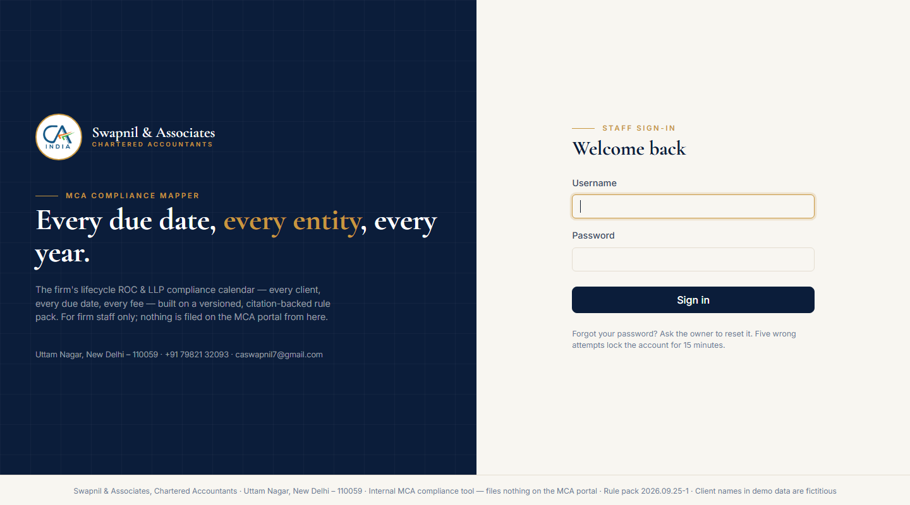
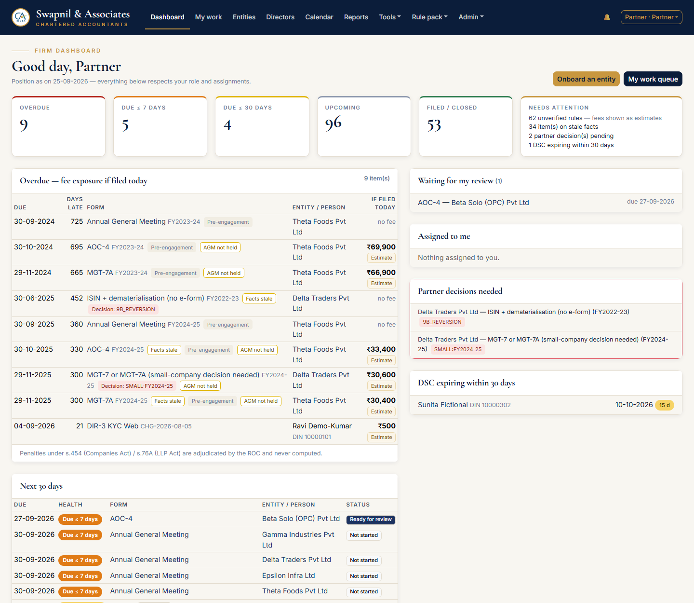
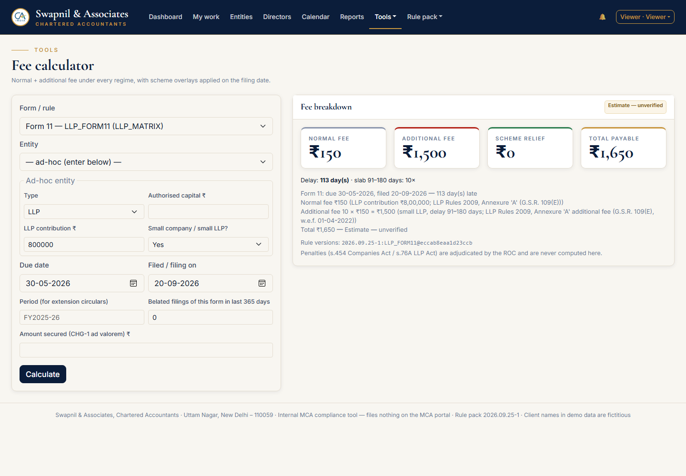
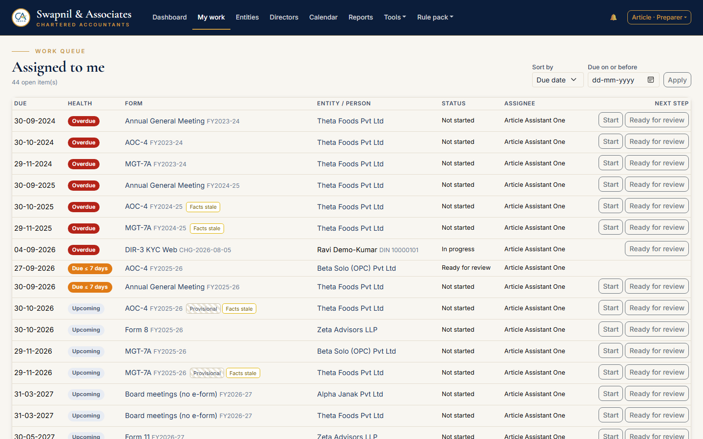
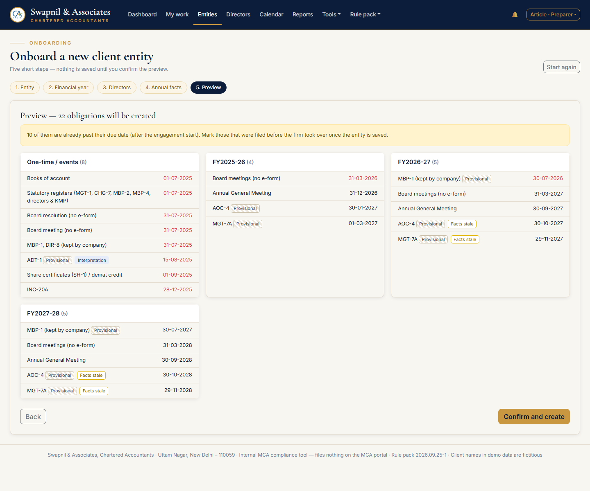
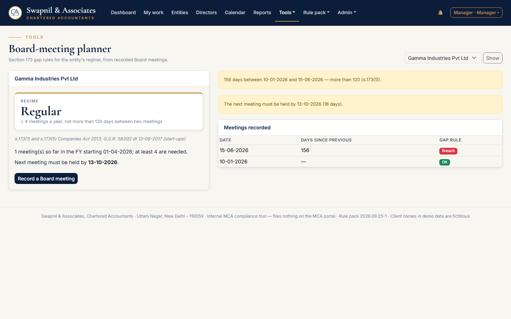
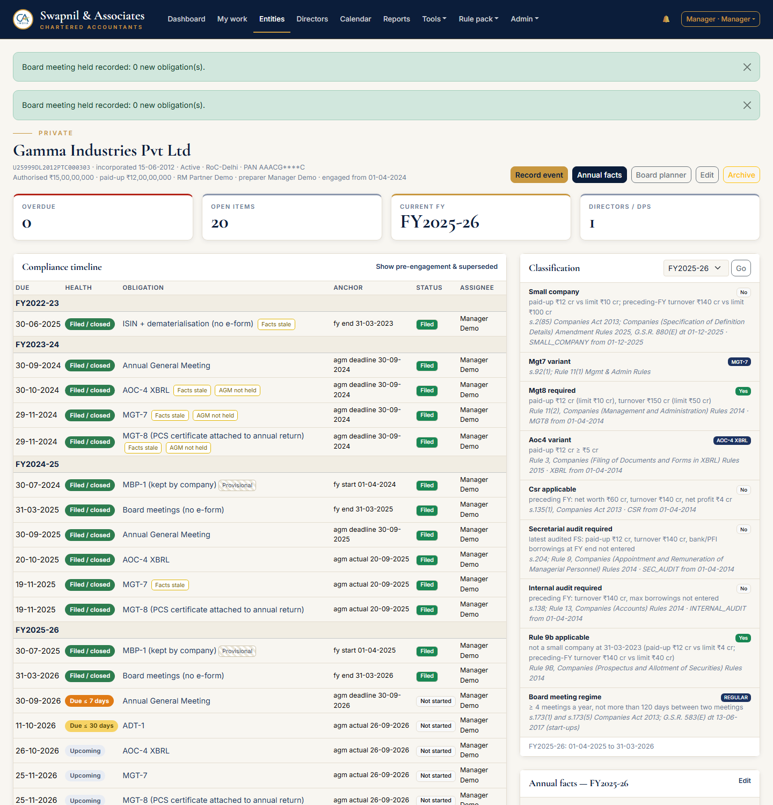
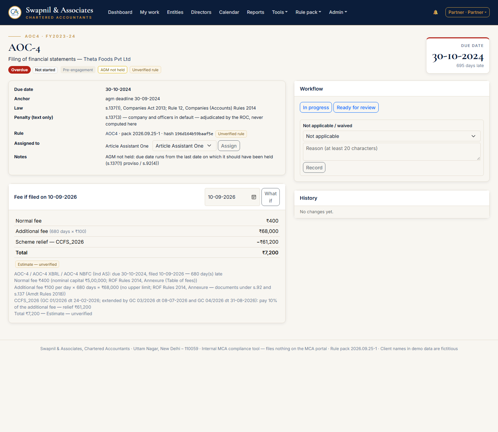
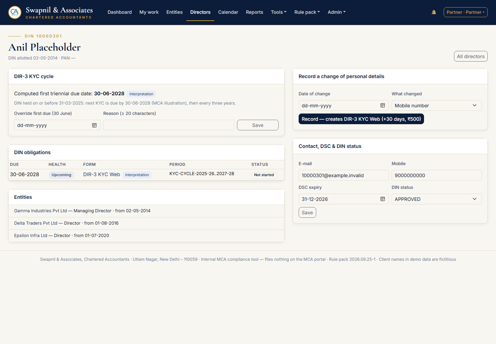
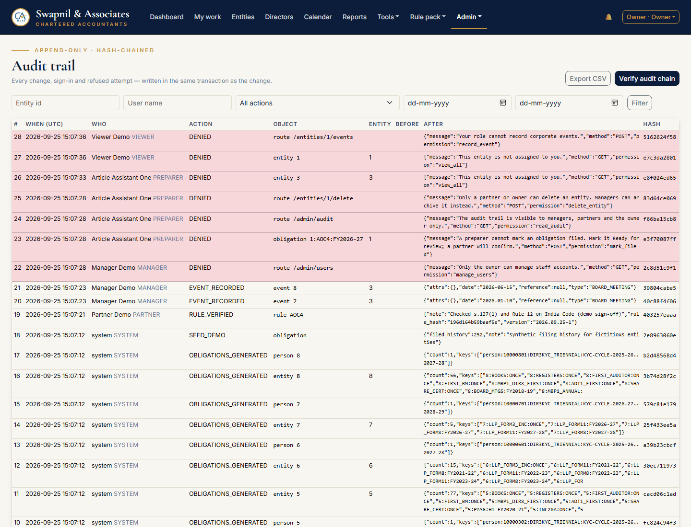

# User guide: MCA Compliance Mapper

For the staff of Swapnil & Associates. Start the app by double-clicking **`START_APP.bat`**. The browser opens at http://127.0.0.1:5000. Keep the black window open while you work; closing it stops the app.

## Everyone: the basics
- **First sign-in:** you must set your own password. It needs at least 12 characters, must not be a common password, and must not contain your username. Five wrong attempts lock the account for 15 minutes; the Owner can unlock it sooner.
- **Colours tell you the health of every item:**
  - **red** = overdue;
  - **orange** = due within 7 days;
  - **yellow** = due within 30 days;
  - **grey** = upcoming;
  - **green** = filed or closed.
- **Tags:**
  - *Provisional:* the anchor date (e.g. the AGM) is not known yet.
  - *Facts stale:* this year's figures have not been entered.
  - *Pre-engagement:* due before the firm took over; still open, so now ours.
  - *Interpretation:* a seed reading awaiting partner sign-off.
  - *Decision:* a partner must decide.
- **Bell icon:** reminders at 30, 7 and 1 day(s) before a due date and on the first overdue day.
- **Your name (top right):** notifications, change password, sign out. Sessions end after 30 minutes idle and after 12 hours at most.

## Viewer
- Sees the dashboard, calendar, directors and reports **for entities where they are the preparer or relationship manager**, plus the rule pack and the fee calculator.
- Cannot change anything. Attempts are refused and recorded.

## Article assistant / Preparer
1. **My work:** your queue, sorted by due date. The one-click buttons move an item to *In progress* and then *Ready for review*. You cannot mark anything *Filed*; a partner confirms.

   

2. **Onboard a new client:** Entities → **Onboard (wizard)**. Enter the entity, check the first-FY dates (an LLP shows both first-year options), add directors by DIN, enter the latest year's figures, **preview every obligation**, then *Confirm and create*. Anything shown in red was already overdue at onboarding. Mark those filed earlier (ask a partner) or work on them.

   

3. **Annual facts:** entity → *Annual facts*. One row per financial year. The *Drives* column shows which filings each figure affects (e.g. paid-up capital → MGT-7 vs 7A, XBRL, MGT-8). Enter the AGM date as soon as the AGM is held: AOC-4, MGT-7 and ADT-1 dates move from *Provisional* to final.
4. **Record an event:** entity → *Record event* → choose the type (director appointed, allotment, charge, special resolution, RO shift, BEN-1 received…). The form shows **what it will create**, e.g. DIR-12 in 30 days. Appointments and resignations also update the list of directors.
5. **Directors:** record a change of mobile, e-mail or address. It creates a DIR-3 KYC Web due in 30 days (₹500) without resetting the three-year cycle.

## Manager
Everything a preparer does, plus:
- **Approve for filing** items that others marked *Ready for review*. You never see *Approve* on your own item (maker–checker).
- **Assign work:** My work → *All visible* or *Unassigned* → tick the items → *Bulk assign*.
- **Board-meeting planner:** Tools → Board planner shows the entity's regime (Regular: ≥ 4 a year, gap ≤ 120 days; Relaxed: one in each half-year, gap ≥ 90 days) and when the next meeting must be held.

  

- **Audit trail:** Admin → Audit trail. Filter and export to CSV.
- **Archive** an entity (its history is kept).

## Partner
Everything a manager does, plus:
- **Mark filed:** on an *Approved for filing* item, enter the SRN, filing date, fees paid and, optionally, the challan PDF/PNG. The app computes the fee due on that date and flags any mismatch with what was paid.
- **Not applicable / Waived:** with a reason of at least 20 characters.
- **Fee "what if":** on any obligation, change the *Fee if filed on* date. Scheme relief (e.g. CCFS-2026) is applied automatically.

  

- **Partner decisions:** when the classification panel says **Ambiguous** (e.g. small-company status for FY 2024-25 filed after the limits changed), choose the answer and give a reason. Everything is recomputed.
- **Verify rules:** Rule pack → open a row → check the source → *Verify this row*. Until all rules behind a client letter are verified, the letter is blocked.
- **Client reminder letter:** Reports → *Client reminder letter* → choose the entity and the window → print or save as PDF on the letterhead, or *Copy e-mail text*.
- **Director view:** override a director's KYC cycle (with a reason). Reveal a full PAN (logged).

## Owner
Everything a partner does, plus:
- **Users & sessions:** add staff (a temporary password is shown once), reset passwords, unlock, deactivate (never delete), end any session.
- **Firm settings:** firm name, tagline, address, phone, e-mail, signatory, logo on/off, brand colours, SRN format, two-factor requirement for partners, ADT-1-for-first-auditor policy.
- **Rule pack:** Versions & diff → *Edit a rule file*. The whole pack is validated before saving and every client is recomputed. Then change `VERSION` and **Publish**. To record a notification, use the *Regulatory update log*.
- **Verify audit chain:** Admin → Audit trail → *Verify audit chain*.

  

- **Backups:** `.venv\Scripts\python cli.py backup` (safe while the app runs; stored in `instance\backups`). Restore with `cli.py restore <file> --yes` after closing the app.

## Calendar and exports
- **Calendar:** month or agenda view; filter by entity, staff or form. **My calendar (.ics)** can be imported into Outlook or Google Calendar, with a 7-day reminder on each item.
- **Reports:** compliance register and overdue & fee exposure in **Excel**, entity compliance score, staff on-time %.

## Good practice
- Enter AGM dates and annual figures promptly. That removes the *Provisional* and *Facts stale* tags.
- Record events the day they happen. The 30-day clocks start from the event date.
- Penalties (s.454 Companies Act / s.76A LLP Act) are adjudicated by the ROC. The app shows fees only.
- Nothing here files anything on the MCA portal. Filing is done on MCA V3 as usual; then record the SRN here.
