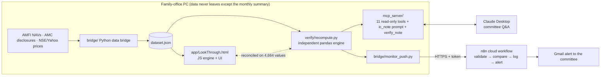

# LookThrough: AI-assisted look-through portfolio intelligence for a family office

**ICAI AICA Level 2 capstone project.** LookThrough answers a question family-office investment committees ask often: *what do we really own, and does it breach our investment policy?* It looks through every mutual fund into the stocks it holds, adds those to the direct equity holdings, and tests the combined portfolio against the family's investment policy. Claude answers the committee's questions through MCP using only verified figures, and an n8n workflow monitors the policy every month.

> **Real Indian market data** (AMFI NAVs, AMC monthly portfolio disclosures, NSE and Yahoo prices) with a **fictitious family** (the Mehta family: two individuals, an HUF, an LLP and a son). No confidential or client data is used anywhere. **Decision support only, not investment advice.**

## The problem

A family office holds shares directly and through a dozen mutual funds, spread across several entities (individuals, an HUF, an LLP). Nobody sees the **combined** exposure. The same stock sits in the direct book and inside several funds, two funds with different names hold nearly the same portfolio, and a policy limit such as "no single stock above 10%" can be breached without anyone noticing. Checking this by hand means reconciling twelve AMC spreadsheets every month.

## What LookThrough does

| Capability | Result on the demo family (31-Aug-2026) |
|---|---|
| Look-through exposure across direct holdings and fund holdings | All 12 funds looked through, 501 companies; HDFC Bank is **12.56%** of equity (Rs 3.84 cr direct + Rs 1.87 cr via funds) |
| Investment-policy tests | **2 breaches** (single stock; Financial Services sector at 33.39%) and **3 warnings** (fund-overlap pairs at 54.56%, 63.95% and 61.02%). 1 test NOT COMPUTABLE |
| Fund analytics | Returns, Sharpe, Sortino, drawdown, beta, alpha, capture ratios, overlap matrix for 12 schemes |
| Equity research | Ratios, Piotroski F-score and valuation for 65 companies; neutral screening labels |
| Indicative tax per entity | Short- and long-term gains under ss. 196 and 198 of the Income-tax Act, 2025 |
| **Entities and transactions** | Add entities (individual, HUF, LLP, company, firm, trust) and record purchases, SIPs and sales in the app; validated and saved on the PC with an audit trail |
| **Contract-note import (PDF)** | Upload a broker's equity contract note (password-protected is fine): trades, ISINs, charges and trade date are read, reconciled to the note's net amount and checked against market prices; you review, then record all trades at once. STT is kept out of the cost basis |
| **Mutual-fund CAS import (PDF)** | Upload a CAMS / KFintech detailed CAS: every folio's unit balance is reconciled line by line from opening to closing, schemes and plans are matched by ISIN, stamp duty is added to cost, and transactions already recorded are detected; you review, then record |
| **Add mutual-fund schemes** | Search AMFI's scheme list by name, code or ISIN and add a fund (Direct and Regular Growth): its NAV history is fetched and it can be used in transactions and CAS imports. Equity-oriented funds only, with at least 13 months of NAVs |
| **Add listed companies** | Search NSE's equity list and add a company to the security master: its prices (and statements, if any) are fetched so it can be valued and used in transactions and contract notes; its sector can be corrected for the sector limit |
| **Latest prices** | With the bridge running, refreshed every 5 minutes: value and gain at latest prices for the family, each entity and each holding; the concentration limits (largest stock, sector, top 10, HHI) re-tested at latest prices beside the month-end result; the same in the family report; the latest price on each company page. Every figure names its price and NAV dates. Shares from Yahoo (NSE, about 15 minutes delayed in market hours; last close otherwise), NAVs as last published by AMFI. Returns, risk, benchmarks and the reconciliation stay at the month-end valuation date |
| **Sign-in and roles** | Viewer, analyst and admin roles; hashed passwords, lockout, session cookies; sign-out after 30 minutes without activity (8 hours at most); a Content-Security-Policy that runs only the app's own scripts; admin manages users; every sign-in and sign-out audited |
| **Installable app (PWA)** | Install LookThrough from Chrome or Edge (sidebar: *Install as an app*) to open it in its own window from the Start menu. The service worker caches only an offline page and the icons, never the app page or any data, so portfolio figures stay behind sign-in; if the bridge is not running the app says how to start it |
| **Claude via MCP** | 11 read-only tools; investment-committee notes checked by code before they are shown |
| **n8n monthly monitor** | The PC sends verified results; n8n logs them, compares with last month and emails the committee on a breach |

## Architecture



## AICA Level 2 modules used

| Module | How LookThrough uses it | Where |
|---|---|---|
| 1, 2, 10: AI agents, Claude connectors, MCP | Claude reaches the portfolio engine through an MCP server; the agent calls tools, drafts a note and runs the QC gate itself | [mcp_server/](mcp_server/) |
| 5: Offline LLMs | The extraction prompt is not tied to any one model and its JSON output is checked against a schema, so it is designed to work with a local model in LM Studio and keep a confidential annual report on the PC (not yet tested with a local model) | [prompts/financial_extraction_prompt.md](prompts/financial_extraction_prompt.md) |
| 6: Python for CAs | Data bridge, reference engine, AMC parser, verification | [bridge/](bridge/), [verify/](verify/) |
| 7: Full-stack web app (PWA, local hosting) | Single-file offline web app with a locally hosted data bridge | [app/](app/), [app_src/](app_src/) |
| 9: AI-driven workflow automation (n8n) | Monthly policy monitor with run history and alerts | [n8n/](n8n/) |

## Why the numbers can be trusted

| Control | Evidence |
|---|---|
| **Two independent engines.** The app (JavaScript) and `verify/recompute.py` (pandas) compute every metric separately | [reconciliation_result.txt](verify/reconciliation_result.txt): **4,664 values agree**, 20/20 check groups |
| **Code checks the model.** `verify_note` binds every figure in Claude's note to the tool field it came from: same value, same unit, the tool cited on that line, and words that name that field | [mcp_result.txt](verify/mcp_result.txt): **42/42**, including tests where a coincidental value (cash in funds offered as 'beta'), a wrong citation, a wrong unit and a swapped field are each refused; six binding rules mutation-tested. The sample note passes with 32 of 32 figures bound, each to its field ([sample_ic_note.verify.json](examples/sample_ic_note.verify.json)) |
| **The MCP layer ties out** to the reference engine | 1,073 ratios, 132 fund metrics, 66 overlap pairs, tax for 5 entities |
| **Functional and smoke tests** | [functional_result.txt](verify/functional_result.txt): **23/23**; all 15 screens × 6 entities, light and dark themes, phone width |
| **Independent oracle tests** | [oracle_result.txt](verify/oracle_result.txt): **12/12**, recomputed from raw data, not via either engine (catch errors both engines share) |
| **Sign-in and data entry** | [bridge_result.txt](verify/bridge_result.txt): **76/76** (roles, lockout, cross-site refusal, idle sign-out, script-hash CSP, installable app that caches no data, validation, oversell protection, audit); browser flow **35/35** (`verify/entry_ui_check.py`). Guards mutation-tested |
| **Contract-note reader** | [contract_note_result.txt](verify/contract_note_result.txt): **37/37** on fictitious notes in two broker layouts, an AES-encrypted copy and rejects (wrong net amount, implausible rate, unknown company, scan, non-PDF, duplicate import, oversold sale refuses the whole note). Quantity/rate swap guarded three ways, each mutation-tested |
| **CAS reader** | [cas_result.txt](verify/cas_result.txt): **32/32** on a fictitious CAS (CAMS and KFintech layouts, untracked scheme, opening balance, AES copy) and rejects (broken unit chain, units x NAV mismatch, implausible NAV, summary CAS, contract note, duplicate or pre-statement sale). Five guards mutation-tested |
| **Security master** | [equity_result.txt](verify/equity_result.txt): **22/22** (NSE-listed only, no priced duplicates, 13-month price rule, statements optional, fund holdings priced on demand, sector edit, removal only when unused, audit, nothing written to data/config); offline; five guards mutation-tested |
| **Scheme master** | [scheme_result.txt](verify/scheme_result.txt): **28/28** (search, Growth-only, equity-only, 13-month NAV rule, duplicates, use in transactions and CAS, edit, removal only when unused, audit); offline with synthetic NAVs; five guards mutation-tested |
| **Missing data is never guessed** | Missing figures show as "—" or NOT COMPUTABLE, and a missing figure is never reported as within the limit |
| **Traceable source data** | Every AMC file is logged with its URL, download time and SHA-256 ([_sources.csv](data/amc_portfolios/_sources.csv)); AMFI scheme codes are fixed, with the basis recorded |
| **Audit trail** | Every MCP call is logged with a SHA-256 of the result; every monitor run is logged in n8n and on the PC |

### Independent reviews before submission
Two independent reviews were run against the finished app: a financial-logic review by a CA/quant reviewer and a UI/UX audit of every screen and control. **The two engines agreed on every value, but both reviews still found real errors, because a mistake shared by both engines passes reconciliation.** All Critical and Major findings were fixed in both engines and covered by new oracle tests:

| Finding | Effect before the fix | Fix |
|---|---|---|
| Infosys files statements in USD | Read as rupees: P/E 1,386x, "Fails screen" | Non-INR statements excluded with a warning when scale confirms it |
| "Pharmaceuticals & Biotechnology" matched IT | 31 pharma stocks counted as IT | Healthcare checked first; 31/31 correct |
| ELSS 3-year lock-in ignored | Switch simulator offered Rs 54.30 lakh that cannot be redeemed | Locked lots excluded from tax-if-sold, harvesting and switches |
| Stress test left out funds not looked through | -20% market loss understated (Rs 7.68 cr) | Included at beta 1 as a stated assumption (Rs 8.84 cr after the full price refresh) |
| Allocation ignored 30.6% of equity with no market cap | Advised moving Rs 9 cr on partial data | Coverage shown; gaps withheld below 90%. The cause was found later: 438 fund holdings had never been priced. A full refresh priced them and coverage is now 97.6% |
| Banks screened without asset quality | ICICI Bank "Passes screen" on 4 tests | "Insufficient data" until GNPA, NNPA, CAR exist |
| Benchmarks are price indices | Every fund's alpha overstated ~1-1.5 pp | Stated on every comparison (TRI data: future work) |

### Real-data problems found and fixed during the build
- **AMFI changed the layout of NAVAll.txt** (plan and option moved into separate columns), so all 12 funds were silently dropped. The parser now reads the header row.
- **Name matching picked the wrong fund.** "ICICI Prudential Large Cap" matched *ICICI Prudential US Bluechip Equity*, a US fund. All AMFI codes are now fixed and cross-checked.
- **A benchmark had the wrong label.** "Nifty Smallcap" data was actually the Nifty 500. Series are now named after the index they really contain, with a warning.
- **A scheme was renamed.** ICICI Equity & Debt became ICICI Aggressive Hybrid between the July and August disclosures.
- **Nippon publishes `.xlsx` files named `.xls`**, and some AMC column headings wrap onto a second line. The parser now handles both.

## Quick start (Windows)

1. Install Python 3.11+ (tick *Add python.exe to PATH*).
2. **Open the app (read-only snapshot):** double-click **`Open_App.bat`**. It opens `app/LookThrough.html` in Chrome, falling back to Edge; no setup is needed and it works offline with the data snapshot of 31-Aug-2026. `Start_LookThrough.bat` (the live data bridge) also opens in Chrome first. The app cannot run in Internet Explorer or Edge's IE mode (common on corporate PCs); if it is opened there, the page says so and explains what to do.
3. **Enter data (sign-in):** run **`Start_LookThrough.bat`**. On first run it asks you to create the admin account; then use *Data & controls → Entities / Transactions / Users*. Entries are validated, saved on this PC (`data/user/`, never committed) and audited. Forgotten password or locked account: double-click **`Reset_Password.bat`** on this PC (6-8 characters, upper and lower case and a digit; audited).
4. **Claude via MCP:** install the dependencies (`Start_LookThrough.bat` once), add the entry from [mcp_server/claude_desktop_config.example.json](mcp_server/claude_desktop_config.example.json) to Claude Desktop, restart it, and ask: *"Use the ic_note prompt: is the family over-exposed to HDFC Bank?"*
5. **n8n monitor:** see [n8n/README.md](n8n/README.md).
6. **Run the verification:**
   ```
   .venv\Scripts\python.exe verify\recompute.py
   node verify\reconcile_app.js      (needs: cd verify && npm install && npx playwright install chromium)
   .venv\Scripts\python.exe verify\mcp_check.py
   .venv\Scripts\python.exe verify\oracle_check.py
   .venv\Scripts\python.exe verify\bridge_check.py
   .venv\Scripts\python.exe verify\entry_ui_check.py
   .venv\Scripts\python.exe verify\contract_note_check.py
   .venv\Scripts\python.exe verify\cas_check.py
   .venv\Scripts\python.exe verify\scheme_check.py
   .venv\Scripts\python.exe verify\equity_check.py
   .venv\Scripts\python.exe verify\amc_parser_check.py
   .venv\Scripts\python.exe verify\holdings_lag_check.py   (early in a month fund holdings lag the prices: every screen and MCP tool must say so)
   .venv\Scripts\python.exe verify\latest_prices_check.py  (figures at latest prices recomputed independently in pandas)
   .venv\Scripts\python.exe verify\offline_rebuild_check.py (a fresh clone, network blocked, rebuilds the snapshot exactly)
   ```
   All of these run offline on a fresh clone: the first use seeds `data/live` from the committed 31-Aug-2026 snapshot (`data/snapshot/`) and `data/cache` from `data/seed_cache/`, so the figures match the documentation. *Refresh all data* in the app then moves to the latest month-end.

## Folders

```
app/                 single-file offline web app (includes the data snapshot)
app_src/             app source (HTML/CSS/JS engine and screens)
bridge/              Python data bridge: sources, AMC parser and downloader, monitor push
mcp_server/          MCP server: 11 read-only tools, ic_note prompt, verify_note QC gate
n8n/                 n8n workflow source and setup
verify/              reference engine, reconciliation, functional, smoke and MCP tests, with results
prompts/             prompt files used by the product
examples/            tool outputs, sample IC note with QC result, monitor payload and alert email
data/config/         dummy family, schemes (fixed AMFI codes), universe, indices, investment policy
data/amc_portfolios/ provenance manifest of the AMC files used (the files themselves are published by the AMCs)
data/snapshot/       the 31-Aug-2026 dataset the documentation describes (a fresh clone starts from it)
data/seed_cache/     month-end source data from which an offline rebuild reproduces that snapshot exactly
docs/                project summary, methodology, limitations, responsible-AI note
```

## Data sources

| Data | Source | Status |
|---|---|---|
| Scheme codes and NAVs | AMFI `NAVAll.txt`; history from api.mfapi.in, which mirrors AMFI | Official; history API secondary |
| Scheme holdings | AMC monthly portfolio disclosures (SEBI-mandated), 10 of 12 schemes loaded | Official |
| Symbols and ISINs | NSE `EQUITY_L.csv` | Official |
| Prices, statements, indices | Yahoo Finance via `yfinance` | Secondary; indices are price indices, not total-return indices |

Tax figures are indicative only (before surcharge, 4% cess and brought-forward losses). They use tax year 2026-27 rates: 20% short-term and 12.5% long-term above Rs 1.25 lakh per assessee, under **sections 196 and 198 of the Income-tax Act, 2025** (formerly ss. 111A and 112A of the 1961 Act; ICAI *Tabular Mapping of Sections*, March 2026). Confirm them against the Finance Act in force.

See [docs/PROJECT_SUMMARY.md](docs/PROJECT_SUMMARY.md) for methodology, limitations, responsible-AI considerations and future work.
