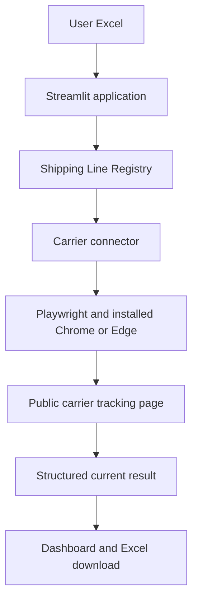

# ContainerPulse – Multi-Carrier Container Tracking Platform

ContainerPulse is an ICAI AICA Level 2 capstone project that consolidates live
container-tracking information from public carrier websites into one
Streamlit dashboard. It uses Python browser automation and does not require a
paid carrier API or API key.

> **Responsible-use statement:** ContainerPulse automates the same public
> tracking pages available to a normal user. It does not bypass CAPTCHA,
> login requirements, access restrictions, rate limits, or other website
> security controls.

## Problem statement

Logistics teams frequently track containers across different shipping-line
websites. The user must repeatedly open each carrier page, enter a container
number, read different page layouts, and combine the results manually. This is
slow, inconsistent, and difficult to review as a portfolio.

## Objective

Provide a simple multi-carrier tool that accepts an Excel list, routes each
container to its carrier connector, extracts the current tracking position,
and presents a clear dashboard and downloadable Excel report.

## Business use case

ContainerPulse helps finance, procurement, logistics, import/export, and
operations teams obtain a current exception view of active shipments. It can
reduce repetitive website checks and make tracking failures or completed
shipments easier to identify during operational reviews.

## Key features

- Excel upload with only `Container Number` and `Shipping Line`.
- **Track All Containers** workflow.
- Working dedicated connectors for **MSC** and **Maersk**.
- Current status, location, vessel, ETA, last event, and checked time.
- KPI dashboard for Total, In Transit, Arrived/Completed, and Tracking Errors.
- Attention-required visibility through warning rows and the Tracking Errors
  section.
- Downloadable updated Excel report.
- Shipping Line Registry with Ready / Not Configured / Setup Failed states.
- Prototype setup assistant for discovering controls and fields on a new
  carrier website.
- Clean unsupported-carrier and website-error handling.
- Uses an already-installed Chrome or Edge browser; it does not download a
  separate browser.

## How it works

1. The user uploads an Excel workbook or uses the local master workbook.
2. ContainerPulse validates the two required columns.
3. The Shipping Line Registry determines the appropriate connector.
4. Playwright launches the existing Chrome/Edge installation.
5. The connector opens the carrier's public tracking page and searches the
   container number.
6. Available tracking fields are converted into a common result structure.
7. Streamlit displays KPIs, results, warnings, and an Excel download.

## Supported carriers

| Carrier | Connector | Status |
|---|---|---|
| MSC | Dedicated Playwright connector | Ready |
| Maersk | Dedicated Playwright connector | Ready |

Carrier websites can change without notice. A previously working connector may
therefore require maintenance.

## Shipping Line Registry concept

The Admin / Shipping Line Registry page stores:

- Shipping Line Name
- Tracking URL
- Connector Status
- Discovered connector configuration for custom carriers

For a new carrier, **Setup Connector** attempts to locate a container-number
input, Track/Search button, and visible tracking-result fields. It then retests
the saved configuration. Successful discovery becomes `Ready`; otherwise the
registry stores `Setup Failed` with a clear reason. This is a prototype:
complex sites may still require a dedicated connector.

## Technology stack

- Python
- Streamlit
- Playwright
- Existing Google Chrome or Microsoft Edge
- Pandas
- OpenPyXL
- Excel/CSV-compatible data exchange
- Local JSON configuration for the carrier registry

No Docker, API keys, paid services, admin-right installation, or shipment
history database is required.

## Architecture



See [docs/ARCHITECTURE.md](docs/ARCHITECTURE.md) for details.

## Repository structure

```text
ContainerPulse_Capstone_Final/
├── app.py
├── data/
│   ├── master_containers.xlsx
│   └── shipping_line_registry.json
├── docs/
├── sample_data/
│   └── sample_containers.xlsx
├── services/
├── tests/
├── tracker/
├── requirements.txt
├── run_containerpulse.bat
├── .gitignore
├── LICENSE
└── README.md
```

The existing `tracker/` and `services/` module names are retained so the tested
application imports and behaviour remain unchanged.

## Installation and running on Windows

### Prerequisites

- Python 3.11 or newer
- Google Chrome or Microsoft Edge already installed
- Internet access to the public carrier websites

### Recommended method

1. Download or clone this repository.
2. Extract it to a normal user folder.
3. Double-click `run_containerpulse.bat`.
4. If the browser does not open automatically, use the local Streamlit address
   displayed in the command window.

Manual alternative:

```powershell
python -m pip install -r requirements.txt
python -m streamlit run app.py
```

Do **not** run `playwright install chromium`. ContainerPulse is designed to use
the Chrome/Edge browser already installed on the Windows laptop.

## Input Excel format

The workbook must contain exactly these required columns:

| Container Number | Shipping Line |
|---|---|
| DEMO0000001 | MSC |
| DEMO0000002 | MAERSK |

The included workbook contains fictional values for demonstration of the file
format. They are not expected to return live carrier results. Use only tracking
numbers that you are authorized to check, and never commit operational data to
a public repository.

Sample: `sample_data/sample_containers.xlsx`

## Output fields

- Container Number
- Shipping Line
- Current Status
- Current Location
- Vessel
- Latest ETA
- Last Tracking Event
- Checked At
- Tracking Result
- Error

## Screenshots

Add redacted capstone screenshots under `docs/screenshots/` before presentation:

- `dashboard.png` – upload and KPI dashboard
- `tracking_results.png` – current tracking results
- `attention_required.png` – failed/attention-required result example
- `shipping_line_registry.png` – registry administration page

Do not add screenshots containing real container numbers, shipment routes,
customer information, or other confidential details.

## Security and privacy

- No API keys or carrier credentials are stored.
- No shipment tracking history is stored.
- Tracking results remain in the active Streamlit session unless downloaded.
- Debug screenshots, logs, browser sessions, databases, secrets, and generated
  result files are excluded through `.gitignore`.
- CAPTCHA, login, human-verification, and access-denial states are reported and
  never bypassed.
- Users remain responsible for carrier terms of use and appropriate request
  frequency.

## Limitations

- Public carrier websites can change layout or selectors.
- Carrier anti-automation policies may prevent tracking.
- CAPTCHA or login requirements stop automation.
- The Setup Connector feature is heuristic and cannot configure every website.
- Tracking runs are sequential and intended for a capstone/local demonstration,
  not high-volume production use.
- The included dummy container numbers do not produce live tracking results.

## Future scope

- Dedicated connectors for additional carriers.
- Admin authentication and role-based access.
- Secure hosted deployment architecture.
- Scheduled tracking with compliant request controls.
- Connector health monitoring and selector maintenance alerts.
- Optional enterprise database and authorized history retention.
- Email/Teams exception notifications.

## Capstone learning and outcomes

This project demonstrates:

- Turning a practical logistics problem into a working automation product.
- Modular connector and registry architecture.
- Browser automation against dynamic web applications.
- Data validation, normalization, exception handling, and Excel reporting.
- Streamlit dashboard design and Windows-friendly delivery.
- Regression testing and privacy-conscious repository preparation.
- Responsible automation that respects access controls.

## License

Released under the [MIT License](LICENSE).
