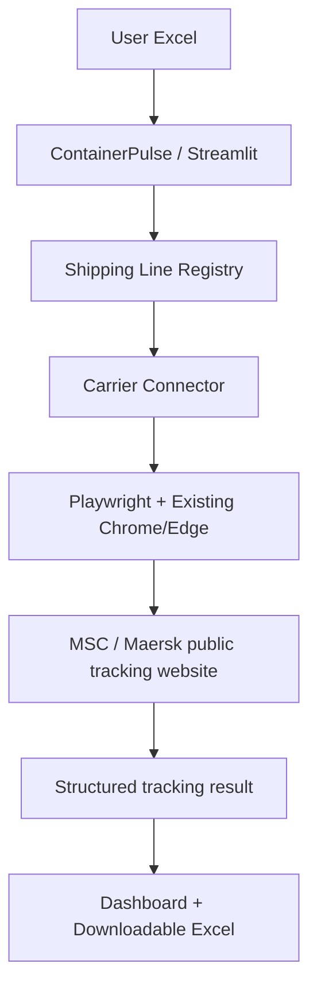
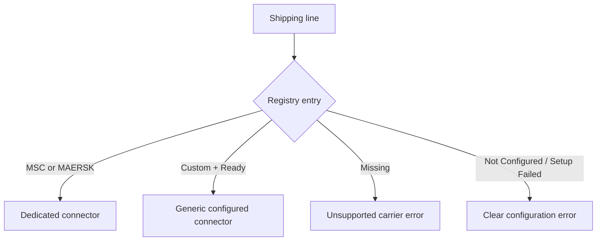

# ContainerPulse Architecture

## Overview

ContainerPulse is a modular Streamlit application. The dashboard orchestrates
input validation and results presentation, while registry and connector
modules isolate carrier-specific browser automation.

## Component responsibilities

| Component | Responsibility |
|---|---|
| `app.py` | Streamlit pages, upload/master workflow, progress, KPIs, results, registry administration, and downloads |
| `services/excel_service.py` | Input validation and formatted Excel output |
| `services/tracking_service.py` | Batch orchestration and common result schema |
| `services/registry_service.py` | Local JSON registry CRUD and connector status |
| `services/connector_setup.py` | Heuristic discovery and automatic retest for custom carriers |
| `services/status_service.py` | Mutually exclusive dashboard state classification |
| `tracker/runner.py` | MSC/Maersk dedicated connector routing |
| `tracker/msc.py` | MSC public-page automation and extraction |
| `tracker/maersk.py` | Maersk public-page automation and extraction |
| `tracker/generic.py` | Executes saved custom-carrier configurations |
| `tracker/browser.py` | Detects and launches installed Chrome/Edge |

## Input and output model

Input requires only:

- Container Number
- Shipping Line

Every row is converted to a common current-result structure containing status,
location, vessel, ETA, last event, checked time, success/failure, and error.
There is no previous/current snapshot rotation or shipment-history database.

## Registry routing

MSC and Maersk remain protected built-in connectors. Custom entries are stored
in `data/shipping_line_registry.json`.

## Setup Connector prototype

The setup assistant uses a supplied test container to:

1. Open the configured public tracking URL.
2. Detect visible container input and Track/Search controls.
3. Submit the test container.
4. Search the rendered page for standard tracking labels/selectors.
5. Save a configuration locally.
6. Open a fresh browser run and retest that configuration.

The entry becomes Ready only when the retest identifies the container and at
least one tracking field. CAPTCHA, login, human verification, and access denial
stop setup immediately.

## Browser strategy

ContainerPulse does not download Playwright Chromium. The launcher tries:

1. Playwright `channel="chrome"`
2. Playwright `channel="msedge"`
3. Common installed Chrome/Edge executable paths

This matches the constraints of a normal office Windows laptop without Docker,
admin rights, or additional executables.

## State and privacy

- Tracking results exist only in the current Streamlit session and optional
  user-downloaded Excel output.
- Registry configuration is local JSON, not shipment history.
- Runtime debug artifacts are excluded from Git.
- No API keys or credentials are required.

## Error handling

Failed tracking is classified as Tracking Error. Explicit delivered/completed/
closed statuses are classified as Arrived / Completed. Every other successful
result is classified as In Transit. Unsupported carriers and setup failures are
returned as row-level errors so a batch can continue.
