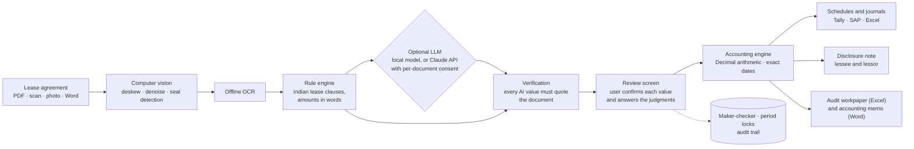
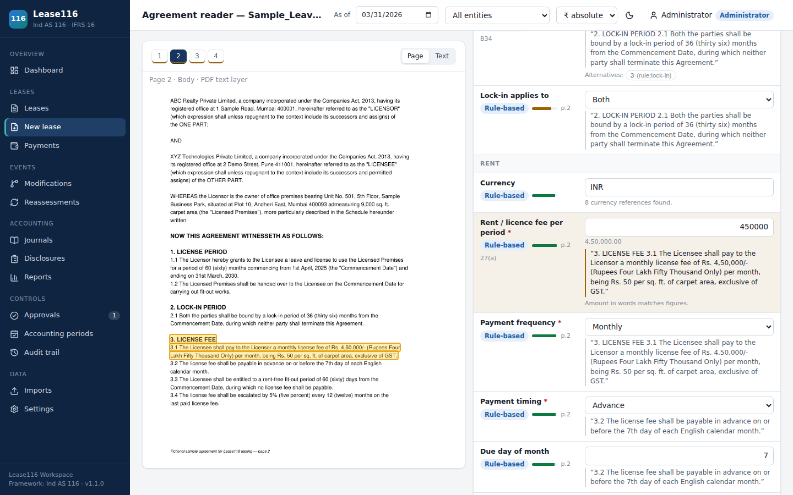
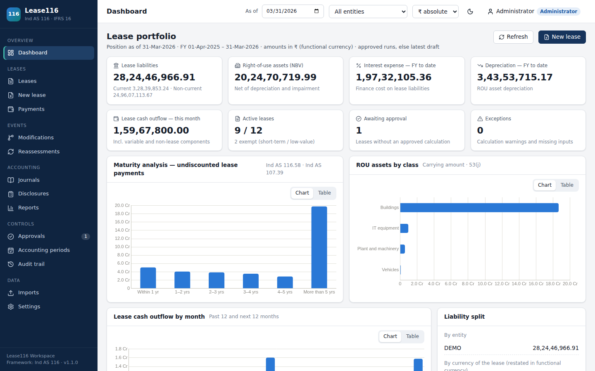
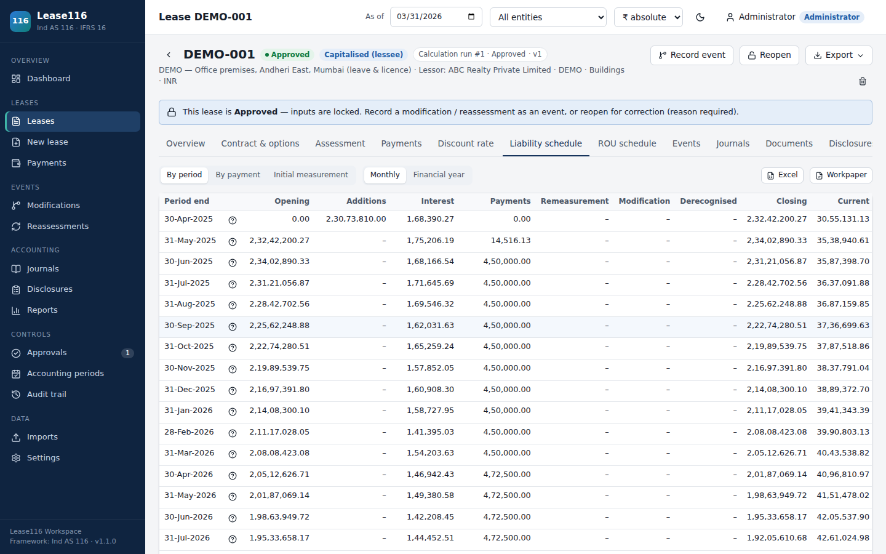
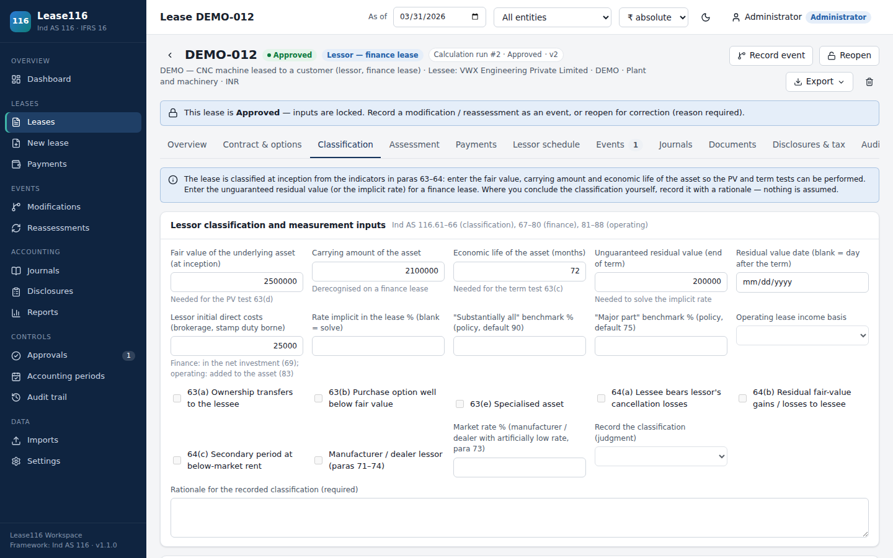
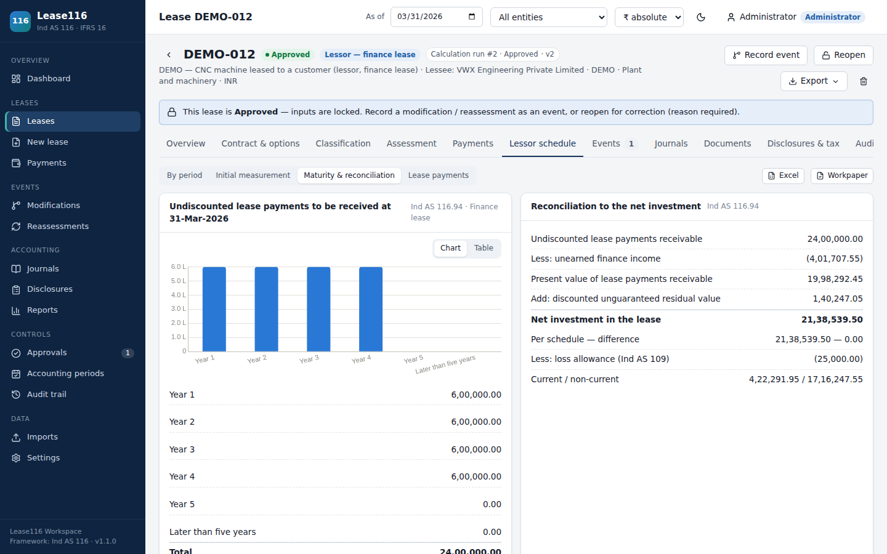
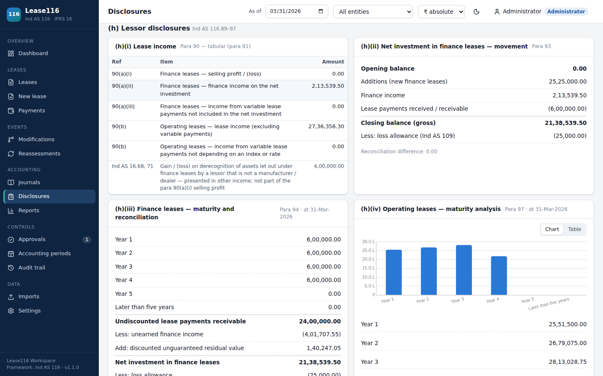
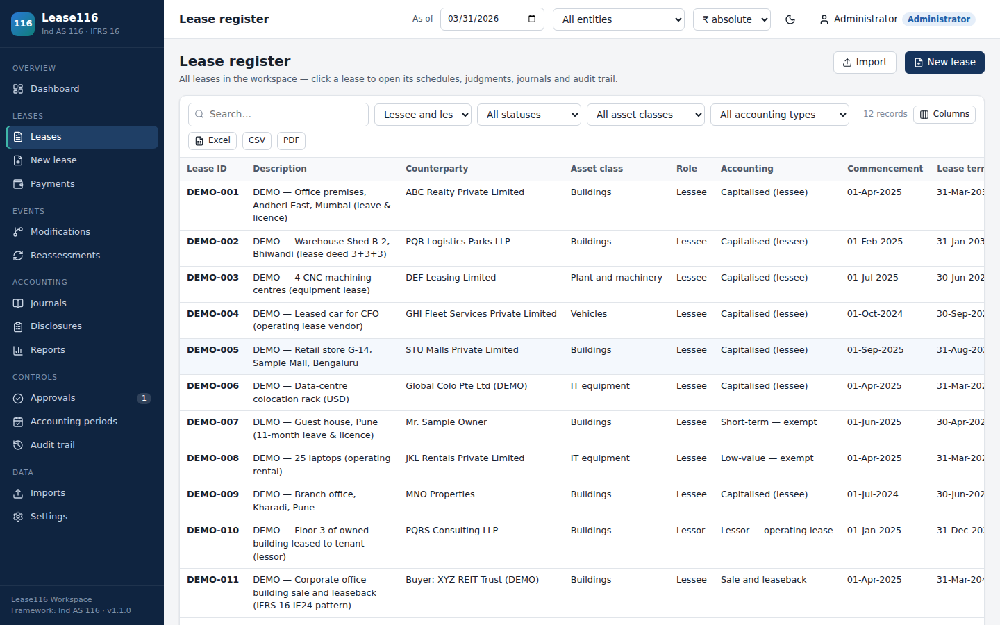

# Lease116 — Ind AS 116 Lease Accounting for Lessees and Lessors

**ICAI — AI for Chartered Accountants (AICA) Level 2 · Capstone Project**
**Submitted by:** CA Vaibhav Sahu

Lease116 is an offline Windows desktop application that takes a lease agreement from a scanned or digital document to audit-ready Ind AS 116 accounting. It reads the agreement with computer vision, OCR and a rule engine for Indian lease language, and cites the source clause for every value it proposes. It asks the preparer to decide each judgment the standard requires. It then produces the schedules, journals, disclosure note, Excel audit workpaper and accounting memo under maker-checker control. It covers leases where the entity is the **lessee** and where it is the **lessor**. IFRS 16 can be selected instead of Ind AS 116.

---

## 1. The problem

| Pain point in practice | Consequence |
|---|---|
| Lease terms are buried in long agreements, often scanned stamp-paper copies | Manual abstraction is slow; clauses such as lock-in, escalation, rent-free period and deposit are missed or misread |
| Ind AS 116 needs judgments: lease term, discount rate, deposit fair value, and lessor classification | Judgments go undocumented, so audit queries and restatements follow |
| Exact-date present values, modifications, reassessments and lessor straight-lining are done in spreadsheets | Formula breaks, rounding drift, schedules that do not tie to the ledger |
| Disclosures (paras 53–60 for lessees, 89–97 for lessors) are prepared separately | Notes do not agree with the schedules; the para 94 reconciliation and the maturity analysis are often missing |
| Client agreements are confidential | Cloud AI tools are often not acceptable for client documents |

## 2. The solution



## 3. Where AI is used, and the guardrails

| AI element | What it does | Guardrail |
|---|---|---|
| Computer vision (OpenCV) | Deskews tilted scans, cleans noise, detects stamps and seals, measures blur and flags poor scans; pages are classified (e-stamp, body, schedule, signature) | If image clean-up fails, the unprocessed page is used — reading never stops |
| OCR (RapidOCR / ONNX, offline) | Reads scanned pages on the PC | Blurred or low-confidence pages are flagged; every value is confirmed by the user |
| Rule engine | Finds parties, dates, term, lock-in, rent, escalation, rent-free period, deposit, stamp duty and CAM in Indian lease wording; parses amounts written in words ("Rupees Four Lakh Fifty Thousand") | Every value carries its source quote and page; words and figures are cross-checked |
| Optional LLM (local Ollama / LM Studio, or Claude API) | Fills gaps the rules cannot read | Off by default. Cloud use needs administrator permission plus consent for each document (audit-logged). An AI value whose quote is not found in the document is rejected |
| Human in the loop | — | Judgments (reasonably-certain options, IBR, deposit market rate, classification) are never answered by the software; calculation is blocked until the user decides |
| AI-assisted development | The application was specified, directed and reviewed by the author and built with Claude (Anthropic) as an AI coding assistant | Accounting outputs are covered by automated tests, published benchmarks and an independent recomputation (section 6) |

## 4. What it covers

| Area | Coverage |
|---|---|
| Lessee accounting | Lease term with options and documented judgments; all payment types (escalations, rent-free, CPI, residual value guarantees, purchase options, penalties, incentives, CAM split); initial measurement on exact dates; ROU build-up; effective-interest schedules; depreciation; impairment with capped reversal |
| Lessee events | Modifications (separate lease, scope increase / decrease, term change, consideration change), reassessments (revised vs unchanged rate), terminations, restoration revisions — each with an impact preview before saving |
| Lessor accounting | Lessee / lessor choice at entry; classification (paras 61–66) with evidence for 63(a)–(e) and 64(a)–(c) and policy benchmarks; finance leases (implicit rate including IDC, net investment, constant-rate finance income, manufacturer / dealer selling profit, residual reduction, expected credit losses); operating leases (straight-line income, IDC); variable and non-lease components; modifications under paras 79, 80(a), 80(b) and 87; early termination |
| Related balances | Security deposits paid and received (Ind AS 109), restoration provisions (Ind AS 37), foreign-currency leases (Ind AS 21), deferred-tax support (Ind AS 12), short-term / low-value exemptions, subleases (B58), sale and leaseback |
| Outputs | Dashboard with lessee and lessor KPIs; 19 reports; disclosure note (paras 53–60 and 89–97, incl. the para 94 reconciliation); journals (CSV / Excel / Tally XML / SAP-style); Excel audit workpaper with live formulas; Word accounting memo |
| Controls | Roles, maker-checker, segregation of duties, period locks, immutable calculation runs with input hashes, full audit trail |

## 5. Screenshots

All screenshots use the built-in demonstration portfolio (fictional entities and agreements).

| Agreement reader — each value with its source clause highlighted |
|---|
|  |

| Portfolio dashboard | Lessee — lease liability schedule |
|---|---|
|  |  |

| Lessor — classification evidence (paras 61–66) | Lessor — para 94 maturity analysis and reconciliation |
|---|---|
|  |  |

| Disclosure note — lessor section (paras 89–97) | Lease register |
|---|---|
|  |  |

## 6. Accuracy and testing

| Check | Result |
|---|---|
| Automated tests (`python -m pytest -q`) | **101 passed**, in two independent Python environments |
| IFRS 16 Illustrative Examples IE13, IE16, IE17, IE18, IE19, IE24 | The engine reproduces the example figures recorded in the test suite to the currency unit (initial measurement, reassessment, modifications, sale and leaseback); those figures should be confirmed against the licensed IFRS text (build report, section 5) |
| Independent recomputation of five lessor examples (finance lease, operating lease with deposit and IDC, para 87 modification, termination, manufacturer / dealer) | Agrees with Lease116 within ₹0.01 of rounding in every figure, incl. the para 94 reconciliation |
| Ledger integrity | At every month-end, posted journals rolled up by account equal the schedule balances (lessee and lessor) |
| Excel workpaper | Recalculated in LibreOffice: live formulas agree with the engine (difference 0.00) |

Details: [docs/05_Build_Status_and_Test_Report.md](docs/05_Build_Status_and_Test_Report.md).

## 7. Quick start (Windows)

| Step | Action |
|---|---|
| 1 | Download this folder and double-click **`Setup.bat`** (one time, 5–15 minutes, internet needed — installs Python packages into `%LOCALAPPDATA%\Lease116`) |
| 2 | Double-click the **Lease116** desktop shortcut (or `Lease116.exe`). The browser opens http://127.0.0.1:8116 and a Lease116 icon appears next to the clock (right-click → *Stop Lease116* to close) |
| 3 | Sign in as `admin` / `admin116` and change the password when prompted |
| 4 | Optional: *Settings → System → Load demonstration portfolio* to explore 12 illustrative leases (10 as lessee, 2 as lessor). Use a practice workspace, not a client database |
| 5 | Try the agreement reader with the fictional agreements in `samples\agreements` (digital leave-and-licence PDF, tilted scanned lease deed, equipment lease in Word, retail revenue-share lease) |

Run from source (any OS with Python 3.11+):

```
python -m venv .venv
.venv\Scripts\activate            # Linux / macOS: source .venv/bin/activate
pip install -r requirements.txt -r requirements-ocr.txt
python -m app                      # opens http://127.0.0.1:8116
pip install -r requirements-dev.txt && python -m pytest -q
```

## 8. Folder structure

| Folder | Contents |
|---|---|
| `app/engine` | Accounting engine — lessee, lessor, sublease, sale and leaseback, exemptions, tax, journals, disclosures (pure Python `Decimal`) |
| `app/docintel` | Agreement reader — loading, computer vision, OCR, rules, LLM adapters, verification |
| `app/db`, `app/services`, `app/api` | Database (SQLite), business services, REST API (FastAPI, OpenAPI-documented) |
| `app/static` | Offline web interface (Vue 3, no external calls) |
| `docs` | PRD and architecture, calculation methodology, user guide, installation and operations, build and test report, screenshots |
| `installer`, `Setup.bat`, `Lease116.exe` | Windows setup script and launcher (source in `installer\launcher`) |
| `samples` | Fictional sample agreements |
| `tests` | Automated tests |

## 9. Documents

| # | Document |
|---|---|
| 01 | [PRD and architecture](docs/01_PRD_and_Architecture.md) |
| 02 | [Calculation methodology](docs/02_Calculation_Methodology.md) |
| 03 | [User guide](docs/03_User_Guide.md) |
| 04 | [Installation and operations](docs/04_Installation_and_Operations.md) |
| 05 | [Build status and test report](docs/05_Build_Status_and_Test_Report.md) |

## 10. Important

Lease116 supports professional judgment; it does not replace it. Every judgment the standard requires is an explicit input with a rationale, and every value read from an agreement must be confirmed by the user. Review the outputs before using them in financial statements or audit files. The sample agreements and the demonstration portfolio are fictional. The limits of verification are stated in section 5 of the build and test report.
