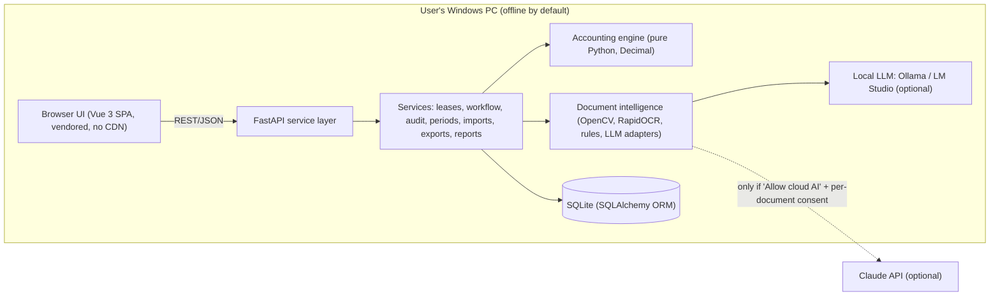
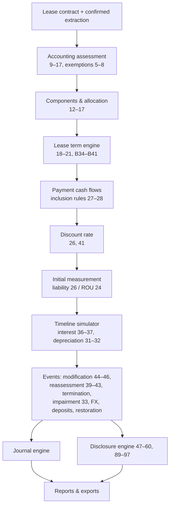
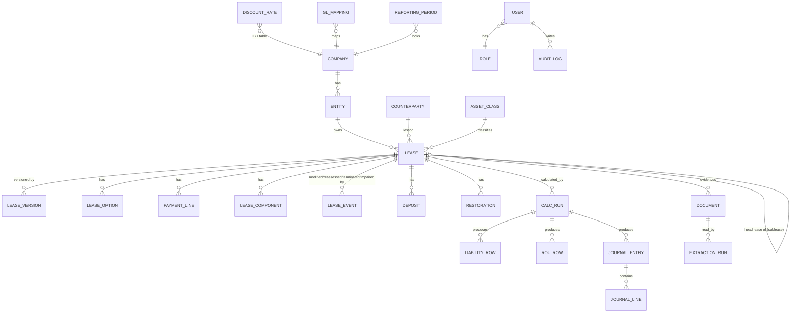

# Lease116 — Ind AS 116 / IFRS 16 Lease Accounting Platform
## Product Requirements Document (PRD) and Solution Architecture

| Item | Detail |
|---|---|
| Document | 01 — PRD and Solution Architecture (Phases 1–3 deliverable) |
| Version | 1.0 |
| Date | 25 September 2026 |
| Primary framework | Ind AS 116 *Leases* (Companies (Indian Accounting Standards) Rules, 2015, as amended) |
| Secondary framework | IFRS 16 *Leases* (configurable) |
| Deployment | Local Windows desktop (x64 and ARM64), browser-based UI served from the user's own PC |
| Status | Baseline for build; implementation status is tracked in `docs/05_Build_Status_and_Test_Report.md` |

> **Reference hierarchy used throughout (spec §40).** (1) notified Ind AS 116 text for the reporting period; (2) its Appendix B application guidance and amendments (incl. para 102A, effective 1 April 2024); (3) connected standards (Ind AS 109, 37, 21, 36, 12, 7, 115, 1); (4) official implementation material (IFRS Interpretations Committee agenda decisions, IFRS 16 Illustrative Examples); (5) entity accounting policies and documented judgments. Educational summaries never override (1)–(4).

---

## 1. Product vision

A professional, auditable lease-accounting platform that:

1. **Reads the lease agreement** (digital PDF, scanned PDF, photograph, Word) using computer vision + OCR + a rules engine + a local LLM (optional Claude API), and proposes every Ind AS 116 input **with the clause text and page as evidence**.
2. **Requires human confirmation** of every extracted input before it drives accounting ("never invent missing accounting inputs").
3. **Computes** the lease liability, ROU asset, schedules, journals and disclosures with Decimal (non-floating-point) arithmetic, exact payment dates and a fully reproducible, versioned event history.
4. **Explains** every figure ("How calculated?") down to the discount factor of each payment and the paragraph reference.
5. **Controls** the process through maker-checker approvals, period locks and a complete audit trail — suitable for statutory audit files and client advisory deliverables.

## 2. Users and roles

| Role | Typical user | Key permissions |
|---|---|---|
| Administrator | Practice IT lead / engagement manager | Users, roles, entity access, settings, GL mapping, period reopening |
| Lease Accountant | Client finance team / consultant | Create/edit leases, run calculations, create events, generate journals |
| Preparer | Article assistant / junior | Create and edit drafts, run AI reader, submit for review |
| Reviewer | Senior / assistant manager | Review, return with comments, mark reviewed |
| Approver | Manager / partner / client controller | Approve calculations and events, lock periods |
| Auditor | Statutory / internal auditor | Read-all, recomputation, GL reconciliation, audit-trail export |
| Read-only | Management / client viewer | Dashboards and reports only |

Segregation of duties: the user who prepared a calculation cannot approve it (configurable — may be relaxed only by an Administrator for single-user installations, and the relaxation itself is audit-logged). Entity-level access restrictions apply to every list, report and export.

## 3. Assumptions (explicit)

| # | Assumption | Type | Where configurable |
|---|---|---|---|
| A1 | Default measurement: exact payment dates, Actual/365 (Fixed), effective annual discount rate (consistent with Excel `XNPV`). Alternative: month-based periodic method (rate ÷ 12). | Entity policy | Settings → Calculation policies; lease override |
| A2 | A payment dated on the commencement date is treated as paid at commencement (excluded from the liability, included in ROU under para 24(b)). | Entity policy | Settings |
| A3 | Remeasurement events are processed at the start of the effective date (payments dated on the effective date follow the revised terms). | Methodology | Documented; fixed |
| A4 | ROU depreciation straight-line on actual days (alternative: equal monthly with partial months by days). | Entity policy | Settings |
| A5 | Current portion of lease liability = principal reduction over the next 12 months (alternative: PV of payments due within 12 months). | Entity policy | Settings |
| A6 | Low-value threshold is **not** assumed. It must be set as an entity policy before any low-value exemption can be approved. | Policy (required) | Settings → Policies |
| A7 | Refundable interest-free security deposits are financial assets under Ind AS 109; the excess of cash paid over initial fair value is treated as an additional lease payment (added to ROU). Flagged as "Accounting judgment required". | Entity policy + judgment | Lease → Deposit |
| A8 | GST with input tax credit is excluded from lease payments; non-creditable GST treatment is a policy choice and is flagged. | Entity policy | Settings |
| A9 | Tax bridge assumes tax base of ROU asset and lease liability = nil unless overridden; it is an accounting-support tool, not a tax-compliance engine. | Assumption | Lease → Tax |
| A10 | Local deployment on the user's PC; SQLite database in `%LOCALAPPDATA%`; multi-user logins supported on the same machine. Network/PostgreSQL deployment is Phase 2. | Technical | `config` |
| A11 | Client agreements are processed offline by default. Claude API use requires an entity-level "Allow cloud AI" setting **and** a per-document confirmation; every call is audit-logged. | Privacy control | Settings → AI engine |
| A12 | Reporting framework switch (Ind AS 116 / IFRS 16) changes presentation/disclosure rules only where the frameworks differ (e.g., cash-flow classification of interest; investment-property fair-value model not available under Ind AS 40). | Framework rule | Settings |

## 4. Functional requirements

Legend: **v1** = delivered in this build; **P2** = Phase 2 roadmap.

| ID | Module | Requirement | Ind AS 116 ref. | Scope |
|---|---|---|---|---|
| F01 | Lease register | Unique Lease ID; entity, BU, cost centre, department, location, project, GL mapping; counterparty incl. related-party flag | 51–52 | v1 |
| F02 | AI agreement reader | Ingest PDF/scan/image/DOCX; CV clean-up; OCR; clause segmentation; rules + local LLM (+ optional Claude) extraction; evidence (quote, page, highlight); confidence; conflicts; missing-field list; judgment flags | 9–28, B34–B42 | v1 |
| F03 | Lease assessment | Identified asset, substitution rights, economic benefits, right to direct use; components; exemption checks with validation | 9–17, B9–B33, 5–8 | v1 |
| F04 | Lease term engine | Non-cancellable period, extension/termination/purchase options, lessor-only options, reasonably-certain assessment with rationale; accounting term separate from contractual maximum | 18–21, B34–B41 | v1 |
| F05 | Payment engine | Fixed, in-substance fixed, rent-free, escalations (compound/simple, step table), index/rate-linked, RVG, purchase option, termination penalty, incentives, advance/arrears, irregular; lease vs non-lease split; inclusion flag + reason | 26–28, 38, B42 | v1 |
| F06 | Discount rate module | Implicit rate / IBR; single, portfolio (tenor/currency table), lease-specific; source, methodology, effective date, evidence, approver | 26, 41 | v1 |
| F07 | Initial measurement | PV of unpaid lease payments with exact dates; ROU build-up with each component shown | 23–28 | v1 |
| F08 | Subsequent measurement | Monthly liability and ROU roll-forwards; payment-level effective-interest schedule; no silent plugs; exceptions shown | 29–43 | v1 |
| F09 | Depreciation | Lease term / useful life (ownership transfer or purchase option), partial periods | 31–32 | v1 |
| F10 | Modifications | Separate-lease test; scope increase/decrease; term change; consideration change; partial/full termination gain/loss; pre- and post-modification schedules preserved | 44–46 | v1 |
| F11 | Reassessments | Lease term, purchase option (revised rate); RVG, index/rate (unchanged rate); floating-rate exception | 39–43 | v1 |
| F12 | Terminations | Full/partial, penalties, derecognition gain/loss | 46(a) | v1 |
| F13 | Security deposits | Separate Ind AS 109 module: fair value, difference, EIR unwinding, refund; materiality flag | Ind AS 109 | v1 |
| F14 | Restoration | Ind AS 37 provision: PV, unwinding, revisions (asset-adjusted), settlement | 24(d), 25; Ind AS 37 | v1 |
| F15 | Foreign currency | Liability retranslated (monetary); ROU at historical rate (non-monetary); FX gain/loss | Ind AS 21 | v1 |
| F16 | Impairment | Ind AS 36 loss/reversal with cap; history; prospective depreciation | 33; Ind AS 36 | v1 |
| F17 | Exemptions | Short-term (class election) and low-value (lease-by-lease) with validation and straight-line expense | 5–8, B3–B8 | v1 |
| F18 | Lessor module | Classification indicators; finance lease (net investment, unearned income, finance income); operating lease (straight-line income) | 61–97 | v1 (core) |
| F19 | Subleases | Classification by reference to head-lease ROU; link to head lease | B58, 68 | v1 (core) |
| F20 | Sale and leaseback | Ind AS 115 sale assessment; off-market adjustments; ROU retained ratio; gain on rights transferred; para 102A policy flag; failed-sale financing | 98–103, 102A | v1 (core) |
| F21 | Tax bridge | Tax bases, temporary differences, DTA/DTL, recoverability/offset flags; income-tax computation adjustments | Ind AS 12 | v1 |
| F22 | Journals | Commencement, monthly, events; configurable GL by entity/class/cost centre/type; Dr = Cr check; CSV / Excel / Tally XML / SAP-style export | — | v1 |
| F23 | Disclosures | Para 53 table, ROU reconciliation by class, liability movement, maturity analysis, Ind AS 7 44A reconciliation, para 59/60 narrative inputs, lessor disclosures | 47–60A, 89–97 | v1 |
| F24 | Dashboard | KPIs, alerts (expiries, renewals, missing rates/contracts, unapproved, exceptions), charts | — | v1 |
| F25 | Reports | 19 reports (incl. lessor schedule and lessor maturity / reconciliation), filterable, export Excel/CSV/PDF | — | v1 |
| F26 | Audit trail & controls | User, timestamp, old/new, reason, document, approval status; maker-checker; period lock/reopen | — | v1 |
| F27 | Documents | Attach agreement, addenda, notices, IBR workings, memos etc. to lease and events | — | v1 |
| F28 | Imports | Templates (lease master, payments, discount rates, opening balances, GL balances); upload → validate → errors → preview → approve → import; error report | — | v1 |
| F29 | Audit recomputation | Recompute from commencement and compare with client/GL balances; variance report | — | v1 |
| F30 | Accounting memo | Auto-generated lease accounting memo (facts, judgments, measurement, JEs) for audit file | 59 | v1 |
| F31 | Network deployment | PostgreSQL, SSO, server install | — | P2 |
| F32 | Direct ERP posting | API posting to SAP/Tally | — | P2 |
| F33 | Transition calculators | Ind AS 101 / Appendix C transition approaches | C1–C20 | P2 |
| F34 | Revaluation model for ROU; portfolio approach | 35, B1 | P2 |

## 5. Accounting requirements matrix (key rules implemented)

| Area | Rule applied by the engine | Ref. | Judgment flag raised when |
|---|---|---|---|
| Recognition exemptions | Short-term = accounting lease term ≤ 12 months at commencement and no purchase option; election by class. Low-value assessed on value **when new**, B5 conditions, not for head lease of a sublease; lease-by-lease | 5–8, B3–B8, App. A | Election selected but validation fails; 11-month agreements with renewal history |
| Identifying a lease | Checklist: identified asset, substantive substitution, economic benefits, right to direct | 9–11, B9–B31 | Substitution right present; capacity portion; directing use unclear |
| Components | Separate lease/non-lease (relative stand-alone price) unless para 15 expedient elected for the class | 12–17 | Non-lease charges found (CAM, services) |
| Lease term | Non-cancellable + extension periods reasonably certain + periods after termination option reasonably certain not to be exercised; lessor-only termination rights ignored | 18–21, B34–B41 | Any lessee option; lock-in shorter than term; enforceability (both-party termination) |
| Lease payments | Fixed/in-substance fixed less incentives receivable; index/rate at commencement value; RVG expected amounts; purchase option if reasonably certain; penalties if term reflects termination; other variable payments excluded | 27–28, 38(b) | Variable payments; index-linked rent |
| Discount rate | Implicit rate if readily determinable, else IBR; revised rate for term/purchase-option reassessment and modifications; unchanged rate for RVG/index changes (except floating rates) | 26, 40–43, 45(c) | IBR without documented methodology/approval |
| Initial ROU | Liability + payments at/before commencement − incentives received + IDC + restoration estimate | 24–25 | IDC includes items that are not incremental |
| Depreciation | Commencement → end of lease term; → end of useful life if ownership transfers or purchase option reasonably certain | 31–32 | — |
| Remeasurement | ΔLiability adjusted to ROU; reduction beyond zero ROU → P&L | 39 | Reduction beyond carrying amount |
| Modifications | Separate lease if additional ROU at commensurate stand-alone price; otherwise remeasure at revised rate; scope decrease → proportionate partial termination gain/loss, then remeasurement to ROU | 44–46 | Always (modifications require reviewer attention) |
| Presentation | ROU separate or disclosed; lease liabilities current / non-current (Schedule III Div. II line items); interest separate from depreciation; cash flows — principal and interest in financing activities (Ind AS), short-term/low-value/variable in operating | 47–50 | Framework = IFRS 16 → interest classification per IAS 7/IFRS 18 policy |
| Disclosures | Para 53(a)–(j), 55, 58 (maturity per Ind AS 107 B11), 59, 60 | 51–60 | Narrative items require user input |
| Deposits | Fair value at market rate; difference = prepaid lease payment (policy); EIR interest income | Ind AS 109 | Always for interest-free deposits ≥ materiality |
| Restoration | PV at pre-tax risk-adjusted rate; unwinding in finance cost; revisions to ROU (cost model) | 24(d); Ind AS 37; Ind AS 16 App. A | Estimate revisions |
| FX | Liability at closing rate; ROU at historical rate; FX to P&L | Ind AS 21.23, 28 | All FX leases |
| Sale and leaseback | Ind AS 115 control transfer; ROU = CA × retained proportion; gain only on rights transferred; off-market adjustments; 102A subsequent measurement | 98–103, 102A | Always |

## 6. User journeys

| # | Journey | Steps |
|---|---|---|
| J1 | **New lease from agreement (AI)** | Upload agreement → CV clean-up + OCR (if scanned) → extraction (rules + local LLM) → review screen (evidence highlighted on page image, confidence, conflicts, missing fields) → confirm/edit each field → judgment questionnaire (term options, IBR, exemptions) → draft lease created → calculate → submit for review → approve → journals |
| J2 | **New lease (manual wizard)** | Contract → Assessment → Term & options → Payments (generator + grid) → Discount rate → Initial costs (prepayments, IDC, incentives, restoration, deposit) → Review & calculate |
| J3 | **Month-end close** | Select period → review exceptions → generate journals → approve → export to ERP / Tally → lock period |
| J4 | **Modification** | Lease → Modifications → choose type → enter revised terms → preview (pre vs post, gain/loss, JE) → attach addendum → submit → approve → new version effective from date (history preserved) |
| J5 | **Reassessment** | Lease → Reassessments → trigger (term/purchase/RVG/index) → rate basis enforced by type → preview → approve |
| J6 | **Year-end reporting** | Disclosures → period → Ind AS 116 note tables, maturity analysis, liability movement → export Excel/PDF |
| J7 | **Statutory audit recomputation** | Import client lease data + GL balances → recompute from commencement → GL reconciliation variance report → audit memo and workpaper export (ICAI format, live formulas) |
| J8 | **Bulk migration** | Download template → fill → upload → validation errors → correct → preview → approve → import |

## 7. System architecture

Design principles: the accounting engine has **no dependency on the UI, the database or the AI layer** — it takes an immutable input snapshot and returns schedules, events, journals, disclosures, exceptions and explanations. Every calculation run stores its input snapshot and hash, so any historical result can be reproduced exactly.

## 8. Accounting calculation architecture

The **timeline simulator** walks every lease day-accurately through: payments, month-ends, and events. Interest between any two dates = balance × ((1+R)^(Δτ) − 1) where R is the effective annual rate and τ the year-fraction under the selected day-count. Because discounting and accretion use the same R and τ, the schedule amortises to exactly nil at the last payment (subject only to the stated rounding rule).

## 9. Database ER model (core)

Full table definitions, indexes and the versioning design are in `docs/03_Data_Model.md` (generated from the ORM so that the document cannot drift from the code).

**Versioning design.** A lease has an append-only chain of `lease_versions` (v1 = initial recognition; each approved event creates v*n*+1 with `effective_date`). Calculation runs are immutable; approval freezes them. Historical periods are never recomputed silently — a change affecting a locked period requires an authorised reopening, which is audit-logged with reason.

## 10. API structure (REST, JSON)

| Area | Endpoints (prefix `/api`) |
|---|---|
| Auth | `POST /auth/login`, `GET /auth/me`, `POST /auth/logout` |
| Dashboard | `GET /dashboard?as_of=&entity_id=` |
| Leases | `GET/POST /leases`, `GET/PATCH /leases/{id}`, `POST /leases/{id}/archive` |
| Assessment/term/payments | `GET/PUT /leases/{id}/assessment`, `/options`, `/payment-terms`, `POST /payment-terms/generate`, `GET/PUT /payments` |
| Rates | `GET/POST /discount-rates`, `POST /discount-rates/lookup` |
| Calculation | `POST /leases/{id}/calculate`, `GET /leases/{id}/schedules`, `GET /leases/{id}/explain/{metric}` |
| Events | `POST /leases/{id}/events/preview`, `POST /leases/{id}/events`, `GET /events` |
| Workflow | `POST /leases/{id}/workflow/{action}` (submit, review, approve, reject, post), `GET /approvals` |
| Documents & AI reader | `POST /documents`, `GET /documents/{id}/pages/{n}.png`, `POST /extractions`, `GET /extractions/{id}`, `POST /extractions/{id}/confirm` |
| Journals | `GET /journals`, `GET /journals/export?format=csv|xlsx|tally|sap` |
| Disclosures | `GET /disclosures`, `GET /disclosures/export` |
| Reports | `GET /reports/{code}`, `GET /reports/{code}/export?format=` |
| Imports | `GET /imports/templates/{type}`, `POST /imports`, `POST /imports/{id}/approve` |
| Periods | `GET /periods`, `POST /periods/{end}/lock`, `POST /periods/{end}/reopen` |
| Settings | `GET/PUT /settings`, `/gl-mappings`, `/asset-classes`, `/users`, `/ai` |
| Audit | `GET /audit` |
| System | `GET /system/capabilities`, `POST /system/backup` |

## 11. Screen architecture

| Navigation | Screens |
|---|---|
| Dashboard | KPI tiles, maturity chart, ROU by class, liability by entity/currency, payments over time, alert lists |
| Leases | Register (search, filters, sort, pagination, column selector, export) → Lease detail with tabs: Overview · Contract · Assessment · Payments · Discount Rate · Liability Schedule · ROU Schedule · Modifications · Journals · Documents · Disclosures · Audit Trail |
| New Lease | AI Agreement Reader (upload → review split-screen) or Manual wizard |
| Payments | Portfolio payment calendar, variable-payment tracker |
| Modifications / Reassessments | Event lists + event wizard with pre/post impact preview |
| Journals | By period/entity/lease; export formats |
| Disclosures | Ind AS 116 note builder |
| Reports | 19 reports |
| Imports | Templates and import workflow |
| Accounting Periods | Lock / reopen |
| Approvals | Maker-checker queue |
| Settings | Company, policies, asset classes, IBR table, GL, users, AI engine, system |
| Audit Trail | Global log with filters and export |

## 12. Modification / reassessment decision logic

| Trigger | Separate lease? | Discount rate | Liability | ROU | P&L |
|---|---|---|---|---|---|
| Additional asset at commensurate stand-alone price (44) | Yes | New lease's own rate | Unchanged (new lease recognised) | Unchanged | — |
| Scope increase not commensurate / term extension (45–46(b)) | No | Revised at effective date | Remeasure revised payments | + ΔL | — |
| Change in consideration only (46(b)) | No | Revised | Remeasure | ± ΔL | — |
| Scope decrease — area/units or term (46(a)) | No | Original rate for retained-scope measurement, then revised | Reduce to retained portion, then remeasure | Reduce proportionately, then + (remeasured − retained) | Gain/loss on partial termination |
| Full termination | — | — | Derecognise | Derecognise | Gain/loss incl. penalty |
| Reassessment: lease term / purchase option (40) | — | Revised | Remeasure | ± ΔL (to nil; excess P&L — 39) | Excess only |
| Reassessment: RVG / index or rate (42) | — | Unchanged (revised if floating interest rate — 43) | Remeasure | ± ΔL | Excess only |

## 13. Journal architecture

Every journal line references a GL **role** (e.g., `ROU_ASSET`, `LEASE_LIABILITY`, `FINANCE_COST_LEASE`). Roles resolve to GL accounts through `gl_mappings` using the most specific match: lease type + asset class + cost centre + entity → … → company default. Each journal carries lease ID, version, calc-run ID, period, event type and narration; debits must equal credits (validated). Journals are generated per lease per period and can be exported summarised or in detail.

| Event | Entries |
|---|---|
| Commencement | Dr ROU / Cr Lease liability; Dr ROU / Cr Bank (prepaid at/before commencement); Dr ROU / Cr Bank (IDC); Dr Bank / Cr ROU (incentives received); Dr ROU / Cr Restoration provision; Dr Security deposit (FV) + Dr ROU (difference) / Cr Bank |
| Monthly | Dr Finance cost / Cr Lease liability; Dr Lease liability / Cr Bank (payments); Dr Depreciation / Cr Accumulated depreciation – ROU; Dr Security deposit / Cr Interest income (unwinding); Dr Finance cost / Cr Restoration provision (unwinding); Dr/Cr FX loss/gain / Cr/Dr Lease liability |
| Events | Remeasurement (Dr/Cr ROU / Cr/Dr Liability); partial termination (Dr Liability / Cr ROU / Cr Gain or Dr Loss); termination; impairment (Dr Impairment loss / Cr Accumulated impairment – ROU); reversal |
| Exempt leases | Dr Short-term / Low-value lease expense / Cr Bank or Accrued rent (straight-line) |

## 14. Audit-control architecture

| Control | Design |
|---|---|
| Status workflow | Draft → Prepared → Under Review → Approved → Posted; Modified / Terminated / Archived as lifecycle states |
| Maker-checker | Preparer ≠ Reviewer ≠ Approver (configurable minimum: preparer ≠ approver) |
| Period lock | Approved periods locked; postings or events dated in a locked period are rejected; reopen needs Administrator/Approver with reason; both actions logged |
| Audit log | Every material change: user, timestamp, object, field, old value, new value, reason, supporting document, approval status |
| Reproducibility | Immutable calc runs with input snapshot + SHA-256 hash + engine version |
| No silent plugs | Reconciliation differences and rounding true-ups displayed as exceptions/explicit lines |
| AI governance | Extraction output is a *proposal*; lease creation requires field confirmation; LLM calls logged (provider, model, document hash, time) |

## 15. Document intelligence (AI agreement reader)

| Stage | Technique | Offline? |
|---|---|---|
| Ingestion | PyMuPDF / pypdf text layer; python-docx; images | Yes |
| Page classification | Text-density test → scanned vs digital; e-stamp certificate / schedule / signature page detection | Yes |
| Computer vision | OpenCV: grayscale, denoise, deskew (min-area-rect), contrast normalisation, stamp-mark detection (HSV ink segmentation) | Yes |
| OCR | RapidOCR (PaddleOCR models on ONNX Runtime); fallback Tesseract; fallback local vision LLM | Yes |
| Structuring | Clause segmentation (numbering/heading patterns), table-row parsing for rent schedules | Yes |
| Extraction | Rules engine (Indian formats: ₹/Rs., lakh/crore, amounts in words, DD/MM/YYYY, "Leave and License", lock-in, CAM); local LLM via Ollama / LM Studio with JSON-schema output; optional Claude API | Yes / optional |
| Verification | Every LLM quote must be found in the document (fuzzy match) — else "unverified"; numerals vs words cross-check; rule vs LLM agreement scoring | Yes |
| Evidence | Page image with highlighted clause boxes; quote and page reference per field | Yes |

## 16. Technology stack

| Layer | Choice | Reason |
|---|---|---|
| Language | Python 3.11–3.13 | Accounting + AI ecosystem, easy for finance teams to audit |
| API | FastAPI + Uvicorn | Typed, fast, auto OpenAPI docs at `/docs` |
| ORM / DB | SQLAlchemy 2 + SQLite (PostgreSQL-ready) | Zero-install local database; portable |
| Precision | `decimal.Decimal` (40-digit context) | No binary floating-point in balances |
| PDF | PyMuPDF (text, rendering, search highlights), pypdf fallback, pypdfium2 | Speed and accuracy |
| CV / OCR | OpenCV, RapidOCR (ONNX Runtime), Pillow | Fully offline OCR, pip-installable |
| LLM | Ollama / LM Studio (local); Anthropic SDK (optional) | Offline-first with optional accuracy boost |
| Excel / PDF / Word | openpyxl, ReportLab, python-docx | Workpapers with live formulas, PDF reports, memos |
| UI | Vue 3 (vendored), Chart.js (vendored), custom CSS design system | No build step; works without internet |
| Tests | pytest, FastAPI TestClient, Playwright | Unit, integration and browser tests |

## 17. MVP (v1) vs Phase 2

| v1 (this build) | Phase 2 |
|---|---|
| Full lessee accounting incl. modifications, reassessments, terminations, deposits, restoration, FX, impairment, exemptions | Network deployment (PostgreSQL), SSO |
| AI agreement reader (offline) + optional Claude | Direct ERP posting APIs |
| Lessor accounting (v1.1: classification, finance and operating leases, deposits received, events, paras 89–97 note), sublease, sale-and-leaseback, tax bridge | Ind AS 101 / Appendix C transition calculators |
| Journals + ERP-friendly exports (CSV, Excel, Tally XML, SAP-style) | Revaluation model, portfolio approach |
| Disclosures, 19 reports, dashboard | Lessor foreign-currency leases, substantial finance-lease modifications (Ind AS 109 derecognition), variable-payment SLB analytics |
| Maker-checker, period locks, audit trail, imports | Email notifications / reminders |

## 18. Testing strategy

| Level | Coverage |
|---|---|
| Accounting unit tests | 25 specified scenarios — each with inputs → expected calculation → expected journals → expected closing balances; independent recomputation in the test (closed-form annuities / independent XNPV) |
| Benchmarks | Figures reproduced from IFRS 16 Illustrative Examples 13, 16, 17, 18, 19 and 24 |
| Invariants | Liability closes to nil; opening + movements = closing for every period; Dr = Cr for every journal; maturity analysis reconciles to carrying amount |
| Document intelligence | Sample Indian agreements (digital, scanned, Word) with known answers; field-level accuracy |
| Integration | API workflow: create → calculate → approve → journals → disclosures → exports; maker-checker and period-lock enforcement; import validation |
| UI | Playwright browser run of key screens with console-error checks and screenshots |
